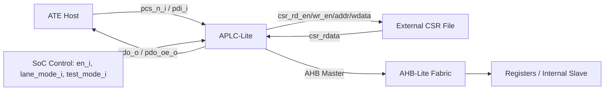
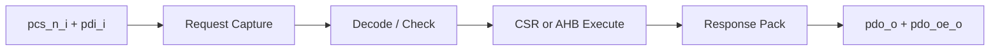
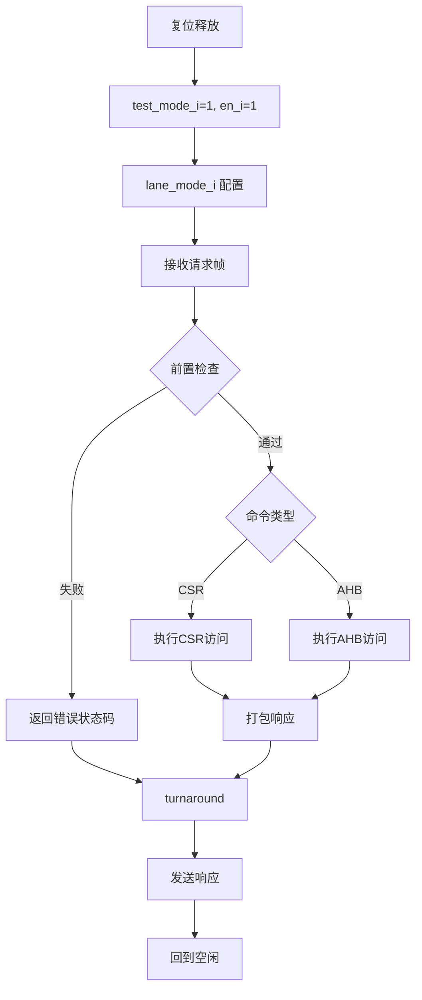

# APLC-Lite 逻辑规格说明书（LRS）

**模块名称**：APLC-Lite
**文档类型**：LRS（Logic Requirement Specification）
**版本**：v1.2
**适用阶段**：MVP / SoC 集成版

# 1. 引言

## 1.1 文档目的

本文档定义 APLC-Lite 的逻辑规格要求，描述模块在 SoC 中的功能定位、外部接口、行为规则、性能目标、异常处理及使用限制。
本文档用于指导以下工作：

- 模块逻辑设计
- RTL 开发
- 验证计划制定
- SoC 集成
- ATE 联调与测试软件开发

------

## 1.2 适用范围

本文档适用于 APLC-Lite 的 MVP 版本，覆盖以下内容：

- 外部类 SPI 半双工测试接口
- CSR 读写访问（通过外部 CSR File 实现）
- AHB-Lite Master 单次 32-bit 访问
- 状态与错误返回
- 测试模式使能约束

> **说明**：APLC-Lite 模块自身不包含内建 CSR 寄存器文件。CSR 读写命令通过专用接口（`csr_rd_en_o` / `csr_wr_en_o` / `csr_addr_o` / `csr_wdata_o` / `csr_rdata_i`）传递至外部 CSR File。寄存器的实际内容由集成方在外部实现。

------

## 1.3 术语和缩略语

| 缩略语        | 全称                            | 说明                           |
| ------------- | ------------------------------- | ------------------------------ |
| APLC          | ATE Pattern Load Controller     | ATE 模式加载控制器             |
| ATE           | Automatic Test Equipment        | 自动测试设备                   |
| CSR           | Control and Status Register     | 控制/状态寄存器                |
| AHB           | AMBA High-performance Bus       | AMBA 高性能总线                |
| MVP           | Minimum Viable Product          | 最小可用版本                   |
| LRS           | Logic Requirement Specification | 逻辑规格说明书                 |
| Lane          | 数据并行位宽                    | 本模块支持 1-bit / 4-bit      |
| Half-Duplex   | 半双工                          | 收发不同时进行                 |
| frame_valid   | 帧完成                          | 接收到完整帧后的有效指示       |
| frame_abort   | 帧中止                          | 接收未完成即被截断             |
| task_desc     | 任务描述符                      | 内部传递的命令解码结构         |
| turnaround    | 方向切换                        | 请求→响应之间的 1 周期间隔     |

------

# 2. 模块概述

## 2.1 APLC.LRS.SUMM.01 功能概述

APLC-Lite 是一个面向测试模式的轻量级访问控制模块。
模块通过外部 ATE 数字 IO 接收命令帧，将命令解释为内部 CSR 访问或 AHB-Lite Master 单次读写，并将执行结果回传给 ATE。

------

### 2.1.1 所处位置

APLC-Lite 位于 SoC 的测试接入边界，连接关系如下：



模块输入来自外部测试口和 SoC 控制端口，模块输出面向外部 CSR File 或 AHB fabric。

------

### 2.1.2 应用场景

APLC-Lite 主要用于以下场景：

1. 产测阶段向芯片内部装载测试 pattern；
2. 对内部寄存器做快速读写；
3. 对某些 memory-mapped 地址做单次读回验证；
4. 作为 function testing 的低成本访问入口；
5. 在 DPPM 改善目标下提供更强可观察性与可控性。

------

### 2.1.3 设计目标

APLC-Lite 的设计目标如下：

- 使用少量数字 IO 提供通用测试访问能力；
- 外部协议保持简单、规则、易于 ATE 生成；
- 内部支持 CSR/AHB 两种访问路径；
- 所有命令具备明确状态返回；
- 逻辑简单、面积小、便于快速集成和验证。

------

## 2.2 APLC.LRS.SUMM.02 模块数据概览

模块数据路径分为四段：

1. **请求接收段**：接收 `opcode/address/wdata`；
2. **命令解释段**：判断请求类型并构造内部任务；
3. **事务执行段**：执行 CSR 或 AHB 访问；
4. **响应发送段**：回传 `status` 或 `status+rdata`。

数据流总览如下：



控制流为串行单任务流程，不支持并发执行。

------

# 3. 功能描述

## 3.1 APLC.LRS.FUNC.01 支持类 SPI 协议

模块对外提供类 SPI 的测试接口，满足以下要求：

- 使用 `pcs_n_i` 作为帧边界；
- 数据以时钟同步方式输入/输出；
- 支持 MSB-first；
- 协议为半双工；
- 请求阶段与响应阶段之间固定插入 1 个 turnaround 周期。

### 逻辑要求

- 当 `pcs_n_i` 拉低后，模块开始接收请求；
- 当 `pcs_n_i` 在请求未接收完成前拉高，应产生帧中止（frame_abort）；
- 当命令执行完成后，模块才允许输出响应；
- 输出阶段由 `pdo_oe_o` 指示方向切换。

### 3.1.1 帧格式

每条命令的请求帧由 `opcode + 参数` 组成，MSB-first 发送。各命令帧格式如下：

| Opcode | 命令 | 帧结构（MSB → LSB） | 总长度（bit） |
| ------ | ---- | -------------------- | ------------- |
| `8'h10` | `WR_CSR` | `[opcode(8) \| reg_addr(8) \| wdata(32)]` | 48 |
| `8'h11` | `RD_CSR` | `[opcode(8) \| reg_addr(8)]` | 16 |
| `8'h20` | `AHB_WR32` | `[opcode(8) \| addr(32) \| wdata(32)]` | 72 |
| `8'h21` | `AHB_RD32` | `[opcode(8) \| addr(32)]` | 40 |

> **内部实现说明**：接收完成后模块执行左归一化（left-normalization），使 opcode 始终位于内部缓存的 `rx_data[79:72]` 位置，简化后续解码。

### 3.1.2 帧接收机制

- 接收器使用 80-bit 移位寄存器 `rx_shift_q`，按 lane mode 每拍移入 1 或 4 bit；
- 前 8 bit 完成后锁存 opcode，并据此确定预期帧长度 `expected_rx_bits`；
- 当已接收位数 `next_count >= expected_rx_bits` 时，产生 `frame_valid`（寄存输出，延迟 1 cycle）；
- 若 `pcs_n_i` 在 `rx_count < expected_rx_bits` 时拉高且 opcode 已锁存，产生 `frame_abort`（寄存输出，延迟 1 cycle）；
- 若 `pcs_n_i` 在 opcode 锁存前（接收不足 8 bit）拉高，接收状态静默复位，不产生 frame_abort。

------

## 3.2 APLC.LRS.FUNC.02 支持 1-bit / 4-bit 通道

模块支持两种 lane mode：

| 模式  | 通道宽度 | 说明                             |
| ----- | -------- | -------------------------------- |
| Mode0 | 1-bit    | 使用 `pdi_i[0]` / `pdo_o[0]`     |
| Mode1 | 4-bit    | 使用 `pdi_i[3:0]` / `pdo_o[3:0]` |

### 逻辑要求

- `lane_mode_i=2'b00` 时，未使用位应忽略或驱动为 0；
- `lane_mode_i=2'b01` 时，每拍收发 4 bit；
- lane mode 由顶层输入端口 `lane_mode_i` 配置（非内部 CSR 寄存器）；
- 当前事务执行期间不允许动态切换 lane mode 生效。

### 3.2.1 Lane Mode 切换约束

- **事务边界定义**：`pcs_n_i=0` 的整个持续期间为事务执行期间，包括 RX、处理、turnaround、TX 全过程。
- **RTL 实际行为**：`lane_mode_i` 在接收器（SLC_CAXIS）和发送器（SLC_SAXIS）中被**连续组合采样**，用于计算每拍移位宽度 `bpc`（bits per clock）。事务中间切换 `lane_mode_i` 会导致移位寄存器步进宽度立即改变，造成帧数据错位。
- **约束要求**：集成方必须保证 `lane_mode_i` 在 `pcs_n_i=0` 期间保持稳定。
- **违反后果**：帧数据损坏，可能产生不可预测的 opcode 值，进而触发 `STS_BAD_OPCODE` 或 `STS_FRAME_ERR` 等错误。模块不检测此违规行为。

**Lane mode 切换违规时序**：

```wavedrom
{ "config": { "hscale": 2 },
  "signal": [
    { "name": "clk_i",         "wave": "p............" },
    { "name": "pcs_n_i",       "wave": "10...........", "node": ".........."},
    { "name": "lane_mode_i",   "wave": "=...=........", "data": ["2'b01(4bit)", "2'b00(1bit)"] },
    { "name": "bpc",           "wave": "=...=........", "data": ["4", "1"] },
    { "name": "pdi_i[3:0]",    "wave": "x====x=======", "data": ["N0","N1","N2","N3","b0","b1","b2","b3","b4","b5","b6..b7"] },
    { "name": "rx_count",      "wave": "=====.=======", "data": ["0","4","8","12","13","14","15","16","17","18","19","20"] },
    {},
    { "name": "期望 rx_count",  "wave": "=====........", "data": ["0","4","8","12","16"] },
    { "name": "实际 rx_count",  "wave": "=====.=======", "data": ["0","4","8","12","13","14","15","16","17","18","19","20"] }
  ],
  "edge": ["A<->B 切换点：数据错位开始"],
  "foot": { "text": "lane_mode 在事务中间切换导致 bpc 从 4 变为 1，rx_count 步进不一致，帧数据损坏" }
}
```

------

## 3.3 APLC.LRS.FUNC.03 支持 CSR/AHB 单次访问

模块支持以下命令：

| Opcode  | 名称       | 类型       |
| ------- | ---------- | ---------- |
| `8'h10` | `WR_CSR`   | CSR 写     |
| `8'h11` | `RD_CSR`   | CSR 读     |
| `8'h20` | `AHB_WR32` | AHB 单次写 |
| `8'h21` | `AHB_RD32` | AHB 单次读 |

### 逻辑要求

- CSR 访问通过 `csr_rd_en_o/csr_wr_en_o/csr_addr_o/csr_wdata_o/csr_rdata_i` 接口传递至外部 CSR File；
- CSR 有效地址范围为 `0x00 ~ 0x3F`，超出范围返回 `STS_BAD_REG`；
- AHB 访问固定为 32-bit 对齐、单次 `NONSEQ/SINGLE/WORD`；
- 非法地址或非法参数必须返回错误码，不得发起错误的 AHB 访问。

------

## 3.4 APLC.LRS.FUNC.04 支持状态与错误返回

每条命令必须返回状态码。读命令还应返回数据。

### 响应格式

| 命令类型 | 响应内容                    | 响应长度 |
| -------- | --------------------------- | -------- |
| 写类命令 | `STATUS[7:0]`               | 8 bit    |
| 读类命令 | `STATUS[7:0] + RDATA[31:0]` | 40 bit   |

响应帧位域图：

```
写命令响应: [status(8)]                     = 8 bits，MSB-first
读命令响应: [status(8) | rdata(32)]         = 40 bits，MSB-first
```

### 状态码定义

状态码采用 power-of-2 编码。每次仅报告一个状态码。

| 状态码    | RTL 名称           | 含义                                         |
| --------- | ------------------ | -------------------------------------------- |
| `8'h00`   | `STS_OK`           | 成功                                         |
| `8'h01`   | `STS_FRAME_ERR`    | 帧错误（pcs_n_i 提前释放导致帧长不足）       |
| `8'h02`   | `STS_BAD_OPCODE`   | 非法 Opcode（不在 0x10/0x11/0x20/0x21 中）   |
| `8'h04`   | `STS_NOT_IN_TEST`  | 非测试模式（test_mode_i=0）                  |
| `8'h08`   | `STS_DISABLED`     | 模块未使能（en_i=0）                         |
| `8'h10`   | `STS_BAD_REG`      | 非法 CSR 地址（reg_addr >= 0x40）            |
| `8'h20`   | `STS_ALIGN_ERR`    | AHB 地址未 4-byte 对齐（addr[1:0] != 0）    |
| `8'h40`   | `STS_AHB_ERR`      | AHB 总线异常（hresp_i=1 或 hready_i 等待超时）|

> **说明**：RTL 对 AHB 错误响应（hresp_i=1）和 AHB 超时两种情况使用同一状态码 `STS_AHB_ERR (0x40)`，不做区分。

### 3.4.1 错误优先级

当多个前置错误条件同时成立时，模块按以下固定优先级仅报告最高优先级错误（if-else 链实现）：

```
STS_FRAME_ERR (0x01)  ← 最高优先级
  > STS_BAD_OPCODE (0x02)
    > STS_NOT_IN_TEST (0x04)
      > STS_DISABLED (0x08)
        > STS_BAD_REG (0x10)
          > STS_ALIGN_ERR (0x20)  ← 最低优先级
```

`STS_AHB_ERR (0x40)` 不在上述优先级链中——AHB 错误仅在所有前置检查通过后、AHB 事务实际执行期间才可能发生，与前置错误互斥。

### 3.4.2 状态码生成过程

1. 帧接收完成后，前端协议检查器（SLC_DPCHK）对 `frame_valid` / `frame_abort` / `opcode` / `test_mode_i` / `en_i` / `reg_addr` / `addr` 进行组合逻辑检查，按优先级链输出 `chk_err_code`；
2. 若检查通过（`chk_pass=1`），任务进入后端执行；
3. 后端执行 CSR 或 AHB 访问，CSR 操作始终返回 `STS_OK`；AHB 操作根据 `hresp_i` 和超时返回 `STS_OK` 或 `STS_AHB_ERR`；
4. 最终状态码通过响应帧（8-bit status byte）返回给 ATE。

------

# 4. 接口描述

## 4.1 APLC.LRS.INTF.01 参数定义

| 参数名               | 默认值 | 说明                               |
| -------------------- | ------ | ---------------------------------- |
| `IO_MAX_W`           | 4      | 外部最大数据宽度                   |
| `ADDR_W`             | 32     | 地址宽度                           |
| `DATA_W`             | 32     | 数据宽度                           |
| `BUS_TIMEOUT_CYCLES` | 256    | AHB 超时周期数（9-bit 计数器）     |
| `CSR_ADDR_MAX`       | `0x3F` | CSR 有效地址上界（reg_addr < 0x40）|

> **超时计数器说明**：计数器为 9-bit 宽，在 AHB 等待态（STATE_WAIT）每拍递增，从 0 计数至 `BUS_TIMEOUT_CYCLES-1`（默认 255）时触发超时。在 AHB 地址相（STATE_REQ）时清零。

------

## 4.2 APLC.LRS.INTF.02 外部测试 IO 接口

### 外部测试 IO 信号

| 接口          | 位宽 | 方向 | 描述                             |
| ------------- | ---- | ---- | -------------------------------- |
| `pcs_n_i`     | 1    | I    | 片选信号，低有效。拉低时开启一次事务（帧接收→执行→响应发送），拉高时标志事务结束。空闲态保持高电平 |
| `pdi_i`       | 4    | I    | 并行数据输入。在 `pcs_n_i=0` 的请求阶段，ATE 主机在每个 `clk_i` 上升沿驱动此总线。1-bit 模式仅 `pdi_i[0]` 有效，其余位忽略；4-bit 模式 `pdi_i[3:0]` 均有效。MSB-first |
| `pdo_o`       | 4    | O    | 并行数据输出。在响应阶段（`pdo_oe_o=1` 时），模块在每个 `clk_i` 上升沿驱动此总线输出状态码和读数据。非发送期间输出值无意义 |
| `pdo_oe_o`    | 1    | O    | 输出使能，高有效，指示模块正在驱动 `pdo_o`。仅在前端 FSM TX 态为 1，其余时刻为 0。集成方据此控制 IO pad 三态方向 |

### 控制端口信号

| 接口          | 位宽 | 方向 | 描述                             |
| ------------- | ---- | ---- | -------------------------------- |
| `en_i`        | 1    | I    | 模块使能，高有效。为 0 时所有命令被前置检查拒绝，返回 `STS_DISABLED(0x08)`，不发起任何 CSR/AHB 访问。由 SoC 集成方硬件端口提供，非 CSR 可配 |
| `lane_mode_i` | 2    | I    | 通道模式选择。`2'b00`=1-bit 模式（每拍收发 1 bit），`2'b01`=4-bit 模式（每拍收发 4 bit）。在接收器和发送器中被连续组合采样，事务期间（`pcs_n_i=0`）必须保持稳定 |
| `test_mode_i` | 1    | I    | 测试模式使能，高有效。为 0 时所有命令被前置检查拒绝，返回 `STS_NOT_IN_TEST(0x04)`。在 `frame_valid` 时刻被采样 |

### 接口要求

- `pcs_n_i=1` 表示空闲；
- 请求阶段由主机驱动 `pdi_i`；
- 响应阶段由模块驱动 `pdo_o`；
- 半双工条件下，主机和模块不得同时驱动数据方向；
- `en_i`、`lane_mode_i`、`test_mode_i` 由 SoC 集成方通过硬件端口提供，非 CSR 可配置。

------

## 4.3 APLC.LRS.INTF.03 时钟复位

| 接口      | 位宽 | 方向 | 描述       |
| --------- | ---- | ---- | ---------- |
| `clk_i`   | 1    | I    | 主时钟。所有内部逻辑在上升沿同步。目标频率 100 MHz。模块为单时钟域设计，AHB 侧与协议侧共用此时钟 |
| `rst_n_i` | 1    | I    | 异步复位，低有效。下降沿立即触发复位，释放需与 `clk_i` 上升沿同步。复位后所有 FSM 回 IDLE，所有输出 deassert（`pdo_oe_o=0`、`htrans_o=2'b00`、`csr_rd_en_o=0`、`csr_wr_en_o=0`） |

### 时钟复位要求

- 模块采用单时钟域，所有逻辑在 `clk_i` 上升沿同步；
- `rst_n_i` 异步有效（下降沿触发复位），同步释放；
- 复位后所有内部状态机回到 IDLE 态；
- 复位后所有输出 deassert：`pdo_oe_o=0`、`htrans_o=IDLE`、`csr_rd_en_o=0`、`csr_wr_en_o=0`、`pdo_o=4'b0`；
- 复位不影响 `en_i`、`lane_mode_i`、`test_mode_i` 等外部输入端口（由集成方控制）。

**复位序列时序**：

```wavedrom
{ "config": { "hscale": 2 },
  "signal": [
    { "name": "clk_i",          "wave": "p.........." },
    { "name": "rst_n_i",        "wave": "0...1......", "node": "....A" },
    { "name": "front_state",    "wave": "=...=......", "data": ["IDLE(rst)", "IDLE"] },
    { "name": "back_state",     "wave": "=...=......", "data": ["S_IDLE(rst)", "S_IDLE"] },
    { "name": "pdo_oe_o",       "wave": "0.........." },
    { "name": "htrans_o",       "wave": "=..........", "data": ["IDLE"] },
    { "name": "csr_rd_en_o",    "wave": "0.........." },
    { "name": "csr_wr_en_o",    "wave": "0.........." },
    { "name": "pdo_o[3:0]",     "wave": "=..........", "data": ["0"] }
  ],
  "edge": ["A 同步释放点"],
  "foot": { "text": "rst_n_i 异步有效（立即进入复位），同步释放（在 clk_i 上升沿退出复位）" }
}
```

------

## 4.4 APLC.LRS.INTF.04 控制信号

### 外部控制信号

| 信号          | 来源 | 方向 | 说明                                     |
| ------------- | ---- | ---- | ---------------------------------------- |
| `pcs_n_i`     | ATE  | In   | 事务边界，低有效开启事务                 |
| `test_mode_i` | SoC  | In   | 测试模式控制，`=0` 时所有命令被拒绝      |
| `en_i`        | SoC  | In   | 模块使能，`=0` 时所有命令被拒绝          |
| `lane_mode_i` | SoC  | In   | 通道模式配置，`2'b00`=1-bit, `2'b01`=4-bit |

> **注意**：MVP 版本中 `en_i`、`lane_mode_i`、`test_mode_i` 均为顶层输入端口，由 SoC 集成方在硬件层面提供。这些信号不通过 CSR 命令配置。

------

## 4.5 APLC.LRS.INTF.05 状态信号

APLC-Lite 对外的状态反馈通过响应帧完成。

| 名称 | 位宽 | 适用命令 | 说明 |
| ---- | ---- | -------- | ---- |
| `status byte` | 8 | 全部命令 | 每条命令执行结束后返回单次状态码 |
| `rdata` | 32 | `RD_CSR` / `AHB_RD32` | 读类命令在状态码后返回读数据 |

------

## 4.6 APLC.LRS.INTF.06 CSR 接口

### CSR 接口信号

APLC-Lite 通过以下信号与外部 CSR File 交互：

| 接口          | 位宽 | 方向 | 描述         |
| ------------- | ---- | ---- | ------------ |
| `csr_rd_en_o` | 1    | O    | CSR 读使能。脉冲持续 1 个时钟周期，指示外部 CSR File 在下一个时钟周期将读数据稳定在 `csr_rdata_i` 上 |
| `csr_wr_en_o` | 1    | O    | CSR 写使能。脉冲持续 1 个时钟周期，外部 CSR File 应在该周期采样 `csr_addr_o` 和 `csr_wdata_o` 完成写入 |
| `csr_addr_o`  | 8    | O    | CSR 读写地址。在 `csr_rd_en_o` 或 `csr_wr_en_o` 有效期间驱动有效地址。有效范围 `0x00~0x3F`，超出范围的请求在前置检查阶段即被拒绝，不会出现在此接口 |
| `csr_wdata_o` | 32   | O    | CSR 写数据。在 `csr_wr_en_o=1` 时有效，外部 CSR File 在同一周期采样此总线完成写入 |
| `csr_rdata_i` | 32   | I    | CSR 读返回数据。外部 CSR File 在 `csr_rd_en_o` 脉冲后的下一个时钟周期驱动此总线，模块在该周期采样（1 cycle 读延迟） |

### CSR 接口时序要求

- `csr_wr_en_o` 脉冲持续 1 个时钟周期，`csr_addr_o` 和 `csr_wdata_o` 在同一周期有效；
- `csr_rd_en_o` 脉冲持续 1 个时钟周期，外部 CSR File 应在**下一个时钟周期**将读数据稳定在 `csr_rdata_i` 上（1 cycle 读延迟）；
- CSR 有效地址范围为 `0x00 ~ 0x3F`。`reg_addr >= 0x40` 的请求在前置检查阶段即被拒绝（返回 `STS_BAD_REG`），不会发起 CSR 读/写操作。

### CSR 地址约束

CSR 地址空间与寄存器含义由外部 CSR File 定义，APLC-Lite 仅约束以下行为：

- ATE 命令中的 `reg_addr` 由 `csr_addr_o` 原样送出；
- 有效地址范围为 `0x00 ~ 0x3F`；
- `csr_rd_en_o` 和 `csr_wr_en_o` 分别表示单周期读写请求。

**CSR 读写时序**：

```wavedrom
{ "config": { "hscale": 2 },
  "signal": [
    { "name": "clk_i",        "wave": "p........" },
    {},
    ["CSR Write",
      { "name": "csr_wr_en_o",  "wave": "0.10.....", "node": "..A" },
      { "name": "csr_addr_o",   "wave": "x.=x.....", "data": ["ADDR"] },
      { "name": "csr_wdata_o",  "wave": "x.=x.....", "data": ["WDATA"] }
    ],
    {},
    ["CSR Read",
      { "name": "csr_rd_en_o",  "wave": "0....10..", "node": ".....B" },
      { "name": "csr_addr_o",   "wave": "x....=x..", "data": ["ADDR"] },
      { "name": "csr_rdata_i",  "wave": "x.....=x.", "data": ["RDATA"], "node": "......C" }
    ]
  ],
  "edge": ["A csr_wr_en 脉冲 1 cycle", "B csr_rd_en 脉冲 1 cycle", "B->C 1 cycle 读延迟"],
  "foot": { "text": "CSR 写为单周期操作；CSR 读有 1 cycle 延迟（rd_en 后下一拍采样 rdata）" }
}
```

------

## 4.7 APLC.LRS.INTF.07 AHB Master 接口

| 接口       | 位宽 | 方向 | 描述             |
| ---------- | ---- | ---- | ---------------- |
| `haddr_o`  | 32   | O    | AHB 地址。在地址相（`htrans_o=NONSEQ`）驱动目标地址，必须 4-byte 对齐（`haddr_o[1:0]=2'b00`）。其余时刻值无意义 |
| `hwrite_o` | 1    | O    | AHB 读写标志。1 表示写操作，0 表示读操作。在地址相有效，与 `haddr_o` 同时驱动 |
| `htrans_o` | 2    | O    | AHB 传输类型。仅使用 `2'b00`(IDLE) 和 `2'b10`(NONSEQ) 两种。地址相驱动 NONSEQ，其余时刻保持 IDLE |
| `hsize_o`  | 3    | O    | AHB 传输大小。固定输出 `3'b010`（32-bit/WORD） |
| `hburst_o` | 3    | O    | AHB 突发类型。固定输出 `3'b000`（SINGLE） |
| `hwdata_o` | 32   | O    | AHB 写数据。当 `hwrite_o=1` 时，在数据相（地址相的下一拍）此总线被模块驱动为有效写数据 |
| `hrdata_i` | 32   | I    | AHB 读返回数据。当 `hwrite_o=0` 时，从设备在 `hready_i=1` 的数据相驱动此总线，模块在同一周期采样 |
| `hready_i` | 1    | I    | AHB 传输完成指示。从设备拉高表示当前传输完成或可接收数据；持续为 0 表示等待，超过 256 cycle 未拉高将触发超时错误 |
| `hresp_i`  | 1    | I    | AHB 错误响应。从设备拉高表示传输出错，模块将产生 `STS_AHB_ERR(0x40)`。正常完成时应保持低电平 |

### AHB 要求

- 仅支持单次访问；
- 地址必须 4-byte 对齐（`addr[1:0]==2'b00`）；
- `hsize_o` 固定为 `WORD`（`3'b010`）；
- `hburst_o` 固定为 `SINGLE`（`3'b000`）；
- 当前事务完成前，不得发起下一笔 AHB 请求；
- `htrans_o=NONSEQ` 仅在地址相（STATE_REQ）驱动，其余时刻为 IDLE（`2'b00`）。

### 无效地址与 DECERR 处理边界

APLC-Lite 在 AHB 总线上的角色为 **Master**，对无效地址/保留地址的处理边界如下：

- **CSR 侧（非总线通路）**：`reg_addr >= 0x40` 的访问在前置检查阶段即被拒绝，返回状态码 `STS_BAD_REG(0x10)`，不发起 CSR 接口握手，**不会产生任何总线错误（DECERR/SLVERR）**。外部 CSR File 对 0x00~0x3F 范围内未映射地址的返回值由集成方决定（典型为返回全零）。
- **AHB 侧（总线通路）**：APLC-Lite 作为 Master **不做无效地址判决**，仅做 4-byte 对齐检查（`addr[1:0]!=0` 返回 `STS_ALIGN_ERR(0x20)` 不发起总线事务）。对齐合法的地址是否落在有效 memory map 内由 SoC AHB 互联/解码器负责，**如返回 `hresp_i=1`（含 DECERR 语义），APLC-Lite 统一映射为 `STS_AHB_ERR(0x40)` 向 ATE 上报**，不区分 DECERR 与 SLVERR。
- **不返回 DECERR 的场景**：APLC-Lite 本身不驱动 DECERR/SLVERR（非 Slave），所有错误通过协议响应帧的状态码通道上报。

### AHB Master 内部状态机

AHB Master 适配器（SLC_SAXIM）使用 5 态 FSM：

| 状态 | 编码 | 说明 |
| ---- | ---- | ---- |
| `STATE_IDLE` | `3'b000` | 等待内部请求 |
| `STATE_REQ`  | `3'b001` | AHB 地址相：驱动 `htrans=NONSEQ`，锁存地址/数据/方向 |
| `STATE_WAIT` | `3'b010` | AHB 数据相/等待相：超时计数器递增 |
| `STATE_DONE` | `3'b011` | 正常完成：`done_o=1`，读操作采样 `hrdata_i` |
| `STATE_ERR`  | `3'b100` | 错误/超时：`done_o=1, err_o=1` |

状态转移：

```
STATE_IDLE ──(req_i=1)──> STATE_REQ
STATE_REQ  ──(hready_i=1)──> STATE_WAIT
STATE_WAIT ──(hready_i=1 && !hresp_i)──> STATE_DONE
STATE_WAIT ──(hresp_i=1 || timeout)──> STATE_ERR
STATE_DONE ──> STATE_IDLE
STATE_ERR  ──> STATE_IDLE
```

超时条件：`timeout_cnt_q == BUS_TIMEOUT_CYCLES - 1`（默认 255）。计数器在 STATE_REQ 清零，STATE_WAIT 每拍 +1。

### AHB-Lite 2-phase 流水时序

AHB-Lite 采用 **地址相 / 数据相** 2 级流水协议，地址/控制信号与写数据 **不在同一拍生效**：

| 时刻 | FSM 状态 | 相位 | 有效信号 | 说明 |
| ---- | -------- | ---- | -------- | ---- |
| T1 | `STATE_REQ` | 地址相 | `haddr_o`, `hwrite_o`, `hsize_o`, `hburst_o`, `htrans_o=NONSEQ` | 主机驱动地址/控制，从机在本拍末按 `hready_i=1` 接受；`hwdata_o` 尚未被采样 |
| T2 | `STATE_WAIT` | 数据相 | `hwdata_o`（写） / `hrdata_i`（读），`htrans_o=IDLE` | 写：从机在本拍采样 `hwdata_o`；读：从机驱动 `hrdata_i`，主机采样；`haddr_o` 已清零 |

关键约束：

- **写操作中，`haddr_o` 与 `hwdata_o` 必然错开 1 拍**（T1 驱动地址，T2 驱动数据）；
- `htrans_o=NONSEQ` 仅在地址相（T1）驱动 **1 个时钟周期**，其余时刻均为 IDLE；
- RTL 实现上 `hwdata_o` 在 REQ/WAIT 两态均被驱动以保证稳定性，但从机采样点是数据相（T2）。

```wavedrom
{ "config": { "hscale": 3 },
  "signal": [
    { "name": "clk_i",       "wave": "p......." },
    { "name": "saxim_state", "wave": "=.===...", "data": ["IDLE","REQ (T1)","WAIT (T2)","DONE/IDLE"] },
    { "name": "htrans_o",    "wave": "=.===...", "data": ["IDLE","NONSEQ","IDLE","IDLE"] },
    { "name": "haddr_o",     "wave": "x.=x....", "data": ["ADDR"] },
    { "name": "hwrite_o",    "wave": "0.1..0.." },
    { "name": "hwdata_o",    "wave": "x..=x...", "data": ["WDATA"] },
    { "name": "hready_i",    "wave": "1......." },
    { "name": "hrdata_i",    "wave": "x...x..." },
    { "name": "done_o",      "wave": "0...10.." }
  ],
  "edge": [],
  "foot": { "text": "AHB-Lite 写：T1 驱动 haddr+hwrite+NONSEQ；T2 驱动 hwdata（从机在此拍采样）。读同理：T1 驱动 haddr，T2 从机驱动 hrdata。" }
}
```

------

## 4.8 APLC.LRS.INTF.08 接口时序

说明：

- 以下波形中的 `txn_phase` 为协议事务阶段抽象，用于描述 RX/执行/TA/TX 流程；**不等同于** `11.2` 中 RTL 前端 FSM 的 `front_state` 编码。
- RTL 实际前端状态为 `IDLE/ISSUE/WAIT_RESP/TA/TX`，其中 `RX=3'd1` 为保留未使用状态。

### 4.8.1 请求-响应总时序（AHB_RD32, 4-bit 模式）

```wavedrom
{ "config": { "hscale": 2 },
  "signal": [
    { "name": "clk_i",          "wave": "p............................." },
    { "name": "pcs_n_i",        "wave": "10...........................1" },
    { "name": "pdi_i[3:0]",     "wave": "x==========..................x", "data": ["OP[7:4]","OP[3:0]","A[31:28]","A[27:24]","A[23:20]","A[19:16]","A[15:12]","A[11:8]","A[7:4]","A[3:0]"] },
    { "name": "txn_phase",      "wave": "=.........==.....==.........=.", "data": ["RX(40b/10cyc)","ISSUE","WAIT_RESP","TA","TX(10cyc)","IDLE"] },
    { "name": "frame_valid",    "wave": "0..........10................." },
    { "name": "chk_pass",       "wave": "0..........10................." },
    { "name": "task_req",       "wave": "0..........10................." },
    { "name": "task_ack",       "wave": "0...........10................" },
    { "name": "saxim_state",    "wave": "=............===..............", "data": ["IDLE","REQ(T1)","WAIT(T2)","DONE/IDLE"] },
    { "name": "htrans_o[1:0]",  "wave": "=............==...............", "data": ["IDLE","NONSEQ","IDLE"] },
    { "name": "haddr_o",        "wave": "x.............=...............", "data": ["ADDR"] },
    { "name": "hwrite_o",       "wave": "0............................." },
    { "name": "hready_i",       "wave": "1............................." },
    { "name": "hrdata_i[31:0]", "wave": "x..............=..............", "data": ["RDATA"] },
    { "name": "resp_valid",     "wave": "0................10..........." },
    { "name": "pdo_oe_o",       "wave": "0.................1.........0." },
    { "name": "pdo_o[3:0]",     "wave": "x.................==========x.", "data": ["S[7:4]","S[3:0]","R[31:28]","R[27:24]","R[23:20]","R[19:16]","R[15:12]","R[11:8]","R[7:4]","R[3:0]"] }
  ],
  "foot": { "text": "AHB_RD32, 4-bit：10 RX + AHB 2-phase 读（T1 haddr+NONSEQ → T2 hrdata 采样）+ 1-cycle TA + 10 TX。RTL 中 `pdo_oe_o` 在整个 TX 窗口保持连续为 1，不是单拍脉冲。" }
}
```

### 4.8.2 WR_CSR 4-bit 模式正常时序

```wavedrom
{ "config": { "hscale": 2 },
  "signal": [
    { "name": "clk_i",          "wave": "p..................." },
    { "name": "pcs_n_i",        "wave": "10...........|..1..." },
    { "name": "pdi_i[3:0]",     "wave": "x============|..x...", "data": ["0x1","0x0","RA[7:4]","RA[3:0]","WD[31:28]","WD[27:24]","WD[23:20]","WD[19:16]","WD[15:12]","WD[11:8]","WD[7:4]","WD[3:0]"] },
    { "name": "txn_phase",      "wave": "==...........|==.=..", "data": ["IDLE","RX(48b/12cyc)","EXEC","TA","TX(2cyc)/IDLE"] },
    { "name": "frame_valid",    "wave": "0............|10..0." },
    { "name": "task_req",       "wave": "0............|10..0." },
    { "name": "task_ack",       "wave": "0............|.10.0." },
    { "name": "csr_wr_en_o",    "wave": "0............|.10.0." },
    { "name": "csr_addr_o",     "wave": "x............|.=x...", "data": ["RA"] },
    { "name": "csr_wdata_o",    "wave": "x............|.=x...", "data": ["WDATA"] },
    { "name": "resp_valid",     "wave": "0............|..10.." },
    { "name": "pdo_oe_o",       "wave": "0............|...1.0" },
    { "name": "pdo_o[3:0]",     "wave": "x............|...==x", "data": ["S[7:4]","S[3:0]"] }
  ],
  "foot": { "text": "WR_CSR(0x10) 4-bit：12 RX + backend + 1 TA + 2 TX（8-bit status），帧长 48 bit" }
}
```

### 4.8.3 RD_CSR 4-bit 模式正常时序

```wavedrom
{ "config": { "hscale": 2 },
  "signal": [
    { "name": "clk_i",          "wave": "p.................." },
    { "name": "pcs_n_i",        "wave": "10...........|....1" },
    { "name": "pdi_i[3:0]",     "wave": "x====........|....x", "data": ["0x1","0x1","RA[7:4]","RA[3:0]"] },
    { "name": "txn_phase",      "wave": "==...........|.==.=", "data": ["IDLE","RX(16b/4cyc)","EXEC","TA","TX(10cyc)/IDLE"] },
    { "name": "frame_valid",    "wave": "0....1.......|....0" },
    { "name": "csr_rd_en_o",    "wave": "0......1.....|....0" },
    { "name": "csr_rdata_i",    "wave": "x.......=....|....x", "data": ["RDATA"] },
    { "name": "resp_valid",     "wave": "0........1...|....0" },
    { "name": "pdo_oe_o",       "wave": "0.........1..|..1.0" },
    { "name": "pdo_o[3:0]",     "wave": "x.........===|==..x", "data": ["S[7:4]","S[3:0]","R[31:28]","R[27:24]","..."] }
  ],
  "foot": { "text": "RD_CSR(0x11) 4-bit：4 RX + backend(含1cyc CSR读延迟) + 1 TA + 10 TX（40-bit status+rdata）" }
}
```

### 4.8.4 AHB_WR32 4-bit 模式正常时序

```wavedrom
{ "config": { "hscale": 2 },
  "signal": [
    { "name": "clk_i",          "wave": "p...................." },
    { "name": "pcs_n_i",        "wave": "10..................1" },
    { "name": "pdi_i[3:0]",     "wave": "x==================x.", "data": ["0x2","0x0","A[31:28]","...","A[3:0]","WD[31:28]","...","WD[3:0]","...","...","...","...","...","...","...","...","...","..."] },
    { "name": "txn_phase",      "wave": "==................|=.", "data": ["IDLE","RX(72b/18cyc)","EXEC/TA/TX/IDLE"] },
    { "name": "frame_valid",    "wave": "0................10.." },
    { "name": "saxim_state",    "wave": "=.................===", "data": ["IDLE","REQ(T1)","WAIT(T2)","DONE"] },
    { "name": "htrans_o",       "wave": "=.................===", "data": ["IDLE","NONSEQ","IDLE","IDLE"] },
    { "name": "haddr_o",        "wave": "x.................=x.", "data": ["ADDR"] },
    { "name": "hwrite_o",       "wave": "0.................1.0" },
    { "name": "hwdata_o",       "wave": "x..................=x", "data": ["WDATA"] },
    { "name": "hready_i",       "wave": "1...................." },
    { "name": "hresp_i",        "wave": "0...................." },
    { "name": "pdo_oe_o",       "wave": "0.................1.0" },
    { "name": "pdo_o[3:0]",     "wave": "x.................==x", "data": ["S[7:4]","S[3:0]"] }
  ],
  "foot": { "text": "AHB_WR32(0x20) 4-bit：18 RX + AHB 2-phase 写（T1 haddr+NONSEQ → T2 hwdata，从机在 T2 采样）+ 1 TA + 2 TX（8-bit status only）。注意 haddr 与 hwdata 错开 1 拍。" }
}
```

### 4.8.5 WR_CSR 1-bit 模式正常时序（概览）

```wavedrom
{ "config": { "hscale": 1 },
  "signal": [
    { "name": "clk_i",          "wave": "p...|...|...|..." },
    { "name": "pcs_n_i",        "wave": "10..|...|...|..1" },
    { "name": "pdi_i[0]",       "wave": "x=..|...|...|..x", "data": ["bit0..bit47"] },
    { "name": "txn_phase",      "wave": "==..|...|..=|.=.", "data": ["IDLE","RX(48cyc)","TA","TX(8cyc)/IDLE"] },
    { "name": "csr_wr_en_o",    "wave": "0...|...|10.|..." },
    { "name": "pdo_oe_o",       "wave": "0...|...|..1|..0" },
    { "name": "pdo_o[0]",       "wave": "x...|...|..=|=x.", "data": ["S[7]..S[4]","S[3]..S[0]"] }
  ],
  "foot": { "text": "WR_CSR 1-bit：48 RX + backend + 1 TA + 8 TX，总计约 60+ cycles" }
}
```

### 4.8.6 AHB_RD32 1-bit 模式正常时序（概览）

```wavedrom
{ "config": { "hscale": 1 },
  "signal": [
    { "name": "clk_i",          "wave": "p...|...|...|...|..." },
    { "name": "pcs_n_i",        "wave": "10..|...|...|...|..1" },
    { "name": "pdi_i[0]",       "wave": "x=..|...|...|...|..x", "data": ["bit0..bit39"] },
    { "name": "txn_phase",      "wave": "==..|..=|..=|...|.=.", "data": ["IDLE","RX(40cyc)","EXEC","TA","TX(40cyc)/IDLE"] },
    { "name": "saxim_state",    "wave": "=...|..=|==.|...|...", "data": ["IDLE","REQ(T1)","WAIT(T2)","DONE"] },
    { "name": "htrans_o",       "wave": "=...|..=|==.|...|...", "data": ["IDLE","NONSEQ","IDLE","IDLE"] },
    { "name": "haddr_o",        "wave": "x...|..=|x..|...|...", "data": ["ADDR"] },
    { "name": "hwrite_o",       "wave": "0...|..0|0..|...|..." },
    { "name": "hrdata_i",       "wave": "x...|...|=x.|...|..x", "data": ["RDATA"] },
    { "name": "pdo_oe_o",       "wave": "0...|...|..1|...|.0." },
    { "name": "pdo_o[0]",       "wave": "x...|...|..=|=..|=x.", "data": ["S[7]..S[0]","R[31]..R[4]","R[3]..R[0]"] }
  ],
  "foot": { "text": "AHB_RD32 1-bit：40 RX + AHB 2-phase（T1 haddr+NONSEQ → T2 hrdata 采样）+ 1 TA + 40 TX，总计约 85+ cycles。haddr 与 hrdata 错开 1 拍。" }
}
```

### 4.8.7 帧中止时序（pcs_n_i 提前释放）

```wavedrom
{ "config": { "hscale": 2 },
  "signal": [
    { "name": "clk_i",          "wave": "p............." },
    { "name": "pcs_n_i",        "wave": "10...1....|...", "node": ".....A" },
    { "name": "pdi_i[3:0]",     "wave": "x====x....|...", "data": ["N0","N1","N2","N3"] },
    { "name": "rx_count",       "wave": "======....|...", "data": ["0","4","8","12","16","0"] },
    { "name": "expected_rx",    "wave": "x.===x....|...", "data": ["48","48","48"] },
    { "name": "receiving_q",    "wave": "01...0....|...", "node": ".B...C" },
    { "name": "frame_abort_o",  "wave": "0....10...|...", "node": "......D" },
    { "name": "frame_valid_o",  "wave": "0............." },
    { "name": "chk_pass",       "wave": "0............." },
    { "name": "chk_err_code",   "wave": "x....0=x..|...", "data": ["0x01"] },
    { "name": "txn_phase",      "wave": "=.....==.=|...", "data": ["IDLE","IDLE","TA","TX/IDLE"] },
    { "name": "pdo_oe_o",       "wave": "0.......1.|.0." },
    { "name": "pdo_o[3:0]",     "wave": "x.......==|.x.", "data": ["0x0","0x1"] }
  ],
  "edge": ["A pcs_n_i 提前拉高", "B 开始接收", "C 接收中止", "D frame_abort 延迟1拍"],
  "foot": { "text": "rx_count=16 < expected=48 时 pcs_n_i↑ → frame_abort → STS_FRAME_ERR(0x01) → TA→TX 返回错误" }
}
```

### 4.8.8 AHB 超时时序

```wavedrom
{ "config": { "hscale": 2 },
  "signal": [
    { "name": "clk_i",          "wave": "p..........|.." },
    { "name": "saxim_state",    "wave": "=.==.......|==", "data": ["IDLE","REQ(T1)","WAIT(T2,256cyc)","ERR","IDLE"] },
    { "name": "htrans_o",       "wave": "=.==.......|==", "data": ["IDLE","NONSEQ","IDLE","IDLE","IDLE"] },
    { "name": "haddr_o",        "wave": "x.=x.......|x.", "data": ["ADDR"] },
    { "name": "hwrite_o",       "wave": "0.=.0......|0.", "data": ["W/R"] },
    { "name": "hready_i",       "wave": "1..0.......|1.", "node": "...A" },
    { "name": "hresp_i",        "wave": "0..........|.." },
    { "name": "timeout_cnt",    "wave": "=..=.......|=.", "data": ["0","1→2→...→255","0"] },
    { "name": "err_o",          "wave": "0..........|10" },
    { "name": "done_o",         "wave": "0..........|10" },
    { "name": "exec_status",    "wave": "x..........|=x", "data": ["0x40"] }
  ],
  "edge": ["A 数据相 hready_i 持续为 0，从设备不响应"],
  "foot": { "text": "T1 地址相 hready_i=1 从机接受地址；T2 进入 WAIT 后 hready_i 持续为 0，timeout_cnt 递增至 255（即 256 个 WAIT 周期）→ STATE_ERR → STS_AHB_ERR(0x40)。" }
}
```

### 4.8.9 AHB 错误响应时序（hresp_i=1）

```wavedrom
{ "config": { "hscale": 2 },
  "signal": [
    { "name": "clk_i",        "wave": "p........" },
    { "name": "saxim_state",  "wave": "=.===..=.", "data": ["IDLE","REQ(T1)","WAIT(T2)","ERR","IDLE"] },
    { "name": "htrans_o",     "wave": "=.===..=.", "data": ["IDLE","NONSEQ","IDLE","IDLE","IDLE"] },
    { "name": "haddr_o",      "wave": "x.=x.....", "data": ["ADDR"] },
    { "name": "hwrite_o",     "wave": "0.1...0.." },
    { "name": "hwdata_o",     "wave": "x..=x....", "data": ["WDATA"] },
    { "name": "hready_i",     "wave": "1........" },
    { "name": "hresp_i",      "wave": "0..10....", "node": "...A" },
    { "name": "err_o",        "wave": "0...10..." },
    { "name": "done_o",       "wave": "0...10..." },
    { "name": "exec_status",  "wave": "x...=x...", "data": ["0x40"] }
  ],
  "edge": ["A hresp_i=1，从设备在数据相报错"],
  "foot": { "text": "AHB 2-phase：T1 地址相驱动 haddr/hwrite/NONSEQ；T2 数据相驱动 hwdata 且监测 hresp_i。hresp_i=1 → STATE_ERR → STS_AHB_ERR(0x40)。" }
}
```

### 4.8.10 非法 Opcode 拒绝时序

```wavedrom
{ "config": { "hscale": 2 },
  "signal": [
    { "name": "clk_i",          "wave": "p............" },
    { "name": "pcs_n_i",        "wave": "10.........1." },
    { "name": "pdi_i[3:0]",     "wave": "x==........x.", "data": ["0xF","0xF"] },
    { "name": "opcode",         "wave": "x.=........x.", "data": ["0xFF(非法)"] },
    { "name": "frame_valid",    "wave": "0..10........" },
    { "name": "chk_pass",       "wave": "0............" },
    { "name": "chk_err_code",   "wave": "x..=.x.......", "data": ["0x02"] },
    { "name": "txn_phase",      "wave": "==..==.===..=", "data": ["IDLE","RX(2cyc,bad op→8bit min)","CHK_FAIL","IDLE","TA","TX[7:4]","TX[3:0]","IDLE"] },
    { "name": "task_req",       "wave": "0............", "node": "" },
    { "name": "pdo_oe_o",       "wave": "0.....1.0...." },
    { "name": "pdo_o[3:0]",     "wave": "x.....==.x...", "data": ["0x0","0x2"] }
  ],
  "foot": { "text": "非法 Opcode(0xFF)：前置检查失败，chk_pass=0 → 不发 task_req → 直接 TA→TX 返回 STS_BAD_OPCODE(0x02)" }
}
```

### 4.8.11 test_mode_i=0 拒绝时序

```wavedrom
{ "config": { "hscale": 2 },
  "signal": [
    { "name": "clk_i",          "wave": "p............." },
    { "name": "test_mode_i",    "wave": "0............." },
    { "name": "pcs_n_i",        "wave": "10..........1." },
    { "name": "pdi_i[3:0]",     "wave": "x====.......x.", "data": ["0x1","0x1","RA[7:4]","RA[3:0]"] },
    { "name": "opcode",         "wave": "x.=.........x.", "data": ["0x11(RD_CSR)"] },
    { "name": "frame_valid",    "wave": "0....10......."},
    { "name": "chk_pass",       "wave": "0............." },
    { "name": "chk_err_code",   "wave": "x....=x.......", "data": ["0x04"] },
    { "name": "txn_phase",      "wave": "==...===....=.", "data": ["IDLE","RX","IDLE","TA","TX","IDLE"] },
    { "name": "csr_rd_en_o",    "wave": "0............." },
    { "name": "pdo_oe_o",       "wave": "0......1.0...." },
    { "name": "pdo_o[3:0]",     "wave": "x......==..x..", "data": ["0x0","0x4"] }
  ],
  "foot": { "text": "test_mode_i=0：有效帧 RD_CSR 被拒绝，不发起 CSR 读，返回 STS_NOT_IN_TEST(0x04)" }
}
```

### 4.8.12 en_i=0 模块禁用拒绝时序

```wavedrom
{ "config": { "hscale": 2 },
  "signal": [
    { "name": "clk_i",          "wave": "p............." },
    { "name": "en_i",           "wave": "0............." },
    { "name": "test_mode_i",    "wave": "1............." },
    { "name": "pcs_n_i",        "wave": "10..........1." },
    { "name": "pdi_i[3:0]",     "wave": "x====.......x.", "data": ["0x1","0x0","RA[7:4]","RA[3:0]"] },
    { "name": "frame_valid",    "wave": "0....10......." },
    { "name": "chk_pass",       "wave": "0............." },
    { "name": "chk_err_code",   "wave": "x....=x.......", "data": ["0x08"] },
    { "name": "txn_phase",      "wave": "==...===....=.", "data": ["IDLE","RX","IDLE","TA","TX","IDLE"] },
    { "name": "pdo_oe_o",       "wave": "0......1.0...." },
    { "name": "pdo_o[3:0]",     "wave": "x......==..x..", "data": ["0x0","0x8"] }
  ],
  "foot": { "text": "en_i=0：test_mode 检查通过但 en 检查失败（优先级 4），返回 STS_DISABLED(0x08)" }
}
```

### 4.8.13 CSR 地址越界拒绝时序

```wavedrom
{ "config": { "hscale": 2 },
  "signal": [
    { "name": "clk_i",          "wave": "p............." },
    { "name": "pcs_n_i",        "wave": "10..........1." },
    { "name": "pdi_i[3:0]",     "wave": "x====.......x.", "data": ["0x1","0x1","0x4","0x0"] },
    { "name": "opcode",         "wave": "x.=.........x.", "data": ["0x11(RD_CSR)"] },
    { "name": "reg_addr",       "wave": "x..=........x.", "data": ["0x40(越界)"] },
    { "name": "frame_valid",    "wave": "0....10......." },
    { "name": "chk_pass",       "wave": "0............." },
    { "name": "chk_err_code",   "wave": "x....=x.......", "data": ["0x10"] },
    { "name": "txn_phase",      "wave": "==...===....=.", "data": ["IDLE","RX","IDLE","TA","TX","IDLE"] },
    { "name": "csr_rd_en_o",    "wave": "0............." },
    { "name": "pdo_oe_o",       "wave": "0......1.0...." },
    { "name": "pdo_o[3:0]",     "wave": "x......==..x..", "data": ["0x1","0x0"] }
  ],
  "foot": { "text": "reg_addr=0x40 >= 0x40：前置检查失败，不发起 CSR 读，返回 STS_BAD_REG(0x10)" }
}
```

### 4.8.14 Turnaround 细节（放大）

```wavedrom
{ "config": { "hscale": 3 },
  "signal": [
    { "name": "clk_i",          "wave": "p........" },
    { "name": "front_state",    "wave": "===.=.=..", "data": ["WAIT_RESP","TA","TX","TX","IDLE"] },
    { "name": "resp_valid_i",   "wave": "010......", "node": ".A" },
    { "name": "resp_ack_o",     "wave": "010......", "node": "" },
    { "name": "status_latched", "wave": "x=.......", "data": ["STATUS"] },
    { "name": "tx_start_o",     "wave": "0.10.....", "node": "..B" },
    { "name": "saxis_state",    "wave": "=..==.=..", "data": ["IDLE","TA(1cyc)","TX","TX/IDLE"] },
    { "name": "pdo_oe_o",       "wave": "0...1.0..", "node": "....C" },
    { "name": "pdo_o[3:0]",     "wave": "x...==.x.", "data": ["D0","D1"] },
    { "name": "tx_done_o",      "wave": "0....10.." }
  ],
  "edge": ["A resp_valid → latch status/rdata", "B tx_start → SAXIS 加载移位寄存器", "C pdo_oe_o=1, 开始输出"],
  "foot": { "text": "turnaround 固定 1 cycle：SAXIS 在 TA 态不驱动 pdo_o，TX 态开始移位输出" }
}
```

### 协议要求

- 请求阶段与响应阶段必须被同一 `pcs_n_i=0` 事务包围；
- turnaround 固定 1 个时钟周期；
- 响应期间 `pdo_oe_o=1`（由前端 FSM 控制器在 TX 态驱动）。

------

## 4.9 APLC.LRS.INTF.09 时序约束

### 逻辑时序要求

- 输入在 `clk_i` 上升沿被采样；
- 输出应在对端采样边沿前稳定；
- `pcs_n_i` 应满足建立保持要求；
- `pdi_i` 在有效周期内不得毛刺切换。

### AHB 超时约束

- AHB 从设备应在 `BUS_TIMEOUT_CYCLES`（默认 256）周期内返回 `hready_i=1`；
- 超时将导致 `STS_AHB_ERR (0x40)` 错误。

### 实现约束建议

- 关键路径主要在：
  - `pdi_i -> 接收移位寄存器 -> opcode 判定`
  - `命令译码 -> AHB 控制输出`
  - `响应打包 -> pdo_o`

------

# 5. 性能需求

## 5.1 APLC.LRS.PERF.01 流水处理

MVP 版本为**单任务串行执行**，不支持真正意义上的多级并行流水。
但在逻辑上划分为以下处理阶段：

1. 请求接收；
2. 命令译码；
3. 事务执行；
4. 响应发送。

### 要求

- 同一时刻只允许一个任务处于执行态；
- 事务完成前不允许接收新任务进入执行；
- 允许前端在协议层实现有限状态切换，但不支持命令重叠。

------

## 5.2 APLC.LRS.PERF.02 处理延时

> **性能前提**：以下延时估计基于总线零等待（`hready_i` 始终为 1）假设。若 AHB 从设备存在等待态，实际延时 = 基础延时 + 等待周期数。最坏延时不超过 基础延时 + `BUS_TIMEOUT_CYCLES`（默认 256）。

### 4-bit 模式下最小延时估计

#### `AHB_RD32`

| 阶段 | 周期数 |
| ---- | ------ |
| 请求接收 | 10 cycles（40 bit / 4 bpc） |
| 译码与发起 | 1~2 cycles |
| AHB 返回 | 1~N cycles |
| turnaround | 1 cycle |
| 响应发送 | 10 cycles（40 bit / 4 bpc） |

**最小端到端延时**约为 `23~24 cycles`

#### `AHB_WR32`

| 阶段 | 周期数 |
| ---- | ------ |
| 请求接收 | 18 cycles（72 bit / 4 bpc） |
| 执行 | 2 cycles |
| turnaround | 1 cycle |
| 响应发送 | 2 cycles（8 bit / 4 bpc） |

**最小端到端延时**约为 `23 cycles`

### 1-bit 模式下最小延时估计

#### `AHB_RD32`

| 阶段 | 周期数 |
| ---- | ------ |
| 请求接收 | 40 cycles |
| 译码与发起 | 1~2 cycles |
| AHB 返回 | 1~N cycles |
| turnaround | 1 cycle |
| 响应发送 | 40 cycles |

**最小端到端延时**约为 `83~84 cycles`

#### `WR_CSR`

| 阶段 | 周期数 |
| ---- | ------ |
| 请求接收 | 48 cycles |
| 执行 | ~6 cycles（backend pipeline） |
| turnaround | 1 cycle |
| 响应发送 | 8 cycles |

**最小端到端延时**约为 `63 cycles`

------

## 5.3 APLC.LRS.PERF.03 工作频率

### 设计目标

| 时钟域   | 目标频率        |
| -------- | --------------- |
| `clk_i`  | 100 MHz         |
| AHB 后端 | 100 MHz（同域） |

### 说明

- 100 MHz 为逻辑设计目标，不等于最终签核频率；
- 最终频率应以综合与 STA 结果为准。

------

# 6. 低功耗需求

> 以下低功耗条目属于**设计目标/建议**，不是当前版本已验证结论。

## 6.1 APLC.LRS.LP.01 动态翻转控制

模块应尽可能降低空闲态无效翻转：

- `pcs_n_i=1` 时，接收移位逻辑不应继续更新；
- 非发送阶段，发送移位寄存器不应翻转；
- `timeout counter` 仅在 AHB 等待态（STATE_WAIT）工作；
- 非测试模式下，AHB 输出保持空闲值（`htrans=IDLE`）。

------

## 6.2 APLC.LRS.LP.02 空闲 CG 设计目标

在后续低功耗版本中，可对以下逻辑引入局部门控时钟：

- 协议接收寄存器组（门控条件：`pcs_n_i=1`）
- 响应发送寄存器组（门控条件：非 TX/TA 态）
- AHB 超时计数器（门控条件：`state != STATE_WAIT`）
- 调试统计寄存器（门控条件：对应统计事件非活跃）

**量化目标**（综合后由 DC/Genus CG 报告与 PT-PX 回标验证）：

| 指标 | 设计目标 | 验证方式 |
| ---- | -------- | -------- |
| 空闲态时钟门控覆盖率 | ≥ 80%（触发器被 integrated CG 覆盖的比例） | DC/Genus `report_clock_gating` |
| 空闲态动态功耗 | ≤ 工作态动态功耗的 10% | PT-PX 带 VCD 回标 |
| CG 插入对时序的影响 | 关键路径 slack 退化 < 5% | STA 对比 pre/post CG insert |

> **说明**：以上目标为综合后验证项，RTL 阶段提供门控时机，综合阶段据此做闭环评估。

------

## 6.3 APLC.LRS.LP.03 门控效率设计目标

如纳入 SoC 统一 CG 策略，建议满足：

- 空闲态翻转显著低于工作态（目标：空闲态触发器翻转率 < 工作态的 5%，由 gate-level VCD 统计）；
- 有效工作期间不引入功能风险（通过 gate-level 仿真覆盖全部功能波形用例验证）；
- 门控控制不影响测试路径可用性（DFT 插入后 ATPG stuck-at 覆盖率 ≥ 99%）。

------

# 7. 资源需求

## 7.1 APLC.LRS.AREA.01 逻辑资源估计

在未绑定工艺库前，给出定性/定量粗估：

### 主要逻辑组成

- 请求接收移位寄存器
- 命令译码与检查逻辑
- CSR 接口驱动逻辑
- AHB 控制逻辑（含超时计数器）
- 响应打包与发送逻辑
- 主状态机（前端 6 态 + 后端 6 态）与错误处理

### 粗估寄存器规模

| 类型              | 位数估计 |
| ----------------- | -------- |
| RX shift register | 80       |
| TX shift register | 40       |
| 地址/数据暂存     | 96       |
| 状态/计数/控制    | 100~150  |

总寄存器规模约为 **300~400 bit** 级别。

------

## 7.2 APLC.LRS.AREA.02 存储资源估计

MVP 版本不使用 SRAM / 深 FIFO。
存储资源完全由寄存器型缓存构成：

- 请求缓存
- 响应缓存
- 任务描述缓存
- 状态/错误寄存器

因此面积主要由控制逻辑与 flops 构成，而非 memory macro。

------

# 8. 使用方法及限制

## 8.1 APLC.LRS.FLOW.01 初始化条件（硬件）

模块进入可用状态前，应满足：

1. `rst_n_i` 已释放（同步释放完成）；
2. `test_mode_i=1`（由 SoC 端口提供）；
3. 集成方将顶层端口 `en_i` 置 1；
4. 集成方将顶层端口 `lane_mode_i` 配置为所需模式（`2'b00` 或 `2'b01`）。

> **test_mode_i=0 时行为**：所有命令被前置检查拒绝，返回 `STS_NOT_IN_TEST (0x04)`，不执行任何 CSR 或 AHB 访问。模块在协议层仍正常工作（接收帧→返回错误状态码），但不产生任何总线事务。

------

## 8.2 APLC.LRS.FLOW.02 配置方法（软件/ATE）

ATE 侧建议流程：

1. 确认 SoC 已将 `test_mode_i=1`、`en_i=1`、`lane_mode_i` 配置完毕；
2. （可选）通过 `RD_CSR` 读取 `VERSION`（addr=0x00）验证链路（需外部 CSR File 实现 VERSION 寄存器）；
3. 发送目标命令帧；
4. 接收状态码；
5. 若为读命令，解析返回数据；
6. 若失败，根据状态码定位原因（参考 Section 3.4 状态码表）。

------

## 8.3 APLC.LRS.FLOW.03 工作流程（硬件）



------

## 8.4 APLC.LRS.FLOW.04 使用约束（硬/软）

### 硬件约束

| 约束 | 违反后果 |
| ---- | -------- |
| 非测试模式下不得使用 | 所有命令返回 `STS_NOT_IN_TEST (0x04)`，不执行任何访问 |
| `en_i=0` 时不得使用 | 所有命令返回 `STS_DISABLED (0x08)`，不执行任何访问 |
| `pcs_n_i=0` 期间只服务当前事务 | 若主机重叠发起新事务，行为未定义 |
| AHB 地址需满足 4-byte 对齐 | 返回 `STS_ALIGN_ERR (0x20)`，不发起 AHB 访问 |
| AHB 访问固定为 `hburst=SINGLE` | ATE 侧应按单次访问建模 |
| `lane_mode_i` 在事务执行中保持稳定 | 帧数据损坏，不可预测行为（详见 Section 3.2.1） |

### 软件/ATE 约束

| 约束 | 违反后果 |
| ---- | -------- |
| 主机必须遵守帧格式（MSB-first, 正确帧长） | 帧中止或解析出非法 opcode |
| 主机不得在响应阶段驱动与模块冲突的数据方向 | 总线冲突，未定义行为 |
| 命令失败后应根据状态码判断原因后重试 | 盲目重试可能重复相同错误 |
| CSR 地址必须在 `0x00~0x3F` 范围内 | 返回 `STS_BAD_REG (0x10)` |

### test_mode_i 动态切换行为

- `SLC_DPCHK` 在 `frame_valid` 时刻组合采样 `test_mode_i`；
- 帧接收期间（SLC_CAXIS 工作时），`test_mode_i` 不影响接收过程；
- 若 `test_mode_i` 在帧接收完成之前从 `1→0`：帧正常接收完成，但后续前置检查检测到 `test_mode_i=0`，返回 `STS_NOT_IN_TEST`；
- 建议 `test_mode_i` 在事务期间保持稳定。

------

# 9. 异常处理

## 9.1 APLC.LRS.INT.01 中断与异常报告机制

所有异常仅通过当前事务的 **8-bit 响应状态码**（status byte）报告给 ATE。

### 单次错误行为

当一条命令遇到错误时：
1. 前置检查器（SLC_DPCHK）按优先级输出错误码；或 AHB 执行返回错误码；
2. 前端 FSM 进入 TA→TX 发送错误状态码；
3. 事务结束后模块回到 IDLE 态，可立即接受下一条命令。

### 多次错误行为（连续失败命令）

- 每条命令的错误独立报告，前一条命令的错误信息在新命令开始后被覆盖；
- ATE 应在每条命令后检查返回的 status byte。

### 清除机制

- 无需清除操作——每条新命令的状态码自动覆盖前一条。

------

## 9.2 APLC.LRS.ERR.02 异常处理

### 9.2.1 `ERR[01]` 协议/帧异常流程

**触发条件**：

`pcs_n_i` 在接收计数 `rx_count < expected_rx_bits` 时提前拉高（且 opcode 已锁存）。

即：模块已识别出 opcode 并确定了预期帧长度，但帧数据尚未接收完整即被截断。

**特殊情况**：
- 若 `pcs_n_i` 在 opcode 锁存前（接收不足 8 bit）即拉高：接收状态静默复位，**不产生 frame_abort**，不返回任何状态码；
- 若 `pcs_n_i` 在 TX（响应发送）阶段拉高：前端 FSM 直接回到 IDLE，当前响应截断，**不产生新错误码**（因为响应正在发送中）。

**处理要求**：

- 不发起 CSR/AHB 访问；
- 返回 `STS_FRAME_ERR (0x01)`；
- 前端 FSM 走 `IDLE→TA→TX` 错误返回路径（跳过 ISSUE/WAIT_RESP）。

**时序参考**：Section 4.8.7

------

### 9.2.2 `ERR[02]` 参数/命令异常流程

**触发条件**（按优先级降序排列）：

| 优先级 | 条件 | 返回状态码 |
| ------ | ---- | ---------- |
| 2 | Opcode 不在 {0x10, 0x11, 0x20, 0x21} 中 | `STS_BAD_OPCODE (0x02)` |
| 3 | `test_mode_i=0` | `STS_NOT_IN_TEST (0x04)` |
| 4 | `en_i=0` | `STS_DISABLED (0x08)` |
| 5 | CSR 命令且 `reg_addr >= 0x40` | `STS_BAD_REG (0x10)` |
| 6 | AHB 命令且 `addr[1:0] != 2'b00` | `STS_ALIGN_ERR (0x20)` |

**处理要求**：

- 不得发起无效总线访问（CSR 或 AHB）；
- 返回对应错误状态码；
- 前端 FSM 走 `IDLE→TA→TX` 错误返回路径。

**时序参考**：Section 4.8.10（非法 Opcode）、4.8.11（test_mode=0）、4.8.12（en_i=0）、4.8.13（CSR 地址越界）

------

### 9.2.3 `ERR[03]` AHB 总线异常流程

**触发条件**：

| 子类型 | 条件 | 返回状态码 |
| ------ | ---- | ---------- |
| AHB 错误响应 | `hresp_i=1`（在 STATE_WAIT 检测到） | `STS_AHB_ERR (0x40)` |
| AHB 超时 | `timeout_cnt_q == BUS_TIMEOUT_CYCLES-1`（在 STATE_WAIT 超过 256 cycle 未收到 `hready_i=1`） | `STS_AHB_ERR (0x40)` |

> 两种子类型使用**同一状态码** `STS_AHB_ERR (0x40)`，不做区分。

**AHB Master 内部 FSM 状态转移**：

```
正常路径: IDLE → REQ → WAIT → DONE → IDLE
错误路径: IDLE → REQ → WAIT → ERR → IDLE
```

- STATE_REQ（地址相）：驱动 `htrans=NONSEQ`，清零超时计数器；
- STATE_WAIT（数据相/等待相）：超时计数器每拍递增；
- STATE_ERR：`err_o=1, done_o=1`，传递至上层产生 `STS_AHB_ERR`；
- **恢复机制**：STATE_ERR 下一拍自动转 STATE_IDLE，模块可立即接受新请求，无需外部干预。

**处理要求**：

- 返回 `STS_AHB_ERR (0x40)`；
- 本次事务结束后返回空闲态；
- AHB 输出恢复为空闲（`htrans=IDLE, haddr=0`）。

**时序参考**：Section 4.8.8（超时）、4.8.9（hresp 错误）

------

### 9.2.4 多异常并发处理

**前置检查阶段**：

当多个前置错误条件同时成立时（例如 `test_mode_i=0` 且 `en_i=0` 且地址非对齐），模块按 Section 3.4.1 定义的优先级链仅报告**最高优先级的单个错误**。不存在多错误同时上报的情况。

**前置检查与 AHB 错误的关系**：

两者**互斥**。AHB 错误仅在所有前置检查通过后、AHB 事务实际发起并执行期间才可能发生。不存在前置错误和 AHB 错误同时报告的情况。

**TX 阶段 frame_abort**：

若 `pcs_n_i` 在 TX（响应发送）阶段意外拉高：
- 前端 FSM 直接回到 IDLE；
- 当前响应被截断（ATE 可能收到不完整的 status/rdata）；
- 模块不产生新的错误码——已在发送的响应本身已携带状态码。

------

# 10. 维护需求
当前版本的维护与调试依赖标准事务状态码、接口时序以及 RTL 内部信号观测。

------

# 11. 模块内部架构参考

## 11.1 模块层次

| 层级 | 模块名 | 功能 |
| ---- | ------ | ---- |
| Top | `APLC_LITE` | 顶层，例化前端 + 后端 |
| L2 | `SLC_TASKALLO` | 前端：协议接收与任务分发 |
| L2 | `SLC_BANK` | 后端：任务执行与响应组装 |
| L3 | `SLC_CAXIS` | 命令帧接收（移位寄存器） |
| L3 | `SLC_DPCHK` | 协议/参数检查器 |
| L3 | `SLC_CCMD` | 命令译码器（纯组合逻辑） |
| L3 | `SLC_SAXIS` | 响应发送器（含 turnaround） |
| L3 | `SLC_SCTRL_FRONT` | 前端 FSM 控制器 |
| L3 | `SLC_TPIPE` | 单条目任务缓冲 |
| L3 | `SLC_DPIPE` | CSR/AHB 数据路由 |
| L3 | `SLC_SAXIM` | AHB-Lite Master 适配器（含超时） |
| L3 | `SLC_WBB` | 写回缓冲 |
| L3 | `SLC_SCTRL_BACK` | 后端 FSM 控制器 |

## 11.2 前端 FSM 状态

| 状态 | 编码 | 说明 |
| ---- | ---- | ---- |
| IDLE | `3'd0` | 等待帧 |
| RX | `3'd1` | 保留（未使用） |
| ISSUE | `3'd2` | 向后端发起任务 |
| WAIT_RESP | `3'd3` | 等待后端响应 |
| TA | `3'd4` | 1-cycle turnaround |
| TX | `3'd5` | 发送响应 |

补充说明：

- `4.8` 节中的 `txn_phase` 仅用于协议阶段示意，不对应本表中的 `RX/ISSUE/WAIT_RESP/TA/TX` 状态编码。

## 11.3 后端 FSM 状态

| 状态 | 编码 | 说明 |
| ---- | ---- | ---- |
| S_IDLE | `3'd0` | 等待任务 |
| S_LOAD_TASK | `3'd1` | 锁存任务描述符 |
| S_EXEC | `3'd2` | 执行分发 |
| S_WAIT_AHB | `3'd3` | 等待 AHB 完成 |
| S_BUILD_RESP | `3'd4` | 组装响应（写入 WBB） |
| S_DONE | `3'd5` | 完成，释放 TPIPE |

## 11.4 前端-后端内部接口

### Task Channel（SLC_TASKALLO → SLC_BANK）

| 信号 | 位宽 | 说明 |
| ---- | ---- | ---- |
| `task_req` | 1 | 任务请求 |
| `task_ack` | 1 | 任务确认（寄存输出，延迟 1 cycle） |
| `td_opcode` | 8 | Opcode |
| `td_cmd_type` | 2 | 命令类型（`2'b00`=CSR, `2'b01`=AHB）|
| `td_is_read` | 1 | 读标志 |
| `td_reg_addr` | 8 | CSR 地址 |
| `td_addr` | 32 | AHB 地址 |
| `td_wdata` | 32 | 写数据 |

### Response Channel（SLC_BANK → SLC_TASKALLO）

| 信号 | 位宽 | 说明 |
| ---- | ---- | ---- |
| `resp_valid` | 1 | 响应有效 |
| `resp_ack` | 1 | 响应确认 |
| `resp_status` | 8 | 状态码 |
| `resp_rdata` | 32 | 读数据 |
| `resp_has_rdata` | 1 | 是否携带读数据 |

------

# 附录 A 参考资料

1. APLC-Lite SoC Spec（模块功能与接口规格）
2. APLC-Lite RTL 设计说明书
3. SoC AHB-Lite 集成规范
4. 测试模式控制与安全访问约束文档
5. ATE Pattern 生成与联调指南
6. APLC-Lite RTL Compliance Audit v1.1
