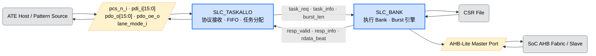
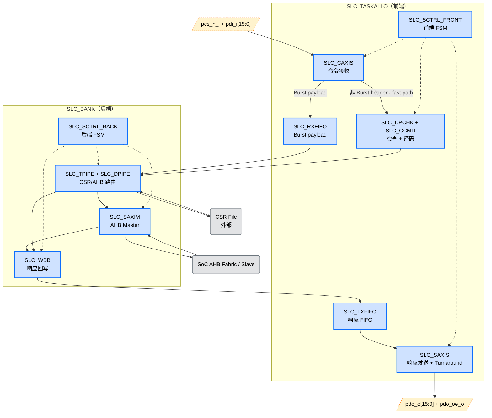
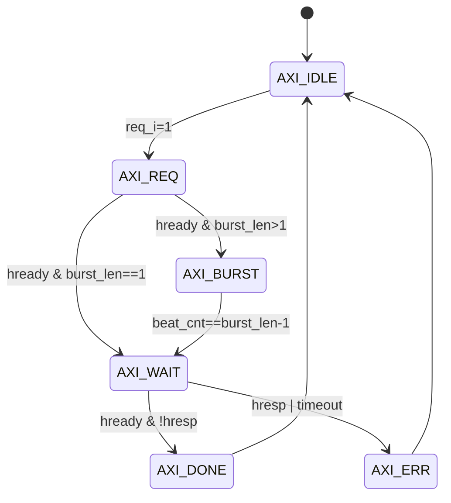
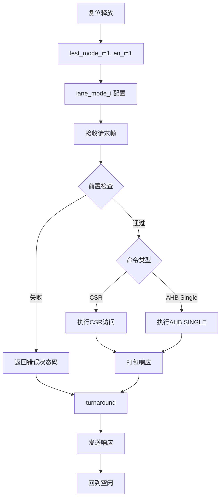
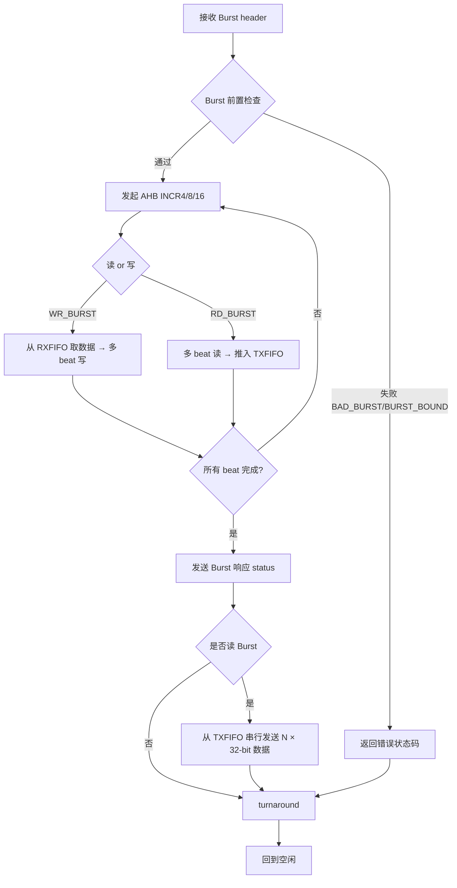
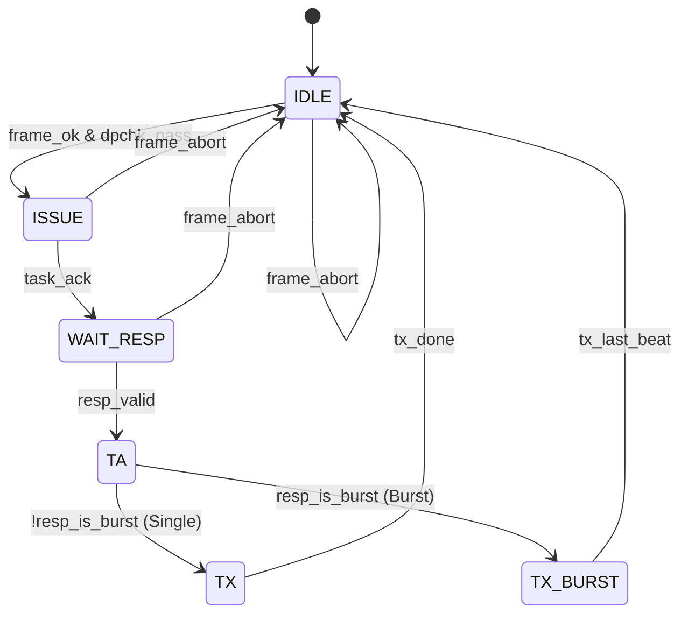
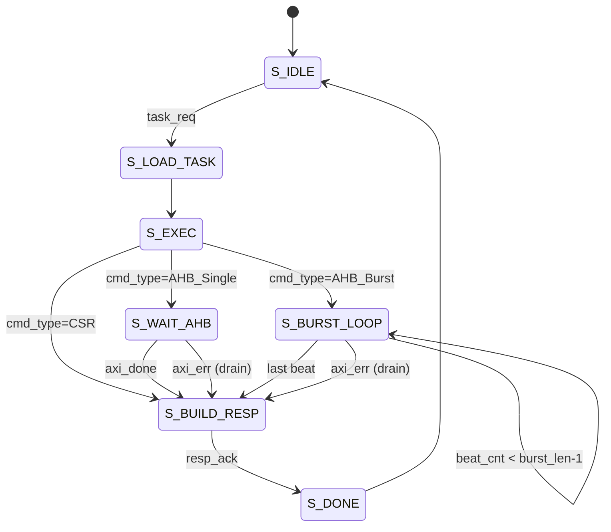

# APLC-Lite 逻辑规格说明书（LRS）

**模块名称**：APLC-Lite
**文档类型**：LRS（Logic Requirement Specification）
**版本**：v2.2
**适用阶段**：v2.2（Burst / 8-16 bit lane / FIFO 扩展版，CSR 状态/DFX 统计全量落地）

# 1. 引言

## 1.1 文档目的

本文档定义 APLC-Lite v2.2 的逻辑规格要求，描述模块在 SoC 中的功能定位、外部接口、行为规则、性能目标、异常处理及使用限制。
本文档用于指导以下工作：

- 模块逻辑设计
- RTL 开发
- 验证计划制定
- SoC 集成
- ATE 联调与测试软件开发

------

## 1.2 适用范围

本文档适用于 APLC-Lite 的 **v2.2 版本**，在 MVP（v1.0）基础上扩展到原始需求的全量特性，覆盖以下内容：

- 外部类 SPI 半双工测试接口
- `1-bit / 4-bit / 8-bit / 16-bit` 四种 lane mode
- CSR 读写访问（`WR_CSR / RD_CSR`）
- AHB-Lite Master 单次 32-bit 访问（`AHB_WR32 / AHB_RD32`）
- **AHB-Lite Master Burst 访问（`AHB_WR_BURST / AHB_RD_BURST`，支持 INCR4 / INCR8 / INCR16）**
- **内部 RX/TX FIFO 与空/满状态上报**
- 状态与错误返回（含 Burst 专有错误）
- 测试模式使能约束

本文档**不覆盖**以下高级特性：

- AXI4 / AXI4-Lite 后端（预留 `SLC_SAXIM` 替换点，v3.0 扩展）
- 异步时钟域
- 独立中断输出端口（IRQ）
- CRC / ECC / Parity 数据完整性校验
- Power island / Retention
- 多 outstanding 事务（单个 Burst 事务仍支持）

------

## 1.3 术语和缩略语

| 缩略语       | 全称                                  | 说明                         |
| ------------ | ------------------------------------- | ---------------------------- |
| APLC         | ATE Pattern Load Controller           | ATE 模式加载控制器           |
| ATE          | Automatic Test Equipment              | 自动测试设备                 |
| CSR          | Control and Status Register           | 控制/状态寄存器              |
| AHB          | AMBA High-performance Bus             | AMBA 高性能总线              |
| LRS          | Logic Requirement Specification       | 逻辑规格说明书               |
| Lane         | 数据并行位宽                          | 本模块 v2.1 支持 1/4/8/16-bit |
| Half-Duplex  | 半双工                                | 收发不同时进行               |
| Burst        | 连续拍传输                            | 多 beat 连续 AHB 访问        |
| NONSEQ/SEQ   | AHB-Lite `htrans` 编码                | 首拍 NONSEQ，后续 SEQ        |
| INCR4/8/16   | AHB-Lite 递增 Burst                   | beat 数 4/8/16，地址 +4      |
| FIFO         | First-In-First-Out                    | 同步 FIFO                    |
| beat         | Burst 中单次数据阶段                  | 1 beat = 32-bit WORD         |
| turnaround   | 方向切换空拍                          | 固定 1 cycle                 |

------

# 2. 模块概述

## 2.1 APLC.LRS.SUMM.01 功能概述

APLC-Lite 是一个面向测试模式的轻量级访问控制模块。
模块通过外部 ATE 数字 IO 接收命令帧，将命令解释为内部 CSR 访问或 AHB-Lite Master 单次/Burst 读写，并将执行结果回传给 ATE。

v2.1 在 MVP 基础上聚焦以下 8 项目标：

1. 打通外部测试链路；
2. 支持 `1-bit / 4-bit / 8-bit / 16-bit` 四种外部 lane 模式；
3. 支持 `WR_CSR / RD_CSR / AHB_WR32 / AHB_RD32` 基本命令；
4. 支持 AHB Burst 命令 `AHB_WR_BURST / AHB_RD_BURST`（INCR4/INCR8/INCR16）；
5. 支持半双工方向切换；
6. 支持协议错误、参数错误、AHB 错误、超时错误与 Burst 专有错误上报；
7. 提供内部 RX/TX FIFO 以匹配 ATE 与片内总线速率差，FIFO 空/满状态对外可见；
8. 频率 100 MHz，16-bit lane 下原始线速达到 200 MB/s 原始需求目标。

------

### 2.1.1 所处位置

APLC-Lite v2.1 位于 SoC 的测试接入边界，连接关系如下：



模块输入来自外部测试口，模块输出面向 SoC 内部 CSR File 或 AHB fabric。

------

### 2.1.2 应用场景

APLC-Lite v2.1 主要用于以下场景：

1. 产测阶段向芯片内部大批量装载测试 pattern（16-bit lane + Burst 下吞吐 ≈ 116~118 MB/s）；
2. 对内部寄存器做快速读写；
3. 对某些 memory-mapped 地址做单次或连续 N 拍读回验证；
4. 作为 function testing 的低成本访问入口；
5. 在 DPPM 改善目标下提供更强可观察性与可控性。

------

### 2.1.3 设计目标

APLC-Lite v2.1 的设计目标如下：

- 使用少量数字 IO 提供通用测试访问能力（16-bit lane 亦仅占用 22 个 IO：16 pdi + 16 pdo + pcs_n + pdo_oe + 2 lane_mode + en + test_mode）；
- 外部协议保持简单、规则、易于 ATE 生成；
- 内部支持 CSR/AHB 两种访问路径，AHB 路径支持 Single 与 Burst；
- 所有命令具备明确状态返回；
- 100 MHz 单时钟域实现，16-bit lane 下原始线速 200 MB/s；
- 逻辑简单、面积中小、便于快速集成和验证。

------

## 2.2 APLC.LRS.SUMM.02 模块数据概览

v2.1 数据路径分为 **5 段**：

1. **接收流**：ATE 通过 `pdi_i[15:0]` 在 `pcs_n_i=0` 期间输入命令帧；`SLC_CAXIS` 按 lane mode 收集 bit/nibble/byte/word 填入接收移位寄存器；Burst 写命令的 payload beat 写入 `SLC_RXFIFO`；
2. **解析流**：`SLC_DPCHK` 对帧完整性、opcode 合法性、test mode、地址对齐、burst 长度合法性、burst 地址边界进行检查；`SLC_CCMD` 把帧转换为统一任务描述符 `task_desc`（含 `burst_len`）；
3. **执行流**：CSR 命令直接访问内部 CSR file；AHB Single 通过 `SLC_SAXIM` 发起 `NONSEQ`；AHB Burst 通过 `SLC_SAXIM` 发起 `NONSEQ + SEQ×(N-1)`，配合 `INCR4/INCR8/INCR16`；
4. **回传流**：`SLC_WBB` 将每个 beat 的 `status_code` 与 `rdata` 打包写入 `SLC_TXFIFO`；
5. **发送流**：`SLC_SAXIS` 在 1-cycle turnaround 结束后从 `SLC_TXFIFO` 取数据驱动 `pdo_o`；Burst beat 间无 turnaround，连续输出。



v2.1 控制流仍为**串行单任务**执行（单个任务本身可为 Burst），不支持真正意义上的多命令并发。

------

# 3. 功能描述

## 3.1 APLC.LRS.FUNC.01 支持类 SPI 协议

模块对外提供类 SPI 的测试接口，满足以下要求：

- 使用 `pcs_n_i` 作为帧边界；
- 数据以时钟同步方式输入/输出；
- 支持 MSB-first；
- 协议为半双工；
- 请求阶段与响应阶段之间固定插入 1 个 turnaround 周期；
- Burst 模式下 beat 间无 turnaround，连续输出。

### 逻辑要求

- 当 `pcs_n_i` 拉低后，模块开始接收请求；
- 当 `pcs_n_i` 在请求未接收完成前拉高，应产生帧中止（`frame_abort`）；
- 当命令执行完成后，模块才允许输出响应；
- 输出阶段由 `pdo_oe_o` 指示方向切换；
- Burst 模式下，响应输出期间 `pdo_oe_o` 保持连续有效直至最后一个 beat 发送完成。

### 3.1.1 帧格式

每条命令的请求帧由 `opcode + 参数` 组成，MSB-first 发送。v2.1 支持 **6 类命令**：

| Opcode  | 命令            | 帧结构（MSB → LSB）                                               | Header 长度 (bit) | 总请求长度 (bit)              |
| ------- | --------------- | ------------------------------------------------------------------ | ----------------- | ----------------------------- |
| `8'h10` | `WR_CSR`        | `[opcode(8) \| reg_addr(8) \| wdata(32)]`                          | 48                | 48                            |
| `8'h11` | `RD_CSR`        | `[opcode(8) \| reg_addr(8)]`                                       | 16                | 16                            |
| `8'h20` | `AHB_WR32`      | `[opcode(8) \| addr(32) \| wdata(32)]`                             | 72                | 72                            |
| `8'h21` | `AHB_RD32`      | `[opcode(8) \| addr(32)]`                                          | 40                | 40                            |
| `8'h22` | `AHB_WR_BURST`  | `[opcode(8) \| burst_len(5) \| rsvd(3) \| addr(32) \| wdata×N(32·N)]` | 48                | `48 + 32·burst_len`           |
| `8'h23` | `AHB_RD_BURST`  | `[opcode(8) \| burst_len(5) \| rsvd(3) \| addr(32)]`               | 48                | 48                            |

**Burst header 格式**：`{opcode[7:0], burst_len[4:0], rsvd[2:0], addr[31:0]}` 共 48 bit。

**合法 `burst_len` 取值**：`1 / 4 / 8 / 16`。`burst_len=1` 在 RTL 退化为 `SINGLE`（见 §4.7），等价于 `AHB_WR32 / AHB_RD32`。

> **内部实现说明**：接收完成后模块执行左归一化（left-normalization），使 opcode 始终位于内部缓存的 `rx_shift_q[79:72]` 位置，简化后续解码。Burst payload 写数据通过 `SLC_RXFIFO` 与命令头解耦。

### 3.1.2 帧接收机制

v2.1 采用 **两阶段接收策略**：

1. 接收器使用 80-bit 移位寄存器 `rx_shift_q`，按 lane mode 每拍移入 1/4/8/16 bit；
2. 前 8 bit 完成后锁存 `opcode_latched_q`，据此确定初始 `expected_rx_bits` 为 header 长度；
3. 对 Burst 命令，在收满 16 bit（含 5-bit `burst_len`）后**重新修正** `expected_rx_bits` 为 `48 + 32·burst_len`（仅对 `AHB_WR_BURST`；`AHB_RD_BURST` 保持 48-bit）；
4. 当已接收位数 `next_count >= expected_rx_bits` 时，产生 `frame_valid`（寄存输出，延迟 1 cycle）；
5. Burst 写命令的 payload beat（每凑够 32 bit）直接写入 `SLC_RXFIFO`，不经过 `rx_shift_q`；
6. 若 `pcs_n_i` 在 `rx_count < expected_rx_bits` 时拉高且 opcode 已锁存，产生 `frame_abort`（寄存输出，延迟 1 cycle）；
7. 若 `pcs_n_i` 在 opcode 锁存前（接收不足 8 bit）拉高，接收状态静默复位，不产生 frame_abort。

内部接收阶段寄存器（v2.1 RTL 实现）：

- `rx_shift_q[79:0]`（header 缓冲）
- `rx_count_q[11:0]`（扩宽以容纳 Burst payload 长度，最大 `48 + 32·16 = 560` bit）
- `opcode_latched_q[7:0]`
- `burst_len_latched_q[4:0]`
- `expected_rx_bits_q[11:0]`
- `phase_q[1:0]`（IDLE / HEADER / PAYLOAD）

------

## 3.2 APLC.LRS.FUNC.02 支持 1 / 4 / 8 / 16-bit 通道

v2.1 支持 **4 种** lane mode：

| 模式  | `lane_mode_i` | 通道宽度 | 使用信号                              | 原始线速 @100MHz |
| ----- | ------------- | -------- | ------------------------------------- | ---------------- |
| Mode0 | `2'b00`       | 1-bit    | `pdi_i[0]` / `pdo_o[0]`               | 12.5 MB/s        |
| Mode1 | `2'b01`       | 4-bit    | `pdi_i[3:0]` / `pdo_o[3:0]`           | 50 MB/s          |
| Mode2 | `2'b10`       | 8-bit    | `pdi_i[7:0]` / `pdo_o[7:0]`           | 100 MB/s         |
| Mode3 | `2'b11`       | 16-bit   | `pdi_i[15:0]` / `pdo_o[15:0]`         | **200 MB/s**     |

### 逻辑要求

- `lane_mode_i=2'b00` 时，`pdi_i[15:1]` 应忽略，`pdo_o[15:1]` 应驱动为 0；
- `lane_mode_i=2'b01/2'b10/2'b11` 时，相应低位区段有效；
- lane mode 由顶层输入端口 `lane_mode_i` 配置，非内部 CSR 寄存器；
- 当前事务执行期间不允许动态切换 lane mode 生效。

### 3.2.1 Lane Mode 切换约束

- **事务边界定义**：`pcs_n_i=0` 的整个持续期间为事务执行期间，包括 RX、处理、turnaround、TX 全过程。
- **RTL 实际行为**：`lane_mode_i` 在接收器（`SLC_CAXIS`）和发送器（`SLC_SAXIS`）中被**连续组合采样**，用于计算每拍移位宽度 `bpc`（bits per clock）。事务中间切换 `lane_mode_i` 会导致移位寄存器步进宽度立即改变，造成帧数据错位。
- **约束要求**：集成方必须保证 `lane_mode_i` 在 `pcs_n_i=0` 期间保持稳定。
- **违反后果**：帧数据损坏，可能产生不可预测的 opcode 值，进而触发 `STS_BAD_OPCODE` 或 `STS_FRAME_ERR` 等错误。模块不检测此违规行为。

```wavedrom
{ "config": { "hscale": 2 },
  "signal": [
    { "name": "clk",              "wave": "p............." },
    { "name": "pcs_n_i",          "wave": "10............" },
    { "name": "lane_mode_i[1:0]", "wave": "=......=......", "data": ["2'b11 (16-bit)","2'b10 (8-bit) ⚠"] },
    { "name": "pdi_i[15:0]",      "wave": "x======x......", "data": ["W0","W1","W2","W3","??","??"] },
    { "name": "rx_shift_en",      "wave": "01...........0" },
    { "name": "rx_count[5:0]",    "wave": "==.===.=......", "data": ["0","16","32","48","56(8b step)","64"] },
    { "name": "frame_valid",      "wave": "0............." },
    { "name": "chk_err_code",     "wave": "x.........=...", "data": ["BAD_OPCODE / FRAME_ERR"] }
  ]
}
```

关键节点：
- cycle 1：`pcs_n_i` 拉低，模块开始按 16-bit lane 接收（`lane_mode_i = 2'b11`）
- cycle 1–4：`rx_count` 按 16/cycle 步进 → 0/16/32/48
- cycle 7：集成方违规切换 `lane_mode_i` → 8-bit，`rx_count` 步进退化为 8/cycle
- cycle 8 之后：实际接收数据已损坏，下游 opcode 译码与帧长检查失配
- cycle 10：触发 `STS_BAD_OPCODE` 或 `STS_FRAME_ERR`，模块**不主动检测此违规**（依赖结果错误暴露）

### 3.2.2 各 lane 模式吞吐对照

| lane mode | 原始线速   | `AHB_RD_BURST×16` 有效吞吐 | `AHB_WR_BURST×16` 有效吞吐 |
| --------- | ---------- | -------------------------- | -------------------------- |
| 1-bit     | 12.5 MB/s  | ≈ 7.5 MB/s                 | ≈ 7.5 MB/s                 |
| 4-bit     | 50 MB/s    | ≈ 30 MB/s                  | ≈ 30 MB/s                  |
| 8-bit     | 100 MB/s   | ≈ 60 MB/s                  | ≈ 60 MB/s                  |
| 16-bit    | 200 MB/s   | **≈ 118 MB/s**             | **≈ 116 MB/s**             |

详见 §5.4 吞吐量章节。

------

## 3.3 APLC.LRS.FUNC.03 支持 CSR/AHB 单次与 Burst 访问

v2.1 在 MVP 4 个 opcode 基础上扩展 2 个 Burst opcode：

### 3.3.1 Opcode 一览

| Opcode  | 名称             | 类型             | Burst 长度 | 响应长度 (bit)           |
| ------- | ---------------- | ---------------- | ---------- | ------------------------ |
| `8'h10` | `WR_CSR`         | CSR 写           | —          | 8                        |
| `8'h11` | `RD_CSR`         | CSR 读           | —          | 40                       |
| `8'h20` | `AHB_WR32`       | AHB 单次写       | 1          | 8                        |
| `8'h21` | `AHB_RD32`       | AHB 单次读       | 1          | 40                       |
| `8'h22` | `AHB_WR_BURST`   | AHB Burst 写     | 4 / 8 / 16 | 8                        |
| `8'h23` | `AHB_RD_BURST`   | AHB Burst 读     | 4 / 8 / 16 | `8 + 32·burst_len`       |

### 3.3.2 burst_len → hburst 映射

| `burst_len` | `hburst_o[2:0]` | AHB 语义     |
| ----------- | --------------- | ------------ |
| `5'd1`      | `3'b000`        | `SINGLE`     |
| `5'd4`      | `3'b011`        | `INCR4`      |
| `5'd8`      | `3'b101`        | `INCR8`      |
| `5'd16`     | `3'b111`        | `INCR16`     |

非法 `burst_len`（不在 {1,4,8,16} 中）由 `SLC_DPCHK` 前置检查拒绝，返回 `STS_BAD_BURST (0x80)`，不发起任何 AHB 事务。

### 3.3.3 Burst 地址与 1KB 边界限制

依据 AHB-Lite 规范，**Burst 事务地址不得跨 1KB 边界**：

- 判定条件：`addr[9:0] + 4·(burst_len - 1) >= 1024` 则违规；
- 违规返回：`STS_BURST_BOUND (0x81)`；
- 该检查由 `SLC_DPCHK` 在前置阶段完成，不发起任何 AHB 事务。

### 3.3.4 逻辑要求

- CSR 访问通过 `csr_rd_en_o / csr_wr_en_o / csr_addr_o / csr_wdata_o / csr_rdata_i` 接口传递至外部 CSR File；
- CSR 有效地址范围为 `0x00 ~ 0x3F`，超出范围返回 `STS_BAD_REG`；
- AHB 访问固定为 32-bit 对齐、WORD 宽度（`hsize=3'b010`）；
- 不支持 byte / halfword 访问；
- 不支持 WRAP Burst；仅支持 `INCR4 / INCR8 / INCR16`；
- Burst 地址每拍自增 4（WORD）；
- 非法地址、非法参数或非法 burst_len 必须返回错误码，不得发起错误的 AHB 访问。

------

## 3.4 APLC.LRS.FUNC.04 支持状态与错误返回

每条命令必须返回状态码。读命令还应返回数据；Burst 读命令返回 N 个 beat 的数据。

### 3.4.1 响应格式

| 命令类型         | 响应内容                                          | 响应长度 (bit)       |
| ---------------- | ------------------------------------------------- | -------------------- |
| 写类命令         | `STATUS[7:0]`                                     | 8                    |
| Single 读命令    | `STATUS[7:0] + RDATA[31:0]`                       | 40                   |
| Burst 读命令     | `STATUS[7:0] + RDATA[31:0] × burst_len`           | `8 + 32·burst_len`   |

响应帧位域图：

```
写命令响应:         [status(8)]                            = 8 bits，MSB-first
Single 读命令响应:  [status(8) | rdata(32)]                = 40 bits，MSB-first
Burst 读命令响应:   [status(8) | rdata[0](32) | ... | rdata[N-1](32)] = 8+32·N bits，MSB-first
```

Burst 读响应中，beat 之间无 turnaround，连续输出。

### 3.4.2 状态码定义

v2.1 状态码在 MVP 6 个 power-of-2 编码基础上扩展 2 个 Burst 专有编码（非 one-hot）：

| 状态码    | RTL 名称             | 类别       | 含义                                                        |
| --------- | -------------------- | ---------- | ----------------------------------------------------------- |
| `8'h00`   | `STS_OK`             | 成功       | 成功                                                        |
| `8'h01`   | `STS_FRAME_ERR`      | 协议/帧    | 帧错误（`pcs_n_i` 提前释放导致帧长不足）                    |
| `8'h02`   | `STS_BAD_OPCODE`     | 参数/命令  | 非法 Opcode（不在 0x10/0x11/0x20/0x21/0x22/0x23 中）        |
| `8'h04`   | `STS_NOT_IN_TEST`    | 参数/命令  | 非测试模式（`test_mode_i=0`）                               |
| `8'h08`   | `STS_DISABLED`       | 参数/命令  | 模块未使能（`en_i=0`）                                      |
| `8'h10`   | `STS_BAD_REG`        | 参数/命令  | 非法 CSR 地址（`reg_addr >= 0x40`）                         |
| `8'h20`   | `STS_ALIGN_ERR`      | 参数/命令  | AHB 地址未 4-byte 对齐（`addr[1:0] != 0`）                  |
| `8'h40`   | `STS_AHB_ERR`        | AHB 总线   | AHB 总线异常（`hresp_i=1` 或 `hready_i` 等待超时）          |
| `8'h80`   | `STS_BAD_BURST`      | 参数/命令  | 非法 `burst_len`（不在 {1,4,8,16} 中）                      |
| `8'h81`   | `STS_BURST_BOUND`    | 参数/命令  | Burst 地址跨 1KB 边界（违反 AHB INCR 限制）                 |

> **说明**：
> - `STS_AHB_ERR (0x40)` 对 AHB 错误响应（`hresp_i=1`）和 AHB 超时两种情况不做区分；
> - `STS_BAD_BURST (0x80)` 和 `STS_BURST_BOUND (0x81)` 为 v2.1 新增，非 power-of-2 编码，用于区分 Burst 相关的两类参数错误；
> - 每次仅报告一个状态码（参见 §3.4.3 错误优先级）。

<!-- > **⚠ RTL 一致性备注（v2.0 km2.5 RTL）**：
> 当前 RTL（`SLC_DPCHK.sv:35-36`）使用的 Burst 错误编码与本 LRS 不一致：
> | 状态名 | LRS v2.1（本表） | RTL v2.0 km2.5 实际 |
> | ------ | ---------------- | -------------------- |
> | `STS_BAD_BURST` | `0x80` | `8'h40` |
> | `STS_BURST_BOUND` | `0x81` | `STS_BURST_BOUNDARY = 8'h80`（含命名差异） |
>
> **冲突风险**：RTL 中 `STS_BAD_BURST = 0x40` 与 `STS_AHB_ERR = 0x40`（`SLC_DPIPE.sv:47`）**同值冲突**，会导致响应字节无法区分参数错误与总线错误。
> **实现决策（已采纳）**：以本 LRS 为权威源，修正 RTL 编码至 `STS_BAD_BURST = 8'h80` / `STS_BURST_BOUND = 8'h81`，恢复编码独立性。详见 `~/TBUS/APLC LRS v2.1 Self-Check Report.md` §8。 -->

### 3.4.3 错误优先级

当多个前置错误条件同时成立时，模块按以下固定优先级仅报告最高优先级错误（if-else 链实现）：

```
STS_FRAME_ERR (0x01)  ← 最高优先级
  > STS_BAD_OPCODE (0x02)
    > STS_NOT_IN_TEST (0x04)
      > STS_DISABLED (0x08)
        > STS_BAD_REG (0x10)
          > STS_ALIGN_ERR (0x20)
            > STS_BAD_BURST (0x80)
              > STS_BURST_BOUND (0x81)  ← 最低优先级
```

`STS_AHB_ERR (0x40)` 不在上述优先级链中 —— AHB 错误仅在所有前置检查通过后、AHB 事务实际执行期间才可能发生，与前置错误互斥。

### 3.4.4 状态码生成过程

1. 帧接收完成后，前端协议检查器（`SLC_DPCHK`）对 `frame_valid` / `frame_abort` / `opcode` / `test_mode_i` / `en_i` / `reg_addr` / `addr[1:0]` / `burst_len` / `addr[9:0] + 4·(burst_len-1)` 进行组合逻辑检查，按优先级链输出 `chk_err_code`；
2. 若检查通过（`chk_pass=1`），任务进入后端执行；
3. 后端执行 CSR 或 AHB 访问：CSR 操作始终返回 `STS_OK`；AHB 操作根据 `hresp_i` 和超时返回 `STS_OK` 或 `STS_AHB_ERR`；
4. Burst 模式下，任何一个 beat 上 `hresp_i=1` 立即中止 burst，进入 `AXI_ERR` 状态，上报 `STS_AHB_ERR`；
5. 最终状态码通过响应帧首字节（8-bit status byte）返回给 ATE。

------

## 3.5 APLC.LRS.FUNC.05 内部 FIFO 与流控

v2.1 新增两个同步 FIFO，用于吸收 ATE 接口与片内总线之间的速率差：

### 3.5.1 FIFO 定义

| FIFO             | 宽度 × 深度     | 用途                                                 |
| ---------------- | --------------- | ---------------------------------------------------- |
| `SLC_RXFIFO`     | 32-bit × 32     | 缓冲 Burst 写命令的 payload beat                     |
| `SLC_TXFIFO`     | 33-bit × 32     | 缓冲 Burst 读命令返回的数据 beat（32b rdata + 1b last）|

### 3.5.2 FIFO 特性

- 均为同步 FIFO，与 `clk_i` 同域，复位清空；
- 深度参数化（默认 32，参数 `FIFO_DEPTH`）；
- 提供 `empty` / `full` / `almost_full` 指示；
- `SLC_RXFIFO` 空/满状态引出顶层 `rxfifo_empty_o / rxfifo_full_o`；
- `SLC_TXFIFO` 空/满状态引出顶层 `txfifo_empty_o / txfifo_full_o`；
- 非 Burst 命令的命令头不经 FIFO，走 fast path 直达译码器。

### 3.5.3 流控策略

- **RX 反压**：`SLC_RXFIFO` full 时，`SLC_CAXIS` 在 PAYLOAD 阶段暂停接收（不更新 `rx_shift_q`），等待 FIFO 有空间后续接；集成方可由 ATE 感知 `rxfifo_full_o` 做节流；
- **TX 预取**：`SLC_SAXIS` 在 Burst 读响应阶段开始后从 `SLC_TXFIFO` 流式取数据；若 `SLC_TXFIFO` empty，`SLC_SAXIS` 暂停移位（`pdo_oe_o` 保持有效，数据暂停前进）直至下一 beat 到达；
- **深度选择原则**：默认 32 entries 足以覆盖 `burst_len=16` 场景（16 beat）+ 冗余，可通过 `FIFO_DEPTH` 参数调整。

> **反压 vs Error 上报选择说明**：v2.1 选择**反压机制**（`rxfifo_full_o` / `txfifo_empty_o` 端口持续暴露）而非 Slave Error / 中断上报，理由：
> 1. APLC-Lite 对外接口为类 SPI（非 AHB Slave），无 Slave Error 通道；
> 2. v2.1 不实现独立中断输出端口（§9.1）；
> 3. 主机（ATE）应主动监听 `rxfifo_full_o` 节流串行时钟、监听 `txfifo_empty_o` 调整消费速率；
> 4. 协议层无法检测主机违规（如 `rxfifo_full_o=1` 期间继续推送），数据丢失由主机自负。
> 后续 v3.x 引入 IRQ 后可扩展 `RXFIFO_OVF` / `TXFIFO_UDF` sticky 位 + 中断上报。

> **TXFIFO empty 时 ATE 可见行为**：`SLC_SAXIS` 在 `TX_BURST` 阶段遇到 `txfifo_empty_o=1`：
> - `pdo_oe_o` **保持高电平**（不主动释放总线方向）；
> - `pdo_o[15:0]` 保持上一拍数据值（非 HiZ）；
> - 等待 `SLC_TXFIFO` 收到下一 beat 后立即恢复移位。
> ATE 可通过 `txfifo_empty_o` 端口预判是否进入 stall，并适配采样时刻；不会出现"假 valid"语义。

```wavedrom
{ "config": { "hscale": 2 },
  "signal": [
    { "name": "clk",              "wave": "p..........." },
    { "name": "pcs_n_i",          "wave": "0..........." },
    { "name": "pdi_i[15:0]",      "wave": "===...===...", "data": ["W30","W31","W32","W33","W34","W35"] },
    { "name": "rx_shift_en",      "wave": "1..0..1....0" },
    { "name": "rxfifo_wr_en",     "wave": "1..0..1.0..." },
    { "name": "rxfifo_full_o",    "wave": "0.1...0....." },
    { "name": "rxfifo_rd_en",     "wave": "0....10....." },
    { "name": "rxfifo_cnt[5:0]",  "wave": "==.=..=.=...", "data": ["30","31","32","31","32"] }
  ]
}
```

关键节点：
- cycle 0–2：`SLC_CAXIS` 持续推数据进 `SLC_RXFIFO`，`rxfifo_cnt` 增至 32
- cycle 2：`rxfifo_full_o` 拉高（FIFO 满），`SLC_CAXIS` 主动暂停 `rx_shift_en` 与 `rxfifo_wr_en`
- cycle 5：后端 `BURST_LOOP` 通过 `rxfifo_rd_en` drain 出一拍 → `cnt` 降至 31
- cycle 6：`rxfifo_full_o` 清零，`SLC_CAXIS` 恢复接收 W33/W34
- 主机侧约束：必须在 `rxfifo_full_o=1` 期间停止串行时钟驱动，否则 W32 之后的数据丢失

------

# 4. 接口描述

## 4.1 APLC.LRS.INTF.01 参数定义

| 参数名               | 默认值 | 说明                                                   |
| -------------------- | ------ | ------------------------------------------------------ |
| `IO_MAX_W`           | 16     | 外部最大数据宽度（v2.1 扩展至 16）                     |
| `ADDR_W`             | 32     | 地址宽度                                               |
| `DATA_W`             | 32     | 数据宽度                                               |
| `BUS_TIMEOUT_CYCLES` | 256    | AHB 单 beat 超时周期数（9-bit 计数器）                 |
| `CSR_ADDR_MAX`       | `0x3F` | CSR 有效地址上界（`reg_addr < 0x40`）                  |
| `FIFO_DEPTH`         | 32     | RX/TX FIFO 深度（同步寄存器实现）                      |
| `BURST_LEN_MAX`      | 16     | 单事务最大 beat 数（对应 AHB `INCR16`）                |

> **超时计数器说明**：计数器 9-bit 宽，在 AHB 等待态（`STATE_WAIT`）每拍递增，从 0 计数至 `BUS_TIMEOUT_CYCLES-1`（默认 255）时触发超时。Burst 模式下，每个 beat 独立计数（任一 beat 超时即中止 burst）。

------

## 4.2 APLC.LRS.INTF.02 外部测试 IO 接口

### 4.2.1 外部测试 IO 信号

| 接口             | 位宽 | 方向 | 描述                             |
| ---------------- | ---- | ---- | -------------------------------- |
| `pcs_n_i`        | 1    | I    | 片选信号，低有效。拉低开启一次事务（帧接收→执行→响应发送），拉高标志事务结束。空闲态保持高电平 |
| `pdi_i`          | 16   | I    | 并行数据输入。`pcs_n_i=0` 请求阶段由 ATE 主机在每个 `clk_i` 上升沿驱动。各 lane mode 分别使用低 `1/4/8/16` 位，MSB-first |
| `pdo_o`          | 16   | O    | 并行数据输出。响应阶段（`pdo_oe_o=1`）模块在每个 `clk_i` 上升沿驱动。非发送期间输出值无意义 |
| `pdo_oe_o`       | 1    | O    | 输出使能，高有效。仅在前端 FSM TX / TX_BURST 态为 1。集成方据此控制 IO pad 三态方向 |
| `rxfifo_empty_o` | 1    | O    | RX FIFO 空状态指示                                   |
| `rxfifo_full_o`  | 1    | O    | RX FIFO 满状态指示                                   |
| `txfifo_empty_o` | 1    | O    | TX FIFO 空状态指示                                   |
| `txfifo_full_o`  | 1    | O    | TX FIFO 满状态指示                                   |

### 4.2.2 控制端口信号

| 接口          | 位宽 | 方向 | 描述                             |
| ------------- | ---- | ---- | -------------------------------- |
| `en_i`        | 1    | I    | 模块使能，高有效。`en_i=0` 时所有命令被前置检查拒绝，返回 `STS_DISABLED (0x08)`，不发起任何 CSR/AHB 访问。由 SoC 集成方硬件端口提供，非 CSR 可配 |
| `lane_mode_i` | 2    | I    | 通道模式选择。`2'b00`=1-bit，`2'b01`=4-bit，`2'b10`=8-bit，`2'b11`=16-bit。在接收器/发送器中被连续组合采样，事务期间（`pcs_n_i=0`）必须保持稳定 |
| `test_mode_i` | 1    | I    | 测试模式使能，高有效。`test_mode_i=0` 时所有命令被前置检查拒绝，返回 `STS_NOT_IN_TEST (0x04)`。在 `frame_valid` 时刻被采样 |

### 4.2.3 接口要求

- `pcs_n_i=1` 表示空闲；
- 请求阶段由主机驱动 `pdi_i`；
- 响应阶段由模块驱动 `pdo_o`；
- 半双工条件下，主机和模块不得同时驱动数据方向；
- `en_i`、`lane_mode_i`、`test_mode_i` 由 SoC 集成方通过硬件端口提供，非 CSR 可配置；
- FIFO 状态信号为连续有效（组合输出），便于 ATE 或 SoC 观察。

------

## 4.3 APLC.LRS.INTF.03 时钟复位

| 接口      | 位宽 | 方向 | 描述       |
| --------- | ---- | ---- | ---------- |
| `clk_i`   | 1    | I    | 主时钟。所有内部逻辑在上升沿同步。目标频率 100 MHz。模块单时钟域设计，AHB 侧与协议侧共用此时钟 |
| `rst_n_i` | 1    | I    | 异步复位，低有效。下降沿立即触发复位，释放需与 `clk_i` 上升沿同步。复位后所有 FSM 回 IDLE，所有输出 deassert |

### 时钟复位要求

- 模块采用单时钟域，所有逻辑在 `clk_i` 上升沿同步；
- `rst_n_i` 异步有效（下降沿触发复位），同步释放；
- 复位后所有内部状态机回到 IDLE 态；
- 复位后所有输出 deassert：`pdo_oe_o=0`、`htrans_o=IDLE`、`csr_rd_en_o=0`、`csr_wr_en_o=0`、`pdo_o=16'b0`；
- 复位后 RX/TX FIFO 清空，`rxfifo_empty_o=1`、`txfifo_empty_o=1`；
- 复位不影响 `en_i`、`lane_mode_i`、`test_mode_i` 等外部输入端口（由集成方控制）。

```wavedrom
{ "config": { "hscale": 2 },
  "signal": [
    { "name": "clk",              "wave": "p..........." },
    { "name": "rst_n_i",          "wave": "10....1....." },
    { "name": "front_state",      "wave": "x.=.....=...", "data": ["IDLE","IDLE"] },
    { "name": "back_state",       "wave": "x.=.....=...", "data": ["S_IDLE","S_IDLE"] },
    { "name": "axi_state",        "wave": "x.=.....=...", "data": ["AXI_IDLE","AXI_IDLE"] },
    { "name": "pdo_oe_o",         "wave": "x.0........." },
    { "name": "htrans_o[1:0]",    "wave": "x.=.........", "data": ["IDLE"] },
    { "name": "hburst_o[2:0]",    "wave": "x.=.........", "data": ["SINGLE"] },
    { "name": "haddr_o[31:0]",    "wave": "x.=.........", "data": ["32'h0"] },
    { "name": "rxfifo_empty_o",   "wave": "x.1........." },
    { "name": "txfifo_empty_o",   "wave": "x.1........." }
  ]
}
```

关键节点：
- cycle 0：`rst_n_i` 异步拉低（来自集成方复位树），所有 flop 立即异步清零
- cycle 1：FSM 状态强制为 `IDLE/S_IDLE/AXI_IDLE`，`pdo_oe_o=0`，AHB 输出复位为空闲值
- cycle 1：RX/TX FIFO 计数器清零 → `rxfifo_empty_o = txfifo_empty_o = 1`
- cycle 6：`rst_n_i` **同步释放**（与 `clk` 上升沿对齐，由集成方复位同步器保证），模块进入正常工作态
- 复位**不影响** `en_i / lane_mode_i / test_mode_i`（外部端口由集成方控制）

------

## 4.4 APLC.LRS.INTF.04 控制信号

### 外部控制信号

| 信号          | 来源 | 方向 | 说明                                     |
| ------------- | ---- | ---- | ---------------------------------------- |
| `pcs_n_i`     | ATE  | In   | 事务边界，低有效开启事务                 |
| `test_mode_i` | SoC  | In   | 测试模式控制，`=0` 时所有命令被拒绝      |
| `en_i`        | SoC  | In   | 模块使能，`=0` 时所有命令被拒绝          |
| `lane_mode_i` | SoC  | In   | 通道模式配置（2-bit，4 档）              |

> **注意**：`en_i`、`lane_mode_i`、`test_mode_i` 均为顶层输入端口，由 SoC 集成方在硬件层面提供，作为权威配置源；`CTRL` 寄存器（§4.6.3）在复位后镜像端口初值供软件读回，端口运行期变化由 `CTRL` 跟踪。

------

## 4.5 APLC.LRS.INTF.05 状态信号

### STATUS / LAST_ERR 寄存器位域

| 寄存器位         | 名称           | 含义                                 |
| ---------------- | -------------- | ------------------------------------ |
| `STATUS[0]`      | `BUSY`         | 当前有事务执行                       |
| `STATUS[1]`      | `RESP_VALID`   | 最近响应有效                         |
| `STATUS[2]`      | `CMD_ERR`      | 命令错误（sticky）                   |
| `STATUS[3]`      | `BUS_ERR`      | 总线错误（sticky）                   |
| `STATUS[4]`      | `FRAME_ERR`    | 帧错误（sticky）                     |
| `STATUS[5]`      | `IN_TEST_MODE` | 镜像 `test_mode_i`                   |
| `STATUS[6]`      | `OUT_EN`       | 镜像 `pdo_oe_o`                      |
| `STATUS[7]`      | `BURST_ERR`    | Burst 专有错误（sticky）             |
| `LAST_ERR[7:0]`  | `ERR_CODE`     | 最近失败错误码                       |

### 状态报告路径

- **FIFO 状态**：通过 `rxfifo_empty/full_o`、`txfifo_empty/full_o` 四个端口持续输出；
- **响应帧状态码**：每条命令执行完毕后通过响应帧返回的 8-bit 值（§3.4），为一次性非持久化信号；
- **STATUS / LAST_ERR 寄存器**：由外部 CSR File 实现持久化位域，硬件每拍 / 每事务更新；sticky 位由软件通过 WC（写 1 清零）语义清除。

------

## 4.6 APLC.LRS.INTF.06 CSR 接口

### 4.6.1 CSR 接口信号

APLC-Lite 通过以下信号与外部 CSR File 交互：

| 接口          | 位宽 | 方向 | 描述         |
| ------------- | ---- | ---- | ------------ |
| `csr_rd_en_o` | 1    | O    | CSR 读使能，脉冲 1 cycle，指示外部 CSR File 在下一 clk 上将读数据稳定在 `csr_rdata_i` |
| `csr_wr_en_o` | 1    | O    | CSR 写使能，脉冲 1 cycle，外部 CSR File 在该周期采样 `csr_addr_o` 与 `csr_wdata_o` 完成写入 |
| `csr_addr_o`  | 8    | O    | CSR 读写地址。有效范围 `0x00 ~ 0x3F`；超出范围在前置检查阶段拒绝，不出现在此接口 |
| `csr_wdata_o` | 32   | O    | CSR 写数据。`csr_wr_en_o=1` 时有效 |
| `csr_rdata_i` | 32   | I    | CSR 读返回数据。外部 CSR File 在 `csr_rd_en_o` 脉冲后的下一 clk 驱动，模块在该 clk 采样（1 cycle 读延迟） |

### 4.6.2 CSR 接口时序要求

- `csr_wr_en_o` 脉冲持续 1 个时钟周期，`csr_addr_o` / `csr_wdata_o` 在同一周期有效；
- `csr_rd_en_o` 脉冲持续 1 个时钟周期，外部 CSR File 应在**下一个时钟周期**将读数据稳定在 `csr_rdata_i`（1 cycle 读延迟）；
- CSR 有效地址范围为 `0x00 ~ 0x3F`；`reg_addr >= 0x40` 的请求在前置检查阶段即被拒绝（返回 `STS_BAD_REG`）。

### 4.6.3 CSR 地址映射（架构定义，由外部 CSR File 实现）

| 地址   | 名称        | 属性 | 配置时机 | 说明       |
| ------ | ----------- | ---- | -------- | ---------- |
| `0x00` | `VERSION`   | RO   | 静态     | 版本寄存器，编译期固化常量 |
| `0x04` | `CTRL`      | RW   | 静态     | 控制寄存器，复位后镜像 `en_i / lane_mode_i / test_mode_i` 端口初值；端口为权威源，CTRL 供软件读回 |
| `0x08` | `STATUS`    | RO   | 动态     | 状态寄存器，硬件每拍 / 每事务更新（位域见 §4.5） |
| `0x0C` | `LAST_ERR`  | RO   | 动态     | 最近错误码，硬件在错误发生时 sticky 更新（WC 清除） |
| `0x10` | `BURST_CNT` | WC   | 动态     | Burst 事务计数（DFX 统计项，写 1 清零） |

> **配置时机说明**：静态 = 启动后不再改变（复位值 / bootup 配置）；半静态 = 仅在模块空闲态切换；动态 = 运行期硬件持续更新。本模块无半静态寄存器。

> **排布说明**：本模块含 1 个 RW（CTRL）+ 1 个 WC（BURST_CNT）+ 3 个 RO（VERSION / STATUS / LAST_ERR），按功能聚合（标识 / 控制 / 状态 / 错误 / 统计）排列便于阅读。**地址段 `0x14~0x1F` 预留**用于 v3.x 扩展（IRQ_STATUS / IRQ_MASK / FIFO_OVF_CNT / STATUS_FSM 等）。

```wavedrom
{ "config": { "hscale": 2 },
  "signal": [
    { "name": "clk",              "wave": "p..........." },
    { "name": "csr_wr_en_o",      "wave": "010........." },
    { "name": "csr_rd_en_o",      "wave": "0.....10...." },
    { "name": "csr_addr_o[7:0]",  "wave": "x=...x=....x", "data": ["0x04","0x08"] },
    { "name": "csr_wdata_o[31:0]","wave": "x=...x......", "data": ["WD"] },
    { "name": "csr_rdata_i[31:0]","wave": "x......=...x", "data": ["RD@0x08"] }
  ]
}
```

关键节点：
- cycle 1：`csr_wr_en_o` 单 cycle 脉冲，外部 CSR File 在该上升沿采样 `csr_addr_o / csr_wdata_o` 完成写入
- cycle 6：`csr_rd_en_o` 单 cycle 脉冲，外部 CSR File 在下一拍（cycle 7）输出有效 `csr_rdata_i`
- **关键时序约束**：`csr_rdata_i` 需在 `csr_rd_en_o` 拉高后**下一拍** valid，本模块不支持多 cycle 等待
- 集成方需保证外部 CSR File 实现为同步寄存器（`always_ff @(posedge clk)`），不能是组合逻辑

------

## 4.7 APLC.LRS.INTF.07 AHB Master 接口

| 接口       | 位宽 | 方向 | 描述             |
| ---------- | ---- | ---- | ---------------- |
| `haddr_o`  | 32   | O    | AHB 地址。地址相（`htrans_o=NONSEQ/SEQ`）驱动目标地址，必须 4-byte 对齐（`haddr_o[1:0]=2'b00`）。Burst 内每拍 +4 |
| `hwrite_o` | 1    | O    | 读写标志。1=写，0=读。整个 burst 期间保持不变 |
| `htrans_o` | 2    | O    | 传输类型。v2.1 使用 `2'b00`(IDLE) / `2'b10`(NONSEQ) / `2'b11`(SEQ) 三种 |
| `hsize_o`  | 3    | O    | 传输大小。固定 `3'b010`（32-bit / WORD） |
| `hburst_o` | 3    | O    | 突发类型。v2.1 支持 `SINGLE`(`3'b000`) / `INCR4`(`3'b011`) / `INCR8`(`3'b101`) / `INCR16`(`3'b111`)。burst 期间保持稳定 |
| `hwdata_o` | 32   | O    | 写数据。写操作时数据相（地址相下一拍）有效；Burst 写每拍驱动当前 beat 数据 |
| `hrdata_i` | 32   | I    | 读返回数据。读操作从机在 `hready_i=1` 数据相驱动；Burst 读每拍采样 |
| `hready_i` | 1    | I    | 传输完成指示。从机拉高表示当前 beat 完成或可接收；持续 0 表示等待，超过 256 cycle 触发超时 |
| `hresp_i`  | 1    | I    | 错误响应。从机拉高表示出错，模块产生 `STS_AHB_ERR`。Burst 内任一 beat 报错即中止整个 burst |

### 4.7.1 AHB 要求

- 支持 `SINGLE` 与 `INCR4 / INCR8 / INCR16` Burst；
- 地址必须 4-byte 对齐（`addr[1:0]==2'b00`）；
- Burst 地址不得跨 1KB 边界（由 `SLC_DPCHK` 前置检查保证，见 §3.3.3）；
- `hsize_o` 固定 `WORD`（`3'b010`）；
- 模块不支持真正 outstanding（但单个事务可为 Burst）；
- 当前事务完成前，不得发起下一笔 AHB 请求；
- `htrans_o=NONSEQ` 仅在 burst 首拍驱动 1 cycle，其余 beat 为 SEQ，burst 结束后回 IDLE。

### 4.7.2 AHB 不支持的行为

- 不支持 WRAP Burst；
- 不支持 byte / halfword 访问；
- 不支持 BUSY 传输类型；
- 不支持 lock / exclusive 访问；
- 以上不支持行为不在 RTL 中编码。

### 4.7.3 无效地址与 DECERR 处理边界

- **CSR 侧（非总线通路）**：`reg_addr >= 0x40` 的访问在前置检查阶段即被拒绝，返回 `STS_BAD_REG (0x10)`，不发起 CSR 接口握手，**不产生任何总线错误**。
- **AHB 侧（总线通路）**：APLC-Lite 作为 Master **不做无效地址判决**，仅做 4-byte 对齐与 Burst 边界检查；对齐合法的地址是否落在有效 memory map 内由 SoC AHB 互联/解码器负责。如返回 `hresp_i=1`（含 DECERR 语义），APLC-Lite 统一映射为 `STS_AHB_ERR (0x40)` 向 ATE 上报。
- **Burst 子 beat 错误**：Burst 内任一 beat 上 `hresp_i=1` 将立即将 FSM 推入 `AXI_ERR` 并中止后续 beat，响应帧首字节返回 `STS_AHB_ERR`，TX FIFO 中已缓冲的部分 beat 仍会发出（由集成方判断是否信任前缀数据）。
- **不返回 DECERR 的场景**：APLC-Lite 本身不驱动 DECERR / SLVERR（非 Slave）。

### 4.7.4 AHB Master 内部状态机

`SLC_SAXIM` 采用 6 态 FSM：

| 状态         | 编码       | 说明 |
| ------------ | ---------- | ---- |
| `AXI_IDLE`   | `3'b000`   | 等待内部请求 |
| `AXI_REQ`    | `3'b001`   | 首 beat NONSEQ 地址相：驱动 `htrans=NONSEQ`、`hburst`、`haddr`、锁存方向 |
| `AXI_BURST`  | `3'b010`   | 后续 beat SEQ 地址相：驱动 `htrans=SEQ`，`haddr` +4 |
| `AXI_WAIT`   | `3'b011`   | 数据相 / 等待相：与下一个地址相 overlap 1 拍，超时计数器递增 |
| `AXI_DONE`   | `3'b100`   | 正常完成：释放 AHB，通知 `SLC_WBB` |
| `AXI_ERR`    | `3'b101`   | 错误/超时：`err_o=1`，中止 burst，通知 `SLC_WBB` 上报错误 |

<!-- > **RTL 一致性备注（v2.0 km2.5 RTL）**：当前 RTL（`SLC_SAXIM.sv:32-44`）实际命名为 `STATE_IDLE / STATE_REQ / STATE_BURST / STATE_WAIT / STATE_DONE / STATE_ERR`，前缀使用 `STATE_*` 而非 LRS 中的 `AXI_*`。语义与编码完全一致，仅前缀差异。**实现决策（已采纳）**：以 LRS `AXI_*` 命名为准（语义更清晰，避免与其它模块的 `STATE_*` 同名冲突），后续 RTL 修订重命名；编码已对齐，无需修改。 -->

状态转移：

```
AXI_IDLE ──(req_i=1)──> AXI_REQ
AXI_REQ  ──(hready_i=1 && burst_len==1)──> AXI_WAIT
AXI_REQ  ──(hready_i=1 && burst_len>1)──> AXI_BURST
AXI_BURST ──(beat_cnt == burst_len-1)──> AXI_WAIT (末 beat 数据相)
AXI_WAIT ──(hready_i=1 && !hresp_i)──> AXI_DONE
AXI_WAIT ──(hresp_i=1 || timeout)──> AXI_ERR
AXI_DONE ──> AXI_IDLE
AXI_ERR  ──> AXI_IDLE
```



状态图说明：`AXI_REQ → AXI_BURST → AXI_WAIT` 形成 AHB-Lite 2-phase 流水骨架；末 beat 的 `hready` 采样落在 `AXI_WAIT`，与下一个地址相 overlap 1 拍；超时与 `hresp_i` 共享 `AXI_ERR` 出口，由 `SLC_WBB` 统一上报 `STS_AHB_ERR`。

超时条件：`timeout_cnt_q == BUS_TIMEOUT_CYCLES - 1`（默认 255），每 beat 独立计数。

### 4.7.5 AHB-Lite 2-phase 流水时序

AHB-Lite 采用 **地址相 / 数据相** 2 级流水，地址/控制信号与数据 **不在同一拍生效**：

| 时刻 | FSM 状态        | 相位       | 有效信号                                                            | 说明                                           |
| ---- | --------------- | ---------- | ------------------------------------------------------------------- | ---------------------------------------------- |
| T1   | `AXI_REQ`       | 地址相 (首) | `haddr_o`, `hwrite_o`, `hsize_o`, `hburst_o`, `htrans_o=NONSEQ`     | 主机驱动首 beat 地址/控制 |
| T2   | `AXI_BURST`     | 地址相 (续) | `haddr_o += 4`, `htrans_o=SEQ`                                      | 主机驱动后续 beat 地址；数据相与 T1 overlap    |
| ...  | `AXI_BURST`     | 地址相 (续) | `haddr_o += 4`, `htrans_o=SEQ`                                      | Burst 内重复                                   |
| T(N+1) | `AXI_WAIT`    | 数据相 (末) | `htrans_o=IDLE`，`hrdata_i`（读）/ 从机采样完成                     | 末 beat 数据相                                 |

关键约束：
- **写操作中，`haddr_o` 与 `hwdata_o` 必然错开 1 拍**（T1 驱动地址，T2 驱动数据）；
- **Burst 期间 `hburst_o` 保持稳定**（由 SLC_SAXIM 锁存 `hburst_q`）；
- **地址相与数据相 overlap 1 拍**（AHB-Lite pipeline 特性）。

```wavedrom
{ "config": { "hscale": 2 },
  "signal": [
    { "name": "clk",              "wave": "p........." },
    { "name": "axi_state",        "wave": "==..==.==.", "data": ["AXI_IDLE","AXI_REQ","AXI_BURST","AXI_WAIT","AXI_DONE"] },
    { "name": "hburst_o[2:0]",    "wave": "x.=....x..", "data": ["INCR4"] },
    { "name": "htrans_o[1:0]",    "wave": "=.======..", "data": ["IDLE","NSEQ","SEQ","SEQ","SEQ","IDLE"] },
    { "name": "haddr_o[31:0]",    "wave": "x.====x...", "data": ["A","A+4","A+8","A+C"] },
    { "name": "hwrite_o",         "wave": "x.0....x.." },
    { "name": "hready_i",         "wave": "1........." },
    { "name": "hrdata_i[31:0]",   "wave": "x..====x..", "data": ["D0","D1","D2","D3"] }
  ]
}
```

关键节点：
- cycle 1：`AXI_REQ` 进入，驱动 `htrans=NSEQ + haddr=A + hburst=INCR4`（hburst 在整个 burst 锁存）
- cycle 2–4：`AXI_BURST` 持续，每拍发出 `htrans=SEQ + haddr+=4`；同时数据相 overlap → 接收前 3 拍 `hrdata = D0/D1/D2`
- cycle 5：最后一拍地址相 `htrans=IDLE`（burst 终止），数据相收 `D3`
- cycle 6–7：`AXI_WAIT → AXI_DONE`，`hburst_o` 释放为 X
- **关键不变量**：`hburst_o` 在 cycle 1–4（4 个地址相）期间值保持 `INCR4` 不翻转

------

## 4.8 APLC.LRS.INTF.08 接口时序

v2.1 共收录 16 张时序图。默认 lane mode = 16-bit，必要处另行标注。

### 4.8.1 请求-响应总时序（`AHB_RD32`, 16-bit 模式）

```wavedrom
{ "config": { "hscale": 2 },
  "signal": [
    { "name": "clk",              "wave": "p..............." },
    { "name": "pcs_n_i",          "wave": "10.............1" },
    { "name": "pdi_i[15:0]",      "wave": "x===x...........", "data": ["op|A[31:24]","A[23:8]","A[7:0]|0"] },
    { "name": "front_state",      "wave": "=...==...==.=...", "data": ["IDLE","ISSUE","WAIT_RESP","TA","TX","IDLE"] },
    { "name": "axi_state",        "wave": "=....====.......", "data": ["AXI_IDLE","AXI_REQ","AXI_WAIT","AXI_DONE","AXI_IDLE"] },
    { "name": "htrans_o[1:0]",    "wave": "=....==.........", "data": ["IDLE","NSEQ","IDLE"] },
    { "name": "hburst_o[2:0]",    "wave": "=...............", "data": ["SINGLE"] },
    { "name": "haddr_o[31:0]",    "wave": "x....=x.........", "data": ["A"] },
    { "name": "hwrite_o",         "wave": "x....0x........." },
    { "name": "hready_i",         "wave": "1..............." },
    { "name": "hrdata_i[31:0]",   "wave": "x.....=x........", "data": ["D"] },
    { "name": "pdo_oe_o",         "wave": "0.........1..0.." },
    { "name": "pdo_o[15:0]",      "wave": "x.........===x..", "data": ["status|D[31:24]","D[23:8]","D[7:0]|0"] }
  ]
}
```

关键节点：
- cycle 1–3：3 个 16-bit RX 拍接收 40-bit 帧（opcode + addr，末拍 8-bit 有效 + 8-bit 填充）
- cycle 4：前端 `ISSUE`，task channel 握手送至后端
- cycle 5：后端 `AXI_REQ`，发出 `htrans=NSEQ + haddr=A + hburst=SINGLE`
- cycle 6：`AXI_WAIT` 数据相，`hready_i=1` 时采 `hrdata=D`
- cycle 9：前端 `TA`，`pdo_oe_o` 翻转方向（master → slave）
- cycle 10–12：3 个 16-bit TX 拍输出 40-bit 响应（status + rdata）
- cycle 13：`pdo_oe_o` 释放，回到 IDLE

### 4.8.2 `WR_CSR` 正常时序（16-bit 模式）

```wavedrom
{ "config": { "hscale": 2 },
  "signal": [
    { "name": "clk",              "wave": "p..........." },
    { "name": "pcs_n_i",          "wave": "10.........1" },
    { "name": "pdi_i[15:0]",      "wave": "x===x.......", "data": ["0x10|A_csr","WD[31:16]","WD[15:0]"] },
    { "name": "front_state",      "wave": "=...==.==.=.", "data": ["IDLE","ISSUE","WAIT_RESP","TA","TX","IDLE"] },
    { "name": "csr_wr_en_o",      "wave": "0....10....." },
    { "name": "csr_addr_o[7:0]",  "wave": "x....=x.....", "data": ["A_csr"] },
    { "name": "csr_wdata_o[31:0]","wave": "x....=x.....", "data": ["WD"] },
    { "name": "pdo_oe_o",         "wave": "0........10." },
    { "name": "pdo_o[15:0]",      "wave": "x........=x.", "data": ["status|0"] }
  ]
}
```

关键节点：
- cycle 1–3：3 个 16-bit RX 拍接收 48-bit 帧（opcode 0x10 + reg_addr + wdata）
- cycle 4：`ISSUE`；后端立即译码为 CSR 写
- cycle 5：`csr_wr_en_o` 单 cycle 脉冲，外部 CSR File 同步采样写入
- cycle 6：响应组装完成，回到 `WAIT_RESP→TA`
- cycle 9：1 个 16-bit TX 拍输出 8-bit `status` + 8-bit 填充

### 4.8.3 `RD_CSR` 正常时序（16-bit 模式）

```wavedrom
{ "config": { "hscale": 2 },
  "signal": [
    { "name": "clk",              "wave": "p..........." },
    { "name": "pcs_n_i",          "wave": "10.........1" },
    { "name": "pdi_i[15:0]",      "wave": "x=x.........", "data": ["0x11|A_csr"] },
    { "name": "front_state",      "wave": "=.==.==..=..", "data": ["IDLE","ISSUE","WAIT_RESP","TA","TX","IDLE"] },
    { "name": "csr_rd_en_o",      "wave": "0..10......." },
    { "name": "csr_addr_o[7:0]",  "wave": "x..=x.......", "data": ["A_csr"] },
    { "name": "csr_rdata_i[31:0]","wave": "x...=x......", "data": ["RD"] },
    { "name": "pdo_oe_o",         "wave": "0.....1..0.." },
    { "name": "pdo_o[15:0]",      "wave": "x.....===x..", "data": ["status|RD[31:24]","RD[23:8]","RD[7:0]|0"] }
  ]
}
```

关键节点：
- cycle 1：1 个 16-bit RX 拍接收 16-bit 帧（opcode 0x11 + reg_addr）
- cycle 2：`ISSUE`，后端译码为 CSR 读
- cycle 3：`csr_rd_en_o` 单 cycle 脉冲
- cycle 4：外部 CSR File 输出 `csr_rdata_i = RD`，后端组装响应
- cycle 5：`TA` turnaround
- cycle 6–8：3 个 16-bit TX 拍输出 40-bit 响应（status + 32-bit rdata）

### 4.8.4 `AHB_WR32` 正常时序（16-bit 模式）

```wavedrom
{ "config": { "hscale": 2 },
  "signal": [
    { "name": "clk",              "wave": "p............." },
    { "name": "pcs_n_i",          "wave": "10...........1" },
    { "name": "pdi_i[15:0]",      "wave": "x=====x.......", "data": ["0x20|A[31:24]","A[23:8]","A[7:0]|D[31:24]","D[23:8]","D[7:0]|0"] },
    { "name": "front_state",      "wave": "=.....==.==.=.", "data": ["IDLE","ISSUE","WAIT_RESP","TA","TX","IDLE"] },
    { "name": "axi_state",        "wave": "=......===.=..", "data": ["AXI_IDLE","AXI_REQ","AXI_WAIT","AXI_DONE","AXI_IDLE"] },
    { "name": "htrans_o[1:0]",    "wave": "=......==.....", "data": ["IDLE","NSEQ","IDLE"] },
    { "name": "hburst_o[2:0]",    "wave": "=.............", "data": ["SINGLE"] },
    { "name": "haddr_o[31:0]",    "wave": "x......=x.....", "data": ["A"] },
    { "name": "hwrite_o",         "wave": "x......1x....." },
    { "name": "hwdata_o[31:0]",   "wave": "x.......=x....", "data": ["D"] },
    { "name": "hready_i",         "wave": "1............." },
    { "name": "pdo_oe_o",         "wave": "0.........10.." },
    { "name": "pdo_o[15:0]",      "wave": "x.........=x..", "data": ["status|0"] }
  ]
}
```

关键节点：
- cycle 1–5：5 个 16-bit RX 拍接收 72-bit 帧（opcode + 32-bit addr + 32-bit wdata，最末 8-bit 填充）
- cycle 6：`ISSUE`，后端译码为 AHB Single 写
- cycle 7：`AXI_REQ`，发出 `htrans=NSEQ + haddr=A + hwrite=1`
- cycle 8：`AXI_WAIT` 数据相，发出 `hwdata=D`，`hready_i=1` 一拍完成
- cycle 9–10：`AXI_DONE → AXI_IDLE`，响应组装
- cycle 11：1 个 16-bit TX 拍输出 8-bit `status`

### 4.8.5 `AHB_RD32` 正常时序（16-bit 模式）

```wavedrom
{ "config": { "hscale": 2 },
  "signal": [
    { "name": "clk",              "wave": "p............." },
    { "name": "pcs_n_i",          "wave": "10...........1" },
    { "name": "pdi_i[15:0]",      "wave": "x===x.........", "data": ["0x21|A[31:24]","A[23:8]","A[7:0]|0"] },
    { "name": "front_state",      "wave": "=...==..==..=.", "data": ["IDLE","ISSUE","WAIT_RESP","TA","TX","IDLE"] },
    { "name": "axi_state",        "wave": "=....====.....", "data": ["AXI_IDLE","AXI_REQ","AXI_WAIT","AXI_DONE","AXI_IDLE"] },
    { "name": "htrans_o[1:0]",    "wave": "=....==.......", "data": ["IDLE","NSEQ","IDLE"] },
    { "name": "hburst_o[2:0]",    "wave": "=.............", "data": ["SINGLE"] },
    { "name": "haddr_o[31:0]",    "wave": "x....=x.......", "data": ["A"] },
    { "name": "hwrite_o",         "wave": "x....0x......." },
    { "name": "hready_i",         "wave": "1............." },
    { "name": "hrdata_i[31:0]",   "wave": "x.....=x......", "data": ["D"] },
    { "name": "pdo_oe_o",         "wave": "0........1..0." },
    { "name": "pdo_o[15:0]",      "wave": "x........===x.", "data": ["status|D[31:24]","D[23:8]","D[7:0]|0"] }
  ]
}
```

关键节点：
- cycle 1–3：3 个 16-bit RX 拍接收 40-bit 帧（opcode 0x21 + 32-bit addr）
- cycle 5：`AXI_REQ`，发出 `htrans=NSEQ + haddr=A + hwrite=0`
- cycle 6：`AXI_WAIT` 数据相，采 `hrdata=D`
- cycle 9–11：3 个 16-bit TX 拍输出 40-bit 响应（status + rdata）
- 与 §4.8.1 相同场景，本图侧重 AHB Master 内部 6 态 FSM 完整流转

### 4.8.6 `AHB_RD_BURST × 4` 端到端时序（16-bit 模式）

```wavedrom
{ "config": { "hscale": 2 },
  "signal": [
    { "name": "clk_i",        "wave": "p..........." },
    { "name": "pcs_n_i",      "wave": "10.........1" },
    { "name": "pdi_i[15:0]",  "wave": "x===x.......", "data": ["H0","H1","H2"] },
    { "name": "task_req",     "wave": "0...10......" },
    { "name": "task_ack",     "wave": "0...10......" },
    { "name": "hburst_o[2:0]","wave": "x....=....x.", "data": ["INCR4"] },
    { "name": "htrans_o[1:0]","wave": "=....=====..", "data": ["IDLE","NSEQ","SEQ","SEQ","SEQ","IDLE"] },
    { "name": "haddr_o[31:0]","wave": "x....====x..", "data": ["A","A+4","A+8","A+C"] },
    { "name": "hrdata_i[31:0]","wave": "x.....====x.", "data": ["D0","D1","D2","D3"] },
    { "name": "resp_valid",   "wave": "0.....1...0." },
    { "name": "resp_last",    "wave": "0........10." },
    { "name": "pdo_oe_o",     "wave": "0.........1." },
    { "name": "pdo_o[15:0]",  "wave": "x.........=.", "data": ["status+D0..D3"] }
  ],
  "foot": { "text": "AHB_RD_BURST×4, 16-bit：3 RX header + NONSEQ+SEQ×3 + TA + TX。hburst 整个 burst 保持 INCR4。" }
}
```

关键节点：
- cycle 1–3：`pdi_i` 连续收 3 个 16-bit beat 完成 48-bit header（opcode/addr/burst_len）
- cycle 4：`task_req/task_ack` 一拍握手下发 `task_desc` 给 `SLC_BANK`
- cycle 5：AHB 地址相 `NONSEQ`（beat0 地址）
- cycle 5–8：`hburst` 保持 `INCR4`，地址每拍 +4；cycle 6–9 对应 4 个数据相 `hrdata[0..3]`
- cycle 9：`resp_last` 置位，后端 burst 结束
- cycle 10：1 cycle turnaround 后拉高 `pdo_oe_o`，开始经 `pdo_o` 串出 `status + rdata[0..3]`

### 4.8.7 `AHB_RD_BURST × 8` 端到端时序（16-bit 模式）

```wavedrom
{ "config": { "hscale": 2 },
  "signal": [
    { "name": "clk_i",         "wave": "p............." },
    { "name": "pcs_n_i",       "wave": "10............" },
    { "name": "pdi_i[15:0]",   "wave": "x===x.........", "data": ["H0","H1","H2"] },
    { "name": "rx_count_q",    "wave": "=.===.........", "data": ["0","16","32","48"] },
    { "name": "frame_valid",   "wave": "0...10........" },
    { "name": "task_req",      "wave": "0...10........" },
    { "name": "task_ack",      "wave": "0...10........" },
    { "name": "hburst_o[2:0]", "wave": "x....=.......x", "data": ["INCR8"] },
    { "name": "htrans_o[1:0]", "wave": "=....=========", "data": ["IDLE","NSEQ","SEQ","SEQ","SEQ","SEQ","SEQ","SEQ","SEQ","IDLE"] },
    { "name": "haddr_o[31:0]", "wave": "x....========x", "data": ["A","A+4","A+8","A+C","A+10","A+14","A+18","A+1C"] },
    { "name": "hrdata_i[31:0]","wave": "x.....========", "data": ["B0","B1","B2","B3","B4","B5","B6","B7"] },
    { "name": "resp_valid",    "wave": "0.....1......." },
    { "name": "resp_last",     "wave": "0............1" }
  ],
  "foot": { "text": "AHB_RD_BURST×8, 16-bit：3 RX header + NSEQ+SEQ×7 + WBB 收 8 beat，末 beat 置 resp_last" }
}
```

关键节点：
- cycle 1–3：`SLC_CAXIS` 以 16-bit lane 连收 3 拍，`rx_count_q` 走 0→16→32→48，满 48-bit 后 `frame_valid` 脉冲
- cycle 4：`SLC_CCMD` 解码完毕，`task_req/task_ack` 一拍握手下发，`burst_len=8`
- cycle 5：`SLC_SAXIM` 进入 AHB 地址相首拍 `NONSEQ`；`hburst` 锁定 `INCR8` 维持到最后一个地址相
- cycle 6–13：每拍依次捕获 `hrdata[0..7]`，`SLC_WBB` 对应置 `resp_valid`；cycle 13 同拍置 `resp_last`
- cycle 14 起（图外）：`SLC_SAXIS` 做 1 cycle turnaround，然后经 `pdo_o` 连续输出 `status + rdata×8`

### 4.8.8 `AHB_WR_BURST × 4` 端到端时序（16-bit 模式）

```wavedrom
{ "config": { "hscale": 2 },
  "signal": [
    { "name": "clk",              "wave": "p...................." },
    { "name": "pcs_n_i",          "wave": "10..................1" },
    { "name": "pdi_i[15:0]",      "wave": "x===========x........", "data": ["0x22|A[31:24]","A[23:8]","A[7:0]|burst_len=4","D0[31:16]","D0[15:0]","D1[31:16]","D1[15:0]","D2[31:16]","D2[15:0]","D3[31:16]","D3[15:0]"] },
    { "name": "front_state",      "wave": "=...........==....===", "data": ["IDLE","ISSUE","WAIT_RESP","TA","TX","IDLE"] },
    { "name": "rxfifo_wr_en",     "wave": "0....10101010........" },
    { "name": "back_state",       "wave": "=............==..===.", "data": ["S_IDLE","S_LOAD","S_BURST_LOOP","S_BUILD","S_DONE","S_IDLE"] },
    { "name": "axi_state",        "wave": "=............==..===.", "data": ["AXI_IDLE","AXI_REQ","AXI_BURST","AXI_WAIT","AXI_DONE","AXI_IDLE"] },
    { "name": "hburst_o[2:0]",    "wave": "x............=...x...", "data": ["INCR4"] },
    { "name": "htrans_o[1:0]",    "wave": "=............==..=...", "data": ["IDLE","NSEQ","SEQ","IDLE"] },
    { "name": "haddr_o[31:0]",    "wave": "x............====x...", "data": ["A","A+4","A+8","A+C"] },
    { "name": "hwrite_o",         "wave": "x............1...x..." },
    { "name": "hwdata_o[31:0]",   "wave": "x.............====x..", "data": ["D0","D1","D2","D3"] },
    { "name": "rxfifo_rd_en",     "wave": "0............1...0..." },
    { "name": "hready_i",         "wave": "1...................." },
    { "name": "pdo_oe_o",         "wave": "0..................10" },
    { "name": "pdo_o[15:0]",      "wave": "x..................=x", "data": ["status|0"] }
  ]
}
```

关键节点：
- cycle 1–3：3 RX 拍接收 Burst header（opcode 0x22 + 32-bit addr + 8-bit burst_len=4）
- cycle 4–11：8 RX 拍接收 4 × 32-bit payload（每 32-bit 数据需要 2 个 16-bit 拍），同步推入 `SLC_RXFIFO`
- cycle 12：前端 `ISSUE`，task channel 携 `td_burst_len=4 + td_hburst=INCR4`
- cycle 13：`AXI_REQ`，发出 `htrans=NSEQ + haddr=A + hburst=INCR4`（hburst 在 4 拍地址相内保持稳定）
- cycle 14–16：`AXI_BURST` 持续 3 拍，发出 SEQ + 递增地址；同步从 RXFIFO 读出 D0/D1/D2/D3 作为 `hwdata`（数据相 overlap 1 拍）
- cycle 17：`AXI_WAIT` 接最后一拍数据相
- cycle 19：1 个 16-bit TX 拍输出 8-bit `status`

### 4.8.9 AHB Burst 内部 `INCR4` 时序（后端视角）

```wavedrom
{ "config": { "hscale": 2 },
  "signal": [
    { "name": "clk_i",         "wave": "p........" },
    { "name": "task_req_i",    "wave": "010......" },
    { "name": "task_ack_o",    "wave": "010......" },
    { "name": "axi_state",     "wave": "=.=======", "data": ["IDLE","REQ","BURST","BURST","BURST","WAIT","DONE","IDLE"] },
    { "name": "hburst_o[2:0]", "wave": "x..=...x.", "data": ["INCR4"] },
    { "name": "htrans_o[1:0]", "wave": "=..=====.", "data": ["IDLE","NSEQ","SEQ","SEQ","SEQ","IDLE"] },
    { "name": "haddr_o[31:0]", "wave": "x..====x.", "data": ["A","A+4","A+8","A+C"] },
    { "name": "hready_i",      "wave": "1........" },
    { "name": "hrdata_i[31:0]","wave": "x...====x", "data": ["D0","D1","D2","D3"] },
    { "name": "wbb_vld",       "wave": "0...1...0" },
    { "name": "resp_valid_o",  "wave": "0...1...0" },
    { "name": "resp_last_o",   "wave": "0......10" }
  ],
  "foot": { "text": "SLC_SAXIM 内部视角：AXI_REQ(NSEQ) → AXI_BURST(SEQ×3) → AXI_WAIT → AXI_DONE。hburst 锁定 INCR4 贯穿 burst。" }
}
```

关键节点：
- cycle 1：`task_req_i/task_ack_o` 握手进入 `SLC_TPIPE`，派发 INCR4 Burst 读
- cycle 2：`SLC_SAXIM` 进入 `AXI_REQ`，`htrans=NONSEQ`，`hburst=INCR4`，`haddr=A`（beat0 地址相）
- cycle 3–5：进入 `AXI_BURST`，`htrans=SEQ`，`haddr` 每拍 +4；与此同时 cycle 3 起开始捕获 `hrdata[0..3]`（地址相与数据相 overlap 1 拍）
- cycle 6：`htrans=IDLE`，捕获最后一拍 `hrdata[3]`，同拍置 `resp_last_o`
- cycle 7：`AXI_DONE`，释放 AHB
- `hburst_o` 在整个 burst 地址相期间保持 `INCR4` 恒定；地址不跨 1KB 边界由 `SLC_DPCHK` 前置保证

### 4.8.10 CSR 读内部时序

```wavedrom
{ "config": { "hscale": 2 },
  "signal": [
    { "name": "clk_i",                "wave": "p......" },
    { "name": "task_req_i",           "wave": "010...." },
    { "name": "task_ack_o",           "wave": "010...." },
    { "name": "tpipe_vld",            "wave": "0.10..." },
    { "name": "dpipe_vld",            "wave": "0..10.." },
    { "name": "csr_rd_en_o",          "wave": "0..10.." },
    { "name": "csr_addr_o[7:0]",      "wave": "x..=x..", "data": ["RADDR"] },
    { "name": "csr_rdata_i[31:0]",    "wave": "x...=x.", "data": ["RDATA"] },
    { "name": "wbb_vld",              "wave": "0...10." },
    { "name": "resp_valid_o",         "wave": "0....10" },
    { "name": "resp_last_o",          "wave": "0....10" },
    { "name": "resp_packet_o",        "wave": "x....=x", "data": ["OK|RDATA"] }
  ],
  "foot": { "text": "CSR 读：1 cycle 握手 → 1 cycle TPIPE → 1 cycle DPIPE + csr_rd_en → 1 cycle 采 rdata → 1 cycle resp_valid。Single 事务 resp_last=1" }
}
```

关键节点：
- cycle 1：`task_req/task_ack` 一拍握手进入 `SLC_TPIPE`
- cycle 2：`TPIPE→DPIPE` 派发
- cycle 3：`DPIPE` 拉起 `csr_rd_en_o` 并给出 `csr_addr_o`；CSR File 在下一拍返回 `csr_rdata_i`
- cycle 4：`SLC_WBB` 锁存 `{status=OK, rdata}`
- cycle 5：向 `SLC_TASKALLO` 回 `resp_valid + resp_last=1 + resp_packet`，单拍完成

### 4.8.11 `WR_CSR` 4-bit 模式正常时序（参考）

```wavedrom
{ "config": { "hscale": 2 },
  "signal": [
    { "name": "clk",              "wave": "p..................." },
    { "name": "pcs_n_i",          "wave": "10................1." },
    { "name": "lane_mode_i[1:0]", "wave": "=...................", "data": ["2'b01 (4-bit)"] },
    { "name": "pdi_i[3:0]",       "wave": "x============x......", "data": ["op[7:4]","op[3:0]","A[7:4]","A[3:0]","WD[31:28]","WD[27:24]","WD[23:20]","WD[19:16]","WD[15:12]","WD[11:8]","WD[7:4]","WD[3:0]"] },
    { "name": "front_state",      "wave": "=............==.==.=", "data": ["IDLE","ISSUE","WAIT_RESP","TA","TX","IDLE"] },
    { "name": "csr_wr_en_o",      "wave": "0.............10...." },
    { "name": "csr_addr_o[7:0]",  "wave": "x.............=x....", "data": ["A_csr"] },
    { "name": "csr_wdata_o[31:0]","wave": "x.............=x....", "data": ["WD"] },
    { "name": "pdo_oe_o",         "wave": "0...............1.0." },
    { "name": "pdo_o[3:0]",       "wave": "x...............==x.", "data": ["status[7:4]","status[3:0]"] }
  ]
}
```

关键节点：
- cycle 1–12：12 个 4-bit RX 拍接收 48-bit 帧（4 bit/cycle × 12 = 48 bit）
- cycle 13–14：`ISSUE → WAIT_RESP`，CSR 写 1 cycle 完成
- cycle 15：`TA`
- cycle 16–17：2 个 4-bit TX 拍输出 8-bit `status`
- 4-bit lane 总耗时（17 cycles）相比 16-bit lane（11 cycles）增加约 55%，主要在 RX/TX 串行段

### 4.8.12 帧中止时序（`pcs_n_i` 提前释放）

```wavedrom
{ "config": { "hscale": 2 },
  "signal": [
    { "name": "clk",              "wave": "p............." },
    { "name": "pcs_n_i",          "wave": "10.1.......0.1" },
    { "name": "pdi_i[15:0]",      "wave": "x==x.........=", "data": ["0x10|A_csr","WD[31:16]","retry"] },
    { "name": "rx_count[5:0]",    "wave": "==.=.........=", "data": ["0","16","32","0"] },
    { "name": "frame_abort",      "wave": "0..10........." },
    { "name": "chk_err_code",     "wave": "x...=.........", "data": ["FRAME_ERR(0x01)"] },
    { "name": "front_state",      "wave": "=...==.=.....=", "data": ["IDLE","TA","TX(internal)","IDLE","IDLE"] },
    { "name": "pdo_oe_o",         "wave": "0............." }
  ]
}
```

关键节点：
- cycle 1–2：master 发送 2 拍 RX（rx_count 增至 32），WR_CSR 期望 48-bit 帧
- cycle 3：master **提前**拉高 `pcs_n_i`（违规！），`rx_count(32) < expected(48)` 触发 `frame_abort`
- cycle 4：`chk_err_code = STS_FRAME_ERR (0x01)`，前端 FSM 走 `IDLE→TA→TX(internal)` 错误返回路径
- cycle 5–6：FSM 内部完成 TA/TX 状态，但 `pdo_oe_o = 0`（pcs_n_i 已高，不能驱动总线）
- cycle 13：master 重新拉低 `pcs_n_i`，模块从 IDLE 接收新帧（错误码已被覆盖）

### 4.8.13 AHB 超时时序

```wavedrom
{ "config": { "hscale": 2 },
  "signal": [
    { "name": "clk",                "wave": "p........." },
    { "name": "axi_state",          "wave": "===.....==", "data": ["AXI_IDLE","AXI_REQ","AXI_WAIT","AXI_ERR","AXI_IDLE"] },
    { "name": "htrans_o[1:0]",      "wave": "===.....=.", "data": ["IDLE","NSEQ","IDLE","IDLE"] },
    { "name": "hburst_o[2:0]",      "wave": "x=.....x..", "data": ["SINGLE"] },
    { "name": "haddr_o[31:0]",      "wave": "x=x.....x.", "data": ["A"] },
    { "name": "hready_i",           "wave": "1.0.....1." },
    { "name": "hresp_i",            "wave": "0........." },
    { "name": "timeout_cnt[7:0]",   "wave": "=.======.=", "data": ["0","0","1","2","...","254","255","0"] },
    { "name": "exec_status[7:0]",   "wave": "x.......=.", "data": ["AHB_ERR(0x40)"] },
    { "name": "err_o",              "wave": "0.......10" }
  ]
}
```

关键节点：
- cycle 1：`AXI_REQ` 进入，发出 `htrans=NSEQ + haddr=A + hburst=SINGLE`，`timeout_cnt` 清零
- cycle 2：`AXI_WAIT` 数据相，但 `hready_i=0`（slave 永久不响应），`timeout_cnt` 开始递增
- cycle 3–7：图中用 `...` 压缩展示 `timeout_cnt` 从 1 递增至 255（实际跨越 254 cycle）
- cycle 8：`timeout_cnt == BUS_TIMEOUT_CYCLES-1 (255)`，FSM 跳转 `AXI_ERR`，`err_o=1`，`exec_status = STS_AHB_ERR (0x40)`
- cycle 9：自动恢复至 `AXI_IDLE`，AHB 输出回到空闲值，模块可立即接受新请求
- 与 hresp 错误共用同一状态码 0x40，不区分

### 4.8.14 AHB 错误响应时序（Burst 中途 `hresp_i=1`）

```wavedrom
{ "config": { "hscale": 2 },
  "signal": [
    { "name": "clk",                "wave": "p........." },
    { "name": "axi_state",          "wave": "===..==.=.", "data": ["AXI_IDLE","AXI_REQ","AXI_BURST","AXI_ERR","AXI_IDLE"] },
    { "name": "hburst_o[2:0]",      "wave": "x=...x....", "data": ["INCR8"] },
    { "name": "htrans_o[1:0]",      "wave": "===..=....", "data": ["IDLE","NSEQ","SEQ","IDLE"] },
    { "name": "haddr_o[31:0]",      "wave": "x====x....", "data": ["A","A+4","A+8","A+C"] },
    { "name": "hwrite_o",           "wave": "x0...x...." },
    { "name": "hready_i",           "wave": "1...01...." },
    { "name": "hresp_i",            "wave": "0...1.0..." },
    { "name": "hrdata_i[31:0]",     "wave": "x.===x....", "data": ["D0","D1","X(invalid)"] },
    { "name": "txfifo_wr_en",       "wave": "0.110....." },
    { "name": "txfifo_cnt[5:0]",    "wave": "=.==..=...", "data": ["0","1","2","2"] },
    { "name": "exec_status[7:0]",   "wave": "x......=..", "data": ["AHB_ERR(0x40)"] }
  ]
}
```

关键节点：
- cycle 1：`AXI_REQ` 发出 `htrans=NSEQ + haddr=A + hburst=INCR8`
- cycle 2–3：前 2 beat 正常完成，`hrdata=D0/D1` 推入 `SLC_TXFIFO`（`txfifo_cnt` 增至 2）
- cycle 4：第 3 beat 数据相，slave 返回 `hresp_i=1, hready_i=0`（错误响应第 1 cycle）
- cycle 5：`hresp_i=1, hready_i=1`（错误响应第 2 cycle 完成），FSM 跳转 `AXI_ERR`；剩余 5 个 beat 全部取消，第 3 beat 的 X 数据**不**推入 TXFIFO
- cycle 7：`exec_status = STS_AHB_ERR (0x40)`
- 已在 TXFIFO 的 D0/D1 仍按正常路径发往前端，ATE 收到的响应数据流为 2 拍而非 burst_len=8 拍

### 4.8.15 RXFIFO full 反压时序（16-bit 模式）

```wavedrom
{ "config": { "hscale": 2 },
  "signal": [
    { "name": "clk",              "wave": "p..............." },
    { "name": "pcs_n_i",          "wave": "0..............." },
    { "name": "pdi_i[15:0]",      "wave": "===.....===.....", "data": ["W30","W31","W32","W33","W34","W35"] },
    { "name": "rx_shift_en",      "wave": "1..0....1...0..." },
    { "name": "rxfifo_wr_en",     "wave": "1..0....1...0..." },
    { "name": "rxfifo_full_o",    "wave": "0.1.....0......." },
    { "name": "rxfifo_rd_en",     "wave": "0...1010101010.." },
    { "name": "rxfifo_cnt[5:0]",  "wave": "===.========....", "data": ["30","31","32","31","32","31","32","31","32","31","32"] }
  ]
}
```

关键节点：
- cycle 0–2：master 持续推送 `AHB_WR_BURST×16` 的 payload（W30/W31/W32），`rxfifo_cnt` 增至 32（满）
- cycle 2：`rxfifo_full_o = 1`，`SLC_CAXIS` 主动拉低 `rx_shift_en` 与 `rxfifo_wr_en`
- cycle 3–7：FIFO 满期间，master 必须**停止串行时钟**，否则 W32 之后数据丢失（协议层面无法检测）
- cycle 4–6：后端 `BURST_LOOP` 通过 `rxfifo_rd_en` 持续 drain（每 cycle 读 1 word 给 `hwdata_o`），`cnt` 在 31/32 间震荡
- cycle 8：FIFO drain 至阈值以下，`rxfifo_full_o=0`，`SLC_CAXIS` 恢复接收 W33/W34/W35
- 16 beats × 32-bit / 16-bit lane = 32 RX 拍，FIFO 深度 32 恰好可以一次性吸收（若后端不消费）；本图展示**后端边消费边接收**的稳态

### 4.8.16 Turnaround 细节（放大）

```wavedrom
{ "config": { "hscale": 2 },
  "signal": [
    { "name": "clk",              "wave": "p........." },
    { "name": "pcs_n_i",          "wave": "0........1" },
    { "name": "front_state",      "wave": "=.==..=...", "data": ["WAIT_RESP","TA","TX","IDLE"] },
    { "name": "resp_valid",       "wave": "01.0......" },
    { "name": "resp_status[7:0]", "wave": "x.=...x...", "data": ["status"] },
    { "name": "pdi_i[15:0]",      "wave": "x.x.......", "data": ["last RX","HiZ"] },
    { "name": "pdo_oe_o",         "wave": "0..1..0..." },
    { "name": "pdo_o[15:0]",      "wave": "x..===x...", "data": ["status|D[31:24]","D[23:8]","D[7:0]|0"] }
  ]
}
```

关键节点：
- cycle 0–1：`WAIT_RESP` 等待后端响应，`pdi_i` 仍可能由 master 驱动（事务收尾）
- cycle 2：后端 `resp_valid=1` 拉高，前端进入 `TA`（turnaround 1 cycle）
- cycle 2：`TA` 态 `pdo_oe_o=0` 保持，pdi 总线进入 HiZ，避免 master/slave 同时驱动
- cycle 3：进入 `TX`，`pdo_oe_o` 拉高，`pdo_o` 立即输出第 1 拍 `status|D[31:24]`
- cycle 3–5：3 个 16-bit TX 拍连续输出
- cycle 6：TX 完成，`pdo_oe_o` 释放为 0
- cycle 9：`pcs_n_i` 拉高，事务结束

### 协议要求

- 请求阶段与响应阶段必须被同一 `pcs_n_i=0` 事务包围；
- turnaround 固定 1 个时钟周期；
- 响应期间 `pdo_oe_o=1`（由前端 FSM 控制器在 TX / TX_BURST 态驱动）；
- Burst 响应期间 beat 间 `pdo_oe_o` 保持连续有效，无 turnaround 插入。

------

## 4.9 APLC.LRS.INTF.09 时序约束

### 逻辑时序要求

- 输入在 `clk_i` 上升沿被采样；
- 输出应在对端采样边沿前稳定；
- `pcs_n_i` 应满足建立保持要求；
- `pdi_i[15:0]` 在有效周期内不得毛刺切换；
- `lane_mode_i` 在 `pcs_n_i=0` 期间保持稳定（见 §3.2.1）。

### AHB 超时约束

- AHB 从设备应在每 beat `BUS_TIMEOUT_CYCLES`（默认 256）周期内返回 `hready_i=1`；
- 超时将导致 `STS_AHB_ERR (0x40)` 错误；
- Burst 模式下，任一 beat 超时即中止整个 burst。

### 实现约束

- 关键路径主要在：
  - `pdi_i[15:0] -> rx_shift_q -> opcode / burst_len 解码`
  - `task_desc -> SLC_SAXIM -> AHB hburst / htrans 生成`
  - `SLC_TXFIFO -> tx_shift_q -> pdo_o[15:0]`
- 16-bit lane 下路径加宽，但仍为单拍组合，100 MHz 可达。

------

# 5. 性能需求

## 5.1 APLC.LRS.PERF.01 流水处理

v2.1 版本为 **单任务串行执行**，不支持多命令并发（但单个 Burst 事务可为多 beat 连续流水）。
逻辑上划分为以下处理阶段：

1. 请求接收（header + 可选 payload）；
2. 命令译码；
3. 事务执行（CSR / AHB Single / AHB Burst）；
4. 响应发送（含 Burst 多 beat）。

### 要求

- 同一时刻只允许一个任务处于执行态；
- 事务完成前不允许接收新任务进入执行；
- Burst 内部采用 AHB-Lite 2-phase pipeline 实现 1 beat/cycle 理想吞吐；
- 允许前端在协议层实现有限状态切换，但不支持命令级重叠。

------

## 5.2 APLC.LRS.PERF.02 处理延时

> **性能前提**：以下延时估计基于 AHB 零等待（`hready_i` 始终为 1）与 FIFO 非反压假设。若 AHB 从设备存在等待态或 FIFO 反压，实际延时 = 基础延时 + 等待周期数。最坏延时不超过 基础延时 + `BUS_TIMEOUT_CYCLES·burst_len`。

### 5.2.1 16-bit 模式下最小延时估计

#### `AHB_RD_BURST × 4`

| 阶段 | 周期数 |
| ---- | ------ |
| 请求接收 | 3 cycles（48 bit / 16 bpc） |
| 译码/任务发起 | 1~2 cycles |
| AHB 执行 | 5 cycles（NONSEQ + SEQ×3 + 末 beat 数据相） |
| turnaround | 1 cycle |
| 响应发送 | 9 cycles（`8+32·4=136` bit / 16 bpc = 9 cyc 向上取整） |

**最小端到端延时**约为 `19~21 cycles ≈ 200 ns`

#### `AHB_RD_BURST × 16`

| 阶段 | 周期数 |
| ---- | ------ |
| 请求接收 | 3 cycles |
| 译码/任务发起 | 1~2 cycles |
| AHB 执行 | 17 cycles（NONSEQ + SEQ×15 + 末 beat 数据相） |
| turnaround | 1 cycle |
| 响应发送 | 33 cycles（`8+32·16=520` bit / 16 bpc = 33 cyc） |

**最小端到端延时**约为 `54 cycles ≈ 540 ns`

#### `AHB_RD32`

| 阶段 | 周期数 |
| ---- | ------ |
| 请求接收 | 3 cycles（40 bit / 16 bpc = 3 cyc 向上取整） |
| 译码/任务发起 | 1~2 cycles |
| AHB 执行 | 2 cycles |
| turnaround | 1 cycle |
| 响应发送 | 3 cycles（40 bit / 16 bpc） |

**最小端到端延时**约为 `10~11 cycles ≈ 110 ns`

### 5.2.2 4-bit 模式下最小延时估计（对照）

#### `AHB_RD32`

| 阶段 | 周期数 |
| ---- | ------ |
| 请求接收 | 10 cycles（40 bit / 4 bpc） |
| 译码/任务发起 | 1~2 cycles |
| AHB 返回 | 1~N cycles |
| turnaround | 1 cycle |
| 响应发送 | 10 cycles |

**最小端到端延时**约为 `23~24 cycles ≈ 240 ns`（与 MVP 相同）

#### `WR_CSR`

| 阶段 | 周期数 |
| ---- | ------ |
| 请求接收 | 12 cycles（48 bit / 4 bpc） |
| 执行 | ~3 cycles |
| turnaround | 1 cycle |
| 响应发送 | 2 cycles（8 bit / 4 bpc） |

**最小端到端延时**约为 `18 cycles`

### 5.2.3 1-bit 模式下最小延时估计（极端场景）

`AHB_RD_BURST × 16` 在 1-bit 模式下：

- 请求接收：48 cycles
- AHB 执行：17 cycles
- turnaround：1 cycle
- 响应发送：520 cycles

**最小端到端延时**约为 `586 cycles ≈ 5.9 µs`（1-bit 模式下大 burst_len 延时线性增长，不适合高吞吐场景）

------

## 5.3 APLC.LRS.PERF.03 工作频率

### 设计目标

| 时钟域   | 目标频率        |
| -------- | --------------- |
| `clk_i`  | 100 MHz         |
| AHB 后端 | 100 MHz（同域） |

### 说明

- 100 MHz 为逻辑设计目标，不等于最终签核频率；
- 16-bit lane 下路径加宽，但仍为单拍组合逻辑；
- 最终频率应以综合与 STA 结果为准。

------

## 5.4 APLC.LRS.PERF.04 吞吐量

### 5.4.1 原始链路吞吐

| lane mode | 频率    | 原始线速     |
| --------- | ------- | ------------ |
| 1-bit     | 100 MHz | 12.5 MB/s    |
| 4-bit     | 100 MHz | 50 MB/s      |
| 8-bit     | 100 MHz | 100 MB/s     |
| 16-bit    | 100 MHz | **200 MB/s** |

### 5.4.2 有效命令吞吐

由于命令包含 opcode、地址、状态、turnaround 和执行等待，**有效吞吐低于原始线速**。Burst 可显著摊薄 header 开销。

#### `AHB_WR_BURST × 16` 在 16-bit 模式下

- 请求：header 48 bit + payload 512 bit = 560 bit = 35 cycles
- 译码/发射：1~2 cycles
- AHB `INCR16` 写：16 cycles（理想 ready）
- turnaround：1 cycle
- 响应：8 bit = 1 cycle

总计约 `54~56 cycles / 64 byte payload`

有效写吞吐约：

```
64B / 55 cycles @100MHz ≈ 116 MB/s
```

#### `AHB_RD_BURST × 16` 在 16-bit 模式下

- 请求：48 bit = 3 cycles
- 执行：17 cycles（含 NONSEQ 首拍）
- turnaround：1 cycle
- 响应：`8 + 32·16 = 520` bit = 33 cycles

总计约 `54 cycles / 64 byte payload`

有效读吞吐约：

```
64B / 54 cycles @100MHz ≈ 118 MB/s
```

> v2.1 通过 Burst + 16-bit lane 将有效吞吐从 MVP 的 16.7 MB/s 提升 **一个数量级**，原始 200 MB/s 线速目标在纯打流场景下可达；命令化访问下有效吞吐 ≈ 原始线速的 60%。

------

# 6. 低功耗需求

> 以下低功耗条目为**本版本实现要求**。RTL 阶段提供门控使能与时机，synthesis 阶段由 DC/Genus 插入 integrated CG cell，PT-PX 阶段带 VCD 回标完成闭环验证。本版本在 MVP 基础上新增 FIFO empty 时的门控。

## 6.1 APLC.LRS.LP.01 动态翻转控制

模块应尽可能降低空闲态/反压态的无效翻转：

- `pcs_n_i=1` 时，接收移位逻辑与 RX 反序列化逻辑不应继续更新；
- 非发送阶段（非 TX/TA），发送移位寄存器与 TX 序列化逻辑不应翻转；
- `timeout counter` 仅在 AHB 等待态（`AXI_WAIT`）工作；
- 非测试模式下，AHB 输出保持空闲值（`htrans=IDLE, hburst=SINGLE, haddr=0`）；
- **RXFIFO 空时**，后端 `BURST_LOOP` 写数据通道不应翻转；
- **TXFIFO 空时**，前端 TX 序列化逻辑不应启动；
- Burst 期间 `hburst_o` 在整个 burst 持续保持稳定（不每拍翻转）。

------

## 6.2 APLC.LRS.LP.02 空闲 CG 实现要求

本版本对以下逻辑引入局部门控时钟：

- 协议接收寄存器组（门控条件：`pcs_n_i=1`）
- 响应发送寄存器组（门控条件：非 TX/TA 态）
- AHB 超时计数器（门控条件：`state != AXI_WAIT`）
- **RXFIFO 写指针 / 计数器**（门控条件：`rxfifo_full_o=1` 或后端 `BURST_LOOP` 未启动）
- **TXFIFO 读指针 / 计数器**（门控条件：`txfifo_empty_o=1` 或前端非 TX 态）
- 调试统计寄存器（门控条件：对应统计事件非活跃）

**量化目标**（综合后由 DC/Genus CG 报告与 PT-PX 回标验证）：

| 指标 | 指标要求 | 验证方式 |
| ---- | -------- | -------- |
| 空闲态时钟门控覆盖率 | ≥ 80%（触发器被 integrated CG 覆盖的比例） | DC/Genus `report_clock_gating` |
| 空闲态动态功耗 | ≤ 工作态动态功耗的 10% | PT-PX 带 VCD 回标 |
| FIFO empty 态 FIFO 子模块功耗 | ≤ Burst 满速态的 5% | PT-PX 带 VCD 回标 |
| CG 插入对时序的影响 | 关键路径 slack 退化 < 5% | STA 对比 pre/post CG insert |

> **说明**：以上指标为综合后验证项，RTL 阶段提供门控使能信号，synthesis 阶段插入 integrated CG cell，PT-PX 回标闭环。

------

## 6.3 APLC.LRS.LP.03 门控效率实现要求

如纳入 SoC 统一 CG 策略，须满足：

- 空闲态翻转显著低于工作态（目标：空闲态触发器翻转率 < 工作态的 5%，由 gate-level VCD 统计）；
- Burst 满速期间不引入功能风险（通过 gate-level 仿真覆盖 `AHB_RD_BURST × 16` / `AHB_WR_BURST × 16` 用例验证）；
- 门控控制不影响测试路径可用性（DFT 插入后 ATPG stuck-at 覆盖率 ≥ 99%）。

------

# 7. 资源需求

## 7.1 APLC.LRS.AREA.01 逻辑资源估计

在未绑定工艺库前，给出定性/定量粗估（基于 v2.1 16-bit lane + Burst + FIFO 配置）：

### 主要逻辑组成

- 请求接收移位寄存器（`SLC_CAXIS`，含 16-bit 并行 capture）
- 命令译码与检查逻辑（`SLC_DPCHK` + `SLC_CCMD`，含 Burst header 译码）
- CSR 接口驱动逻辑（`SLC_DPIPE` 中的 CSR 通道）
- AHB Master 控制逻辑（`SLC_SAXIM`，含 6 态 FSM、超时计数器、Burst 计数器、`hburst` 编码逻辑）
- **RX/TX FIFO**（`SLC_RXFIFO` / `SLC_TXFIFO`，深度 32）
- 响应打包与发送逻辑（`SLC_SAXIS`）
- 主状态机（前端 6 态 + 后端 7 态）与错误处理

### 粗估寄存器规模

| 类型              | 位数估计 |
| ----------------- | -------- |
| RX shift / capture register | 80~120 |
| TX shift / serialize register | 40~60 |
| 地址/数据/Burst header 暂存 | 128 |
| 状态/计数/控制 | 150~200 |
| AHB Burst counter / hburst latch | 16 |
| **RXFIFO（32 × 32 bit + 5 bit ptr/cnt）** | ~1029 |
| **TXFIFO（32 × 33 bit + 5 bit ptr/cnt）** | ~1061 |
| FIFO 状态指示寄存（`empty/full/almost_*`） | 8 |

总寄存器规模约为 **2400~2600 bit** 级别，相对 MVP 的 300~400 bit 增长约 6~8 倍，主要由两个 FIFO 贡献。

------

## 7.2 APLC.LRS.AREA.02 存储资源估计

v2.1 仍**不使用 SRAM macro**。
所有存储资源由寄存器型缓存构成：

- **RXFIFO 32 × 32**：寄存器实现（不映射到 SRAM macro，避免低密度 macro 浪费）
- **TXFIFO 32 × 33**（含 1 bit `last`/`status` tag 区分）：寄存器实现
- 请求缓存（`SLC_CAXIS`）：寄存器
- 响应缓存（`SLC_SAXIS` / `SLC_WBB`）：寄存器
- 任务描述缓存（`SLC_TPIPE`）：寄存器
- 状态/错误寄存器：寄存器

> **FIFO 实现方式**：由于深度仅 32、宽度 32~33，不满足典型 SRAM macro 经济性下限，统一采用 flip-flop array + 双指针环形结构，便于 DFT scan-chain 覆盖。

------

# 8. 使用方法及限制

## 8.1 APLC.LRS.FLOW.01 初始化条件（硬件）

模块进入可用状态前，应满足：

1. `rst_n_i` 已释放（同步释放完成）；
2. `test_mode_i=1`（由 SoC 端口提供）；
3. 集成方将顶层端口 `en_i` 置 1；
4. 集成方将顶层端口 `lane_mode_i[1:0]` 配置为所需模式（`2'b00`=1-bit / `2'b01`=4-bit / `2'b10`=8-bit / `2'b11`=16-bit）；
5. RX/TX FIFO 在复位后处于 empty 态（`rxfifo_empty_o=1, txfifo_empty_o=1`）。

> **test_mode_i=0 时行为**：所有命令被前置检查拒绝，返回 `STS_NOT_IN_TEST (0x04)`，不执行任何 CSR 或 AHB 访问。模块在协议层仍正常工作（接收帧→返回错误状态码），但不产生任何总线事务。

------

## 8.2 APLC.LRS.FLOW.02 配置方法（软件/ATE）

ATE 侧配置流程：

1. 确认 SoC 已将 `test_mode_i=1`、`en_i=1`、`lane_mode_i` 配置完毕；
2. （可选）通过 `RD_CSR` 读取 `VERSION`（addr=0x00）验证链路；
3. 根据测试场景选择命令类型：
   - 单次访问 → `WR_CSR / RD_CSR / AHB_WR32 / AHB_RD32`
   - 批量数据流 → `AHB_WR_BURST / AHB_RD_BURST`（应使用 16-bit lane 以达到标称吞吐）
4. 发送目标命令帧（注意 Burst header 的 `burst_len` 字段编码）；
5. 接收状态码（Burst 命令后随响应数据流，每 beat 32-bit）；
6. 若失败，根据状态码定位原因（参考 §3.4 状态码表，含 v2.1 新增 `STS_BAD_BURST / STS_BURST_BOUND`）。

### Lane Mode 配置流程

```
                  ┌──────────────┐
                  │  pcs_n_i=1   │  (idle)
                  └──────┬───────┘
                         ▼
                  写 lane_mode_i[1:0]
                         ▼
                  等待 ≥ 2 cycle 同步
                         ▼
                  pcs_n_i 拉低，开始第 1 帧
```

> **关键约束**：`lane_mode_i` 只能在 `pcs_n_i=1` 期间切换，且需保持稳定至下一次 `pcs_n_i=1`。事务期间切换会导致接收数据损坏，详见 §3.2.1。

------

## 8.3 APLC.LRS.FLOW.03 工作流程（硬件）

### 8.3.1 单次访问流程



### 8.3.2 Burst 访问流程（v2.1 新增）



------

## 8.4 APLC.LRS.FLOW.04 使用约束（硬/软）

### 硬件约束

| 约束 | 违反后果 |
| ---- | -------- |
| 非测试模式下不得使用 | 所有命令返回 `STS_NOT_IN_TEST (0x04)`，不执行任何访问 |
| `en_i=0` 时不得使用 | 所有命令返回 `STS_DISABLED (0x08)`，不执行任何访问 |
| **不支持多事务/多 Burst 重叠** | 协议不支持，单 outstanding；后端 Burst 期间前端不接受新命令 |
| 不支持非对齐 AHB 地址 | 返回 `STS_ALIGN_ERR (0x20)`，不发起 AHB 访问 |
| **Burst 不得跨 1KB 边界** | 返回 `STS_BURST_BOUND (0x81)`，不发起 AHB 访问 |
| **Burst 长度仅支持 4/8/16** | 其他编码返回 `STS_BAD_BURST (0x80)` |
| 不支持在事务执行中改变 lane mode 生效 | 帧数据损坏，不可预测行为（详见 §3.2.1） |

### 软件/ATE 约束

| 约束 | 违反后果 |
| ---- | -------- |
| 主机必须遵守帧格式（MSB-first, 正确帧长 + Burst header `burst_len` 编码） | 帧中止或解析出非法 opcode/burst_len |
| 主机不得在响应阶段驱动与模块冲突的数据方向 | 总线冲突，未定义行为 |
| **WR_BURST：主机必须在 RXFIFO 反压期间停止推送数据** | RXFIFO 溢出（v2.1 通过 `rxfifo_full_o` 反压） |
| **RD_BURST：主机必须及时消费 TXFIFO 数据** | TXFIFO 满后 AHB 读 beat 暂停（详见 §3.5） |
| 命令失败后应根据状态码判断原因后重试 | 盲目重试可能重复相同错误 |
| CSR 地址必须在 `0x00~0x3F` 范围内 | 返回 `STS_BAD_REG (0x10)` |

### test_mode_i 动态切换行为

- `SLC_DPCHK` 在 `frame_valid` 时刻组合采样 `test_mode_i`；
- 帧接收期间（SLC_CAXIS 工作时），`test_mode_i` 不影响接收过程；
- 若 `test_mode_i` 在帧接收完成之前从 `1→0`：帧正常接收完成，但后续前置检查检测到 `test_mode_i=0`，返回 `STS_NOT_IN_TEST`；
- **Burst 中途**：若 Burst 已发起 AHB 事务后 `test_mode_i` 变化，**不影响当前 Burst 完成**（前置检查仅在 Burst 起始时刻一次性判定）；
- `test_mode_i` 须在事务期间保持稳定（若中途切换，按上文定义行为处理）。

------

# 9. 异常处理

## 9.1 APLC.LRS.INT.01 中断与异常报告机制

### v2.1 实现

v2.1 版本沿用 MVP 的轮询式状态报告：

- **不实现** sticky 状态位（STATUS 寄存器）；
- **不实现** LAST_ERR 寄存器；
- **不提供** 独立中断输出端口；
- **新增** FIFO 满/空状态作为外部观测信号（`rxfifo_full_o / rxfifo_empty_o / txfifo_full_o / txfifo_empty_o`），但不进入中断逻辑。

所有异常仍通过当前事务的 **8-bit 响应状态码**报告给 ATE。

### 单次错误行为

当一条命令遇到错误时：
1. 前置检查器（SLC_DPCHK）按优先级输出错误码；或 AHB 执行返回错误码；
2. 前端 FSM 进入 `TA→TX` 发送错误状态码；
3. 事务结束后模块回到 IDLE 态，可立即接受下一条命令。

### Burst 错误行为

- **Burst 前置错误**（BAD_BURST / BURST_BOUND）：在 Burst header 接收完成时一次性判定，**不发起任何 AHB beat**，直接返回错误码；
- **Burst 中途 AHB 错误**（hresp 提前置 1 / 超时）：当前 beat 完成后，**剩余 beat 不再发起**，FIFO 中已缓存数据被丢弃（RXFIFO drain / TXFIFO 不再 push），返回 `STS_AHB_ERR`；ATE 收到的响应数据流可能短于 `burst_len`。

### 多次错误行为（连续失败命令）

- 每条命令的错误独立报告，前一条命令的错误信息在新命令开始后被覆盖；
- 无历史错误累积；
- ATE 应在每条命令后检查返回的 status byte。

### 清除机制

- 无需清除操作——每条新命令的状态码自动覆盖前一条；
- Burst 中途异常后，FIFO 内残留数据由模块内部 drain 逻辑清空，下条命令前 FIFO 必为 empty。

### 后续扩展方向

后续版本如引入 IRQ，可基于 `CMD_ERR / BUS_ERR / FRAME_ERR / FIFO_OVF` sticky 位扩展中断输出。

------

## 9.2 APLC.LRS.ERR.02 异常处理

### 9.2.1 `ERR[01]` 协议/帧异常流程

**触发条件**：

`pcs_n_i` 在接收计数 `rx_count < expected_rx_bits` 时提前拉高（且 opcode 已锁存）。

即：模块已识别出 opcode 并确定了预期帧长度（含 Burst header 长度），但帧数据尚未接收完整即被截断。

**特殊情况**：
- 若 `pcs_n_i` 在 opcode 锁存前（接收不足 8 bit）即拉高：接收状态静默复位，**不产生 frame_abort**，不返回任何状态码；
- 若 `pcs_n_i` 在 TX（响应发送）阶段拉高：前端 FSM 直接回到 IDLE，当前响应截断，**不产生新错误码**；
- 若 `pcs_n_i` 在 **Burst payload 接收中途**拉高（仅 `WR_BURST`）：截断，返回 `STS_FRAME_ERR (0x01)`，已推入 RXFIFO 的数据被 drain，**不发起 AHB Burst**。

**处理要求**：

- 不发起 CSR/AHB 访问；
- 返回 `STS_FRAME_ERR (0x01)`；
- 前端 FSM 走 `IDLE→TA→TX` 错误返回路径（跳过 ISSUE/WAIT_RESP/TX_BURST）；
- RXFIFO 强制 drain 至 empty。

**时序参考**：§4.8.12

------

### 9.2.2 `ERR[02]` 参数/命令异常流程

**触发条件**（按优先级降序排列）：

| 优先级 | 条件 | 返回状态码 |
| ------ | ---- | ---------- |
| 2 | Opcode 不在 {0x10, 0x11, 0x20, 0x21, 0x22, 0x23} 中 | `STS_BAD_OPCODE (0x02)` |
| 3 | `test_mode_i=0` | `STS_NOT_IN_TEST (0x04)` |
| 4 | `en_i=0` | `STS_DISABLED (0x08)` |
| 5 | CSR 命令且 `reg_addr >= 0x40` | `STS_BAD_REG (0x10)` |
| 6 | AHB 命令且 `addr[1:0] != 2'b00` | `STS_ALIGN_ERR (0x20)` |
| 7 | Burst 命令且 `burst_len` 不在 {4, 8, 16} 中 | `STS_BAD_BURST (0x80)` |
| 8 | Burst 命令且 `addr + burst_len*4` 跨 1KB 边界 | `STS_BURST_BOUND (0x81)` |

> **注**：`STS_BAD_BURST` 和 `STS_BURST_BOUND` 仅在 opcode 为 `AHB_WR_BURST (0x22)` 或 `AHB_RD_BURST (0x23)` 时可能产生。优先级低于 `ALIGN_ERR`。

**处理要求**：

- 不得发起无效总线访问（CSR 或 AHB）；
- 返回对应错误状态码；
- 前端 FSM 走 `IDLE→TA→TX` 错误返回路径。

**时序参考**：§4.8.13（Burst 1KB 越界）

------

### 9.2.3 `ERR[03]` AHB 总线异常流程

**触发条件**：

| 子类型 | 条件 | 返回状态码 |
| ------ | ---- | ---------- |
| AHB 错误响应（Single） | `hresp_i=1`（在 `AXI_WAIT` 检测到） | `STS_AHB_ERR (0x40)` |
| AHB 错误响应（Burst） | `hresp_i=1` 在 Burst 任一 beat 的 `AXI_WAIT/AXI_BURST` 检测到 | `STS_AHB_ERR (0x40)` |
| AHB 超时 | `timeout_cnt_q == BUS_TIMEOUT_CYCLES-1`（在 `AXI_WAIT` 超过 256 cycle 未收到 `hready_i=1`） | `STS_AHB_ERR (0x40)` |

> 三种子类型使用**同一状态码** `STS_AHB_ERR (0x40)`，不做区分。

**AHB Master 内部 FSM 状态转移**（v2.1 6 态）：

```
正常 Single 路径: AXI_IDLE → AXI_REQ → AXI_WAIT → AXI_DONE → AXI_IDLE
正常 Burst 路径 : AXI_IDLE → AXI_REQ → AXI_BURST(N-1 cycles) → AXI_WAIT → AXI_DONE → AXI_IDLE
错误路径        : ... → AXI_ERR → AXI_IDLE
```

- **AXI_REQ**（首拍地址相）：驱动 `htrans=NONSEQ, hburst=INCR4/8/16`，清零超时计数器；
- **AXI_BURST**（Burst 后续 beat 地址相）：驱动 `htrans=SEQ, haddr+=4`，每 beat 监测 `hresp_i`；
- **AXI_WAIT**（数据相/等待相）：超时计数器每拍递增；
- **AXI_ERR**：`err_o=1, done_o=1`，传递至上层产生 `STS_AHB_ERR`；
- **恢复机制**：`AXI_ERR` 下一拍自动转 `AXI_IDLE`，模块可立即接受新请求；Burst 中途出错时，剩余 beat 不再发起，TXFIFO 中已 push 的数据被 drain。

**处理要求**：

- 返回 `STS_AHB_ERR (0x40)`；
- 本次事务结束后返回空闲态；
- AHB 输出恢复为空闲（`htrans=IDLE, hburst=SINGLE, haddr=0`）；
- RX/TX FIFO 强制 drain 至 empty。

**时序参考**：§4.8.13（超时）、§4.8.14（Burst hresp 错误）

------

### 9.2.4 多异常并发处理

**前置检查阶段**：

当多个前置错误条件同时成立时（例如 Burst 命令且 `test_mode_i=0` 且 `burst_len=2`），模块按 §9.2.2 定义的优先级链仅报告**最高优先级的单个错误**。不存在多错误同时上报的情况。

**前置检查与 AHB 错误的关系**：

两者**互斥**。AHB 错误仅在所有前置检查通过后、AHB 事务实际发起并执行期间才可能发生。不存在前置错误和 AHB 错误同时报告的情况。

**Burst 中途多 beat 出错**：

若 Burst 多 beat 期间多个 beat 连续 `hresp_i=1`，仅以**第一个出错 beat** 的错误为准，立即停止后续 beat 发起，返回单个 `STS_AHB_ERR`。

**TX 阶段 frame_abort**：

若 `pcs_n_i` 在 TX（响应发送，含 `TX_BURST`）阶段意外拉高：
- 前端 FSM 直接回到 IDLE；
- 当前响应被截断（ATE 可能收到不完整的 status/rdata）；
- TXFIFO 强制 drain 至 empty；
- 模块不产生新的错误码。

------

# 10. 维护需求

## 10.1 APLC.LRS.DFX.01 流量统计

本版本实现以下流量统计项（**统一属性 WC**：写 1 清零；**位宽 ≥ 16 bit** 防短期溢出）：

| 统计项 | 位宽 | 属性 | 增量条件 |
| ------ | -------- | -------- | -------- |
| 成功命令计数（按 opcode 6 类分别） | 16 | WC | `resp_valid && status==STS_OK` |
| 失败命令计数（按错误码 8 类分别） | 16 | WC | `resp_valid && status!=STS_OK` |
| CSR 访问计数（读/写分别） | 16 | WC | `csr_rd_en_o` 或 `csr_wr_en_o` 上升沿 |
| AHB Single 访问计数（读/写分别） | 16 | WC | `AXI_REQ` && `hburst==SINGLE` |
| **AHB Burst 访问计数**（`INCR4/INCR8/INCR16` × 读/写共 6 类） | 16 | WC | `AXI_REQ` && `hburst==INCR*` |
| **Burst 总 beat 计数** | 24 | WC | 每 `hready_i=1` && `state in {AXI_REQ,AXI_BURST,AXI_WAIT}` 自增 |
| **RXFIFO 反压发生次数** | 16 | WC | `rxfifo_full_o` 上升沿 |
| **TXFIFO 反压发生次数** | 16 | WC | `txfifo_full_o` 上升沿 |

> **实现说明**：
> - 上述统计项由外部 CSR File 实现为 WC 属性寄存器，地址段分配在 `0x14` 之后的预留区间（具体地址由 SoC 集成方在 CSR 规格中确定）；
> - APLC-Lite 模块在顶层暴露所有必要的事件上升沿信号（`resp_valid / status / htrans_o / hburst_o / rxfifo_full_o / txfifo_full_o` 等），由外部 CSR File 或 SoC 通用 perfmon IP 采样累加，避免侵入模块内部。

------

## 10.2 APLC.LRS.DFX.02 状态信息

可观测信息包括：

- 当前前端/后端状态机状态（`front_state`、`back_state`）
- 当前 opcode 与 `burst_len`（Burst 命令时）
- 最近一次地址（含 Burst 起始地址 + 当前 beat 地址）
- 最近一次写数据
- 最近一次读数据
- 最近错误码
- 当前 lane mode（`lane_mode_i`）
- **RXFIFO / TXFIFO 当前占用计数**（`rxfifo_cnt_o[5:0] / txfifo_cnt_o[5:0]`）
- **AHB Master 当前 beat 索引**（`ahb_beat_idx[3:0]`）

> **实现说明**：
> - **状态机 RO 可观测**：`front_state` / `back_state` / `axi_state` 由外部 CSR File 在 `STATUS_FSM` 寄存器（`0x14` 地址段）中以 RO 语义暴露，供 bring-up 与在线调试使用。
> - **FIFO 内容 read-back**：顶层暴露 `rxfifo_cnt_o / txfifo_cnt_o` 作为占用计数；FIFO 内容 `mem_q[0:31]` 基于面积 / 时序权衡不提供顶层回读端口，内容级调试通过 DFT scan-chain 访问（FIFO 以 flop array 实现，§7.2 保证 100% scan 覆盖）。
> - **内部握手信号**：`task_req/ack`、`resp_valid/ack`、`rxfifo_wr_en/rd_en`、`txfifo_wr_en/rd_en` 维持内部接口定义（§11.4）；SoC 集成方按需通过 DFT wrapper 抽出用于仿真断点与 silicon debug。

------

## 10.3 APLC.LRS.DFX.03 数据采集

仿真或 DFT debug 环境可采集以下关键信号：

- `pcs_n_i`、`pdi_i[15:0]`、`pdo_o[15:0]`、`pdo_oe_o`
- `opcode`、`burst_len`、`addr`、`wdata`、`rdata`
- `htrans_o[1:0]`、`hburst_o[2:0]`、`haddr_o[31:0]`、`hwrite_o`、`hready_i`、`hresp_i`、`hrdata_i[31:0]`、`hwdata_o[31:0]`
- `csr_rd_en_o`、`csr_wr_en_o`、`csr_addr_o[7:0]`
- `rxfifo_full_o`、`rxfifo_empty_o`、`txfifo_full_o`、`txfifo_empty_o`
- `rxfifo_wr_en`、`rxfifo_rd_en`、`txfifo_wr_en`、`txfifo_rd_en`（内部）

这些信号可用于：

- 协议联调（含 Burst header 解析验证）
- AHB Burst 行为分析（含 `hburst` 编码、SEQ-NONSEQ 切换）
- FIFO 反压行为分析
- 失败根因定位

------

# 11. 模块内部架构参考

## 11.1 模块层次

| 层级 | 模块名 | 功能 |
| ---- | ------ | ---- |
| Top | `APLC_LITE` | 顶层，例化前端 + 后端 |
| L2 | `SLC_TASKALLO` | 前端：协议接收与任务分发 |
| L2 | `SLC_BANK` | 后端：任务执行与响应组装 |
| L3 | `SLC_CAXIS` | 命令帧接收（移位/并行 capture, 1/4/8/16-bit lane） |
| L3 | `SLC_DPCHK` | 协议/参数检查器（含 Burst 1KB 边界 + burst_len 合法性） |
| L3 | `SLC_CCMD` | 命令译码器（纯组合逻辑，含 Burst header 译码） |
| L3 | `SLC_SAXIS` | 响应发送器（含 turnaround、TX_BURST 多 beat 串行） |
| L3 | `SLC_SCTRL_FRONT` | 前端 FSM 控制器（6 态，含 TX_BURST） |
| L3 | `SLC_TPIPE` | 单条目任务缓冲（含 Burst 标志位扩展） |
| L3 | `SLC_DPIPE` | CSR/AHB 数据路由 |
| L3 | `SLC_SAXIM` | AHB-Lite Master 适配器（含 6 态 FSM、超时、Burst 计数） |
| L3 | **`SLC_RXFIFO`** | **RX 数据 FIFO（深 32 × 32-bit，反压 → `rxfifo_full_o`）** |
| L3 | **`SLC_TXFIFO`** | **TX 数据 FIFO（深 32 × 33-bit，含 last 标志）** |
| L3 | `SLC_WBB` | 写回缓冲（Burst 模式下与 TXFIFO 协同） |
| L3 | `SLC_SCTRL_BACK` | 后端 FSM 控制器（7 态，含 BURST_LOOP） |

> v2.1 在 MVP 12 个 L3 子模块基础上新增 `SLC_RXFIFO` 与 `SLC_TXFIFO`，形成 14 个 L3 子模块。

## 11.2 前端 FSM 状态

| 状态 | 编码 | 说明 |
| ---- | ---- | ---- |
| IDLE | `3'd0` | 等待帧 |
| ISSUE | `3'd1` | 向后端发起任务（Single/Burst 通用） |
| WAIT_RESP | `3'd2` | 等待后端响应（Single 或 Burst 完成） |
| TA | `3'd3` | 1-cycle turnaround |
| TX | `3'd4` | 发送 status + 单次响应数据 |
| **TX_BURST** | `3'd5` | **从 TXFIFO 串行发送 N × 32-bit Burst 读数据** |



状态图说明：`frame_abort` 来自 §9.2.1 帧级校验失败路径，可在 `ISSUE / WAIT_RESP` 两态直接跳回 `IDLE`，并由 `SLC_SAXIS` 发出最短状态帧。

<!-- > **RTL 一致性备注（v2.0 km2.5 RTL）**：当前 RTL（`SLC_SCTRL_FRONT.sv:31-36`）状态名采用 `IDLE / ISSUE / WAIT_RESP / TA / TX_SINGLE / TX_BURST`，且编码顺序为 `0,2,3,4,5,6`（跳过 1）。LRS 中 `TX = 3'd4` 对应 RTL 的 `TX_SINGLE = 3'd5`。此差异为 RTL/LRS 命名与编码风格不一致，不影响功能正确性。**实现决策（已采纳）**：以 LRS 命名为准，后续 RTL 修订统一为 `TX`/`3'd4`；或在 LRS 附录追加 RTL 命名映射表。 -->

## 11.3 后端 FSM 状态

| 状态 | 编码 | 说明 |
| ---- | ---- | ---- |
| S_IDLE | `3'd0` | 等待任务 |
| S_LOAD_TASK | `3'd1` | 锁存任务描述符（含 Burst 字段） |
| S_EXEC | `3'd2` | 执行分发（CSR / AHB Single / AHB Burst） |
| S_WAIT_AHB | `3'd3` | 等待 AHB 单 beat 完成 |
| **S_BURST_LOOP** | `3'd4` | **Burst 多 beat 循环（与 SLC_SAXIM 协同）** |
| S_BUILD_RESP | `3'd5` | 组装响应（Single → WBB；Burst → TXFIFO push 完成） |
| S_DONE | `3'd6` | 完成，释放 TPIPE |



状态图说明：CSR 路径在 `S_EXEC` 当拍组合产出响应字段，无需等 AHB；AHB Burst 的 beat 计数在 `S_BURST_LOOP` 内闭环，错误路径 `axi_err` 统一 drain 到 `S_BUILD_RESP`，保证响应帧总能回到前端，不会死锁。

## 11.4 前端-后端内部接口

### Task Channel（SLC_TASKALLO → SLC_BANK）

| 信号 | 位宽 | 说明 |
| ---- | ---- | ---- |
| `task_req` | 1 | 任务请求 |
| `task_ack` | 1 | 任务确认（寄存输出，延迟 1 cycle） |
| `td_opcode` | 8 | Opcode |
| `td_cmd_type` | 2 | 命令类型（`2'b00`=CSR, `2'b01`=AHB Single, `2'b10`=AHB Burst） |
| `td_is_read` | 1 | 读标志 |
| `td_reg_addr` | 8 | CSR 地址 |
| `td_addr` | 32 | AHB 地址（Burst 时为起始地址） |
| `td_wdata` | 32 | 写数据（Single 用） |
| **`td_burst_len`** | **5** | **Burst 长度编码（4/8/16，仅 Burst 命令有效）** |
| **`td_hburst`** | **3** | **预编码 hburst 值（INCR4/INCR8/INCR16）** |

### Response Channel（SLC_BANK → SLC_TASKALLO）

| 信号 | 位宽 | 说明 |
| ---- | ---- | ---- |
| `resp_valid` | 1 | 响应有效 |
| `resp_ack` | 1 | 响应确认 |
| `resp_status` | 8 | 状态码 |
| `resp_rdata` | 32 | 读数据（Single 时） |
| `resp_has_rdata` | 1 | 是否携带 Single 读数据 |
| **`resp_is_burst`** | **1** | **本次响应为 Burst（数据走 TXFIFO 通道）** |
| **`resp_burst_len`** | **5** | **Burst 数据 beat 数（前端据此从 TXFIFO 串行发送）** |

### Burst 写数据通道（SLC_TASKALLO → SLC_BANK，经 RXFIFO）

| 信号 | 位宽 | 说明 |
| ---- | ---- | ---- |
| `rxfifo_wr_data` | 32 | RXFIFO 写入数据（前端 capture 一个 32-bit beat 后推入） |
| `rxfifo_wr_en` | 1 | RXFIFO 写使能 |
| `rxfifo_rd_data` | 32 | 后端从 RXFIFO 读出数据，作为 `hwdata_o` |
| `rxfifo_rd_en` | 1 | RXFIFO 读使能（后端 BURST_LOOP 触发） |
| `rxfifo_empty_o` | 1 | RXFIFO 空（后端反压等待） |
| `rxfifo_full_o` | 1 | RXFIFO 满（前端反压主机） |

### Burst 读数据通道（SLC_BANK → SLC_TASKALLO，经 TXFIFO）

| 信号 | 位宽 | 说明 |
| ---- | ---- | ---- |
| `txfifo_wr_data` | 33 | TXFIFO 写入数据（32 bit data + 1 bit last） |
| `txfifo_wr_en` | 1 | 后端 BURST_LOOP 触发 |
| `txfifo_rd_data` | 33 | 前端 TX_BURST 读出 |
| `txfifo_rd_en` | 1 | 前端 TX_BURST 读使能 |
| `txfifo_empty_o` | 1 | TXFIFO 空（前端反压等待） |
| `txfifo_full_o` | 1 | TXFIFO 满（后端 BURST_LOOP 暂停 push） |

### 可观测性信号（DFX / 调试）

以下信号由内部 FSM / FIFO 提供，用于仿真断点、DFT scan-chain 抽出与外部 CSR File RO 镜像（`STATUS_FSM` 及 `0x14~0x1F` 段扩展寄存器）：

| 内部信号 | 位宽 | 来源模块 | 用途 |
| -------- | ---- | -------- | ---- |
| `front_state_q` | 3 | `SLC_SCTRL_FRONT` | 前端 FSM 当前状态（IDLE/ISSUE/WAIT_RESP/TA/TX/TX_BURST） |
| `back_state_q` | 3 | `SLC_SCTRL_BACK` | 后端 FSM 当前状态（S_IDLE..S_DONE） |
| `axi_state_q` | 3 | `SLC_SAXIM` | AHB Master FSM 当前状态（含超时/错误终态） |
| `rxfifo_count_q` | 6 | `SLC_RXFIFO` | RXFIFO 当前占用 beat 数 |
| `txfifo_count_q` | 6 | `SLC_TXFIFO` | TXFIFO 当前占用 beat 数 |
| `burst_beat_cnt_q` | 5 | `SLC_SAXIM` | 当前 Burst 进行到第几 beat |
| `bus_timeout_cnt_q` | 8 | `SLC_SAXIM` | 当前 beat 等待 hready_i 已等的拍数 |
| `last_err_q` | 8 | `SLC_DPCHK`/`SLC_SAXIM` | 最近一次错误状态码（粘滞至下一帧） |

**抽出实现路径**：
- 仿真：上述信号通过 `XMR / hierarchical reference` 直接观察。
- 硅后调试：外部 SoC 在 `APLC_LITE` 上方包一层 `aplc_dfx_wrap`（APLC-Lite 本体不提供此 wrap），通过 mux + scan-chain 将上述信号抽出到芯片级 GPIO 或 JTAG。
- v3.x 演进：可按需将 `front_state_q` / `back_state_q` / `last_err_q` 添加为 RO CSR（地址段 0x14~0x1F 已在 §4.6.3 预留）。

------

# 附录 A 参考资料

1. **TBUS Spec v2.1**（`/home/administrator/TBUS/TBUS Spec v2.1.md`）— 源 spec，本 LRS 主要派生依据
2. **APLC-Lite LRS v0.1 MVP**（`/home/administrator/APLC-Lite/doc/de/APLC LRS.md`）— 本 LRS 章节模板与 ID 体系来源
3. **TBUS LRS v1.1**（`/home/administrator/TBUS/TBUS LRS v1.1.md`）— MVP 阶段信号命名与寄存器映射参考
4. **APLC-Lite SoC Spec** — 模块功能与接口规格上层来源
5. **APLC-Lite RTL 设计说明书**
6. **AMBA AHB-Lite Protocol Specification**（ARM IHI 0033）— Burst / SEQ-NONSEQ / 1KB 边界规则权威
7. **SoC AHB-Lite 集成规范**
8. **测试模式控制与安全访问约束文档**
9. **ATE Pattern 生成与联调指南**（含 v2.1 Burst header 编码示例）
10. **APLC-Lite RTL Compliance Audit v1.1**

------

> 文档结束。本 LRS v2.2 共 11 章 + 1 附录，覆盖 1/4/8/16-bit lane × CSR + AHB Single + AHB Burst (INCR4/8/16) × RX/TX FIFO 全场景。后续若引入 AXI4 / 异步时钟 / 中断引脚 / CRC / 多 outstanding，请新建 v3.x。

